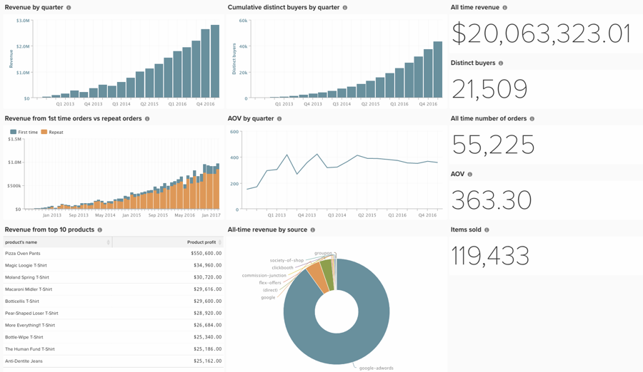

# Criar Painel do investidor

Muitos clientes trabalham com investidores e precisam compartilhar informações da plataforma, mas os painéis criados para tomar decisões comerciais diárias podem não ser o que um investidor está procurando. Abaixo, descreve algumas práticas recomendadas para criar um painel abrangente, mas simples, ideal para compartilhar com investidores ativos e potenciais.

Veja o que é necessário para criar relatórios para seu painel de investidores:

## Relatórios escalares

* **[!UICONTROL All-time revenue]**
* **[!UICONTROL Distinct buyers]**
* **[!UICONTROL All-time number of orders]**
* **[!UICONTROL AOV]**
* **[!UICONTROL Items sold]**

## Relatórios Visuais

* **[!UICONTROL Revenue by quarter]**
   * Métrica - Receita
* **[!UICONTROL Revenue from 1st time orders vs repeat orders]**
   * Métrica - Receita de pedido pela primeira vez
      * Filtro - O número de ordem do usuário é igual a 1
   * Métrica 2 - Repetir receita de ordem
      * Filtro - O número do pedido do usuário é maior que 1
   * Desmarque a caixa para Vários eixos Y
   * Transformar em um gráfico de Colunas Empilhadas
* **[!UICONTROL AOV by quarter]**
   * Métrica 1 - Receita
      * Ocultar esta métrica
   * Métrica 2 - Número de pedidos
      * Ocultar esta métrica
   * Fórmula - AOV
      * A/B
* **[!UICONTROL All-time revenue by source]**
   * Métrica - Receita
   * Agrupar por cliente `utm_source`
* **[!UICONTROL Revenue from top 10 products]**
   * Métrica - Receita do produto
      * Ocultar o gráfico
      * Agrupar por nome do produto. Selecione todos os produtos.
      * Definir o intervalo de tempo como All-Time
      * Definir o intervalo de tempo como Nenhum
      * Em &quot;Mostrar superior/inferior&quot;, mostrar apenas os 10 principais classificados por Lucro do produto
* **[!UICONTROL Cumulative distinct buyers by quarter]**
   * Métrica - Compradores distintos
      * Perspectiva - Cumulativa
* **[!UICONTROL Site visits - New vs. repeat by month]**
* Sessões

Com uma integração [!DNL Google Analytics], você pode incluir relatórios sobre:

* Visitas ao site
* Índice de conversão

Com os [serviços de Enriquecimento de Dados da Commerce](https://business.adobe.com/products/magento/magento-commerce.html), você pode incluir relatórios sobre:

* Clientes únicos por estado/região, idade, sexo.

## Outras dicas

* Usar uma [convenção de nomenclatura](../best-practices/naming-elements.md) clara e concisa
* Compartilhar o painel com usuários investidores
* Ou envie via **[!UICONTROL Automated email summary]**(../data-user/export-data/email-summaries.md)
* Crie apenas um painel. Isso facilita a manutenção do conteúdo e você sabe exatamente o que seus investidores estão vendo.

Organize seus relatórios cuidadosamente e preste atenção aos detalhes. Uma vez concluído, o painel será semelhante ao mostrado abaixo:

