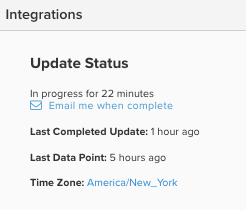

# Progresso do ciclo de atualização

Ao efetuar logon no [!DNL MBI] no painel, há várias maneiras de verificar o status do seu último ciclo de atualização. Tudo depende do tipo de [permissões do usuário](../administrator/user-management/user-management.md) você tem.

## Por que devo verificar o status do ciclo de atualização?

A verificação do ciclo de atualização de status é útil quando você está auditando os dados em seu [!DNL MBI] conta. Se você visualizar [resultados que não atendem às suas expectativas](../data-analyst/data-warehouse-mgr/data-and-updates-faq.md), por exemplo, vendas diárias em [!DNL MBI] não correspondem ao que você está vendo na sua plataforma de comércio eletrônico ou em sua [[!DNL Google] receita de comércio eletrônico](https://experienceleague.adobe.com/docs/commerce-knowledge-base/kb/troubleshooting/miscellaneous/diagnosing-google-ecommerce-revenue-discrepancies.html?lang=en) você pode verificar o último ponto de dados para ver se o problema será resolvido assim que uma atualização for concluída.

## [!UICONTROL Read-Only] e [!UICONTROL Standard]** Usuários

`Read-only` os usuários do podem fazer logon no painel e ver a atualização recente dos dados, passando o mouse sobre o ícone na parte superior direita da página. Isso mostrará quando o último ponto de dados foi extraído.

## [!UICONTROL Admin] Usuários

`Admin` os usuários podem fazer logon no painel e ver o último ponto de dados acima, juntamente com um breve ícone de status de suas integrações de conta.

Para obter mais detalhes, os usuários administradores podem clicar em **[!UICONTROL Manage Data]** > **[!UICONTROL Integrations]**.

Esta página mostrará o status da atualização atual e a hora da última atualização concluída.

Se uma atualização estiver em andamento, você verá um link para solicitar uma notificação por email quando a atualização for concluída.

Se uma atualização não estiver em andamento, você verá um link para forçar o início de uma atualização.

>[!NOTE]
>
>Se tiver horas de blecaute (horário em que não deseja [!DNL MBI] para atualizar seus dados), defina, forçar uma atualização iniciará um ciclo de atualização que não respeite as limitações dessas horas de blecaute.
