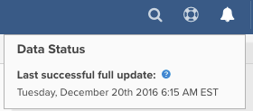

# Atualizar progresso do ciclo

Ao fazer logon no painel do [!DNL Adobe Commerce Intelligence], há várias maneiras de verificar o status do seu último ciclo de atualização. Tudo depende do tipo de [permissões de usuário](../administrator/user-management/user-management.md) que você tem.

## Por que devo verificar o status do ciclo de atualização?

A verificação do ciclo de atualização de status é útil quando você está auditando os dados na sua conta [!DNL Commerce Intelligence]. Se você vir [resultados que não atendam às suas expectativas](../data-analyst/data-warehouse-mgr/data-and-updates-faq.md), por exemplo, as vendas diárias em [!DNL Commerce Intelligence] não correspondem ao que você está vendo na sua plataforma de comércio eletrônico ou na sua [[!DNL Google] receita de comércio eletrônico](https://experienceleague.adobe.com/docs/commerce-knowledge-base/kb/troubleshooting/miscellaneous/diagnosing-google-ecommerce-revenue-discrepancies.html), você poderá verificar o último ponto de dados para ver se o problema é resolvido depois que uma atualização for concluída.

## [!UICONTROL Read-Only] e [!UICONTROL Standard] usuários

`Read-only` usuários podem fazer logon no painel e ver como os dados foram atualizados recentemente, passando o mouse sobre o ícone na parte superior direita da página. Isso mostra quando o último ponto de dados foi extraído.



## [!UICONTROL Admin] Usuários

`Admin` usuários podem fazer logon no painel e ver o último ponto de dados acima, juntamente com um breve ícone de status das integrações das contas.

Para obter mais detalhes, os usuários administradores podem clicar em **[!UICONTROL Manage Data]** > **[!UICONTROL Integrations]**.


Esta página mostra o status da atualização atual e a hora da última atualização concluída.

Se uma atualização estiver em andamento, você verá um link para solicitar uma notificação por email após a conclusão da atualização.

Se uma atualização não estiver em andamento, você verá um link para forçar o início de uma atualização.

>[!NOTE]
>
>Se você tiver definido horas de blecaute (hora em que você não deseja que [!DNL Commerce Intelligence] atualize seus dados), forçar uma atualização inicia um ciclo de atualização que não respeita as limitações dessas horas de blecaute.


## Verificar o status do ciclo de atualização usando a API

Você pode recuperar o ciclo de atualização concluído mais recente usando a **API de Status do Ciclo de Atualização**.

**Solicitação**

```bash
curl -sS -H "X-RJM-API-Key: <EXPORT-API-KEY>" \
  https://api.rjmetrics.com/0.1/client/<CLIENT_ID>/fullupdatestatus
```

**Resposta (exemplo)**

```json
{
  "clientId": 194,
  "lastCompletedUpdateJob": {
    "id": 13554,
    "type": { "id": 2, "name": "Full Update" },
    "start": "2025-12-09 03:26:25",
    "end": "2025-12-09 03:29:03",
    "status": { "id": 4, "name": "Completed Successfully" }
  },
  "lastCompletedUpdateJobWithDataSync": null,
  "timezoneAbbreviation": "EST"
}
```

Para obter parâmetros, autenticação, erros e limites de taxa, consulte [Atualizar API de Status do Ciclo](https://developer.adobe.com/commerce/services/reporting/update-cycle-status-api/) na documentação do desenvolvedor.
