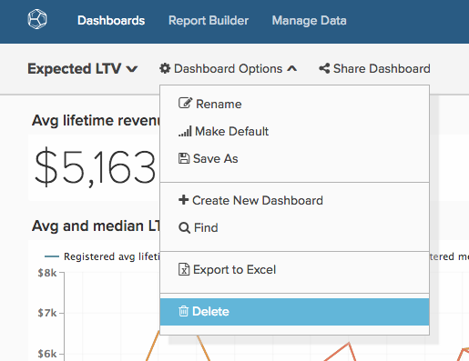
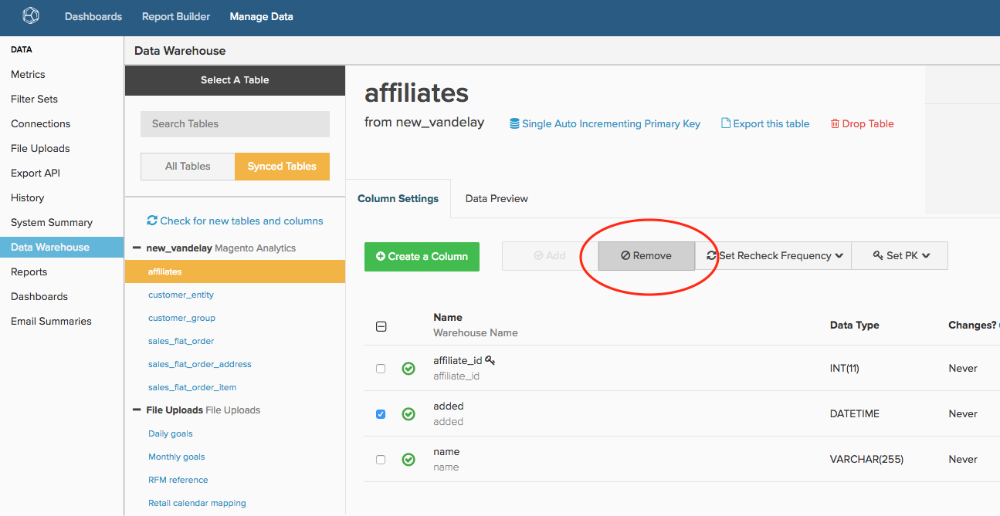

# Limpar sua Conta [!DNL Adobe Commerce Intelligence]

Esteja você com o [!DNL Commerce Intelligence] há seis meses ou seis anos, manter uma conta do tidy é fundamental para que sua organização obtenha o máximo da plataforma. Com o tempo, é natural que haja usuários, painéis, relatórios, métricas e colunas que não sejam mais necessários. Talvez você tenha criado um relatório para uso único e se esquecido dele, ou um usuário que deixou a empresa nunca teve a conta desativada.

Com a [nomenclatura padronizada e clara para todos os elementos](../best-practices/naming-elements.md)) da sua conta do [!DNL Commerce Intelligence], as etapas de auditoria de conta abaixo ajudam a reduzir a desordem e as análises desnecessárias para seus usuários. Um benefício adicional inclui [ciclos de atualização potencialmente mais rápidos](../best-practices/reduce-update-cycle-time.md).

## Etapa 1: Identificar Usuários Não Ativos

O primeiro passo para limpar a sua conta é desativar as contas dos seus usuários inativos, como pessoas que deixaram a empresa ou não usam mais o [!DNL Commerce Intelligence] em suas funções atuais.

Para fazer isso, clique no nome da sua empresa na barra de navegação superior direita e selecione **[!UICONTROL Manage Users]**. Em seguida, selecione o usuário que deseja desativar e clique em **[!UICONTROL Deactivate User]**.

>[!NOTE]
>
>Você precisa de [Permissões de administrador](../administrator/user-management/user-management.md) para fazer isso.

>[!WARNING]
>
>A desativação de um usuário remove os gráficos, painéis e outros ativos criados por esse usuário. Para preservar esses ativos, contate a equipe de [!DNL Commerce Intelligence] [suporte](../guide-overview.md#Submitting-a-Support-Ticket) antes de desativar o usuário. O suporte pode ajudar você a transferir esses ativos para outro usuário.

### Reativar um usuário

Para reativar um usuário, convide-o novamente recriando sua conta com o mesmo endereço de email que foi desativado, e seu acesso e os dados que ele possuía são restaurados no logon.

## Etapa 2: excluir painéis e relatórios não usados

A próxima etapa na auditoria da sua conta é excluir todos os painéis e relatórios não utilizados.

>[!NOTE]
>
>Você precisa de `Admin` ou `Standard` [permissões de usuário](../administrator/user-management/user-management.md) para fazer isso.

Todos os usuários com acesso de `Admin` ou `Standard` podem criar relatórios e painéis. Por esse motivo, todos os usuários com essas permissões devem seguir as etapas abaixo para identificar e remover relatórios não utilizados.

### Examinar seus painéis e relatórios

Antes de excluir qualquer item, você deve revisar seus relatórios e painéis para avaliar o que está em uso. Embora você possa usar o recurso **[!UICONTROL find unused reports]** descrito abaixo, qualquer revisão inicial torna seus esforços de limpeza muito mais produtivos.

### Exclusão de painéis e relatórios

Depois de acessar os painéis e relatórios, você pode começar a limpar a conta.

**Para Remover um Relatório de um Painel**

1. Localize o relatório que deseja remover no painel.
1. Selecione **[!UICONTROL Options]** no canto superior direito do relatório.
1. Clique em **[!UICONTROL Remove From Dashboard]**.

**Para Excluir um Painel Inteiro**

1. Selecione **[!UICONTROL Manage Data]** e depois **[!UICONTROL Dashboards**].
1. Clique no painel que deseja excluir.
1. Clique em **[!UICONTROL Delete Dashboard]**.

Você também pode selecionar **[!UICONTROL Dashboard Options]** e depois **[!UICONTROL Delete]** no próprio painel.

>[!NOTE]
>
>A exclusão de um painel não exclui os relatórios contidos nele, portanto, é necessário executar mais uma etapa para excluir os relatórios.

**Para Excluir Relatórios Não Utilizados**

1. Selecione **[!UICONTROL Manage Data]**, depois **[!UICONTROL Reports]**.
1. Marque a caixa **Mostrar apenas relatórios não utilizados**, localizada abaixo da lista de métricas. Isso cria uma lista de relatórios que não são usados em um painel ou resumo de email.
1. Selecione os relatórios que deseja excluir. É possível selecionar tudo ao clicar na caixa de seleção acima da lista de relatórios.
1. Clique em **[!UICONTROL Delete Selected]**.

Esta é uma análise do processo de exclusão de relatórios não utilizado:

## Etapa 3: Excluir métricas não usadas

Depois de limpar a lista de usuários, os painéis e os relatórios, você pode passar para a auditoria da lista de métricas. Isso ajuda a identificar qualquer item que possa estar desatualizado (por exemplo, uma nova métrica foi criada com uma definição diferente) ou não está em uso.

1. Para gerar uma lista de relatórios dependentes para uma métrica, vá para **[!DNL Manage Data]** e selecione Clique em **[!UICONTROL Metrics]**.
1. Clique em **[!UICONTROL Edit]** ao lado de uma métrica.
1. Na parte inferior da página, você verá uma seção chamada **[!UICONTROL Dependent Charts]**. Clique no link para gerar uma lista de relatórios dependentes para essa métrica.
1. Depois que o sistema concluir a verificação, o [!DNL Commerce Intelligence] exibe uma lista de painéis, relatórios e usuários que usam essa métrica.

Se você decidir que a métrica não é mais necessária, navegue de volta para a página **[!UICONTROL Metrics]** clicando em **[!UICONTROL Back to Metric List]** para encontrar a métrica que deseja excluir. Clique em **[!UICONTROL Delete]**.

## Etapa 4: Avaliar as Colunas Sincronizadas

A última etapa é avaliar as colunas que estão sendo sincronizadas no Data Warehouse. A não apenas dessincronização de colunas pode poluir sua conta, como também pode reduzir o tempo de atualização.

Se quiser continuar, entre em contato com o [!DNL Commerce Intelligence] [Suporte](../guide-overview.md#Submitting-a-Support-Ticket). A equipe de suporte pode criar um relatório que inclua todas as colunas que não estão sendo usadas em nenhum painel para nenhum usuário e que não são usadas em resumos de email, excluindo Relatórios SQL. Você pode usar esse relatório como um guia para selecionar colunas para dessincronização por meio do Data Warehouse Manager.

>[!NOTE]
>
>Você sempre pode começar a sincronizar essas colunas novamente no futuro. Dessincronizar uma coluna remove todos os dados da Data Warehouse; isso significa apenas que essa coluna não é verificada em busca de valores novos ou atualizados durante o ciclo de atualização.

**Para Dessincronizar uma Coluna (ou Colunas)**

1. Vá para **[!DNL Manage Data]** e depois para **[!UICONTROL Data Warehouse]**.
1. Na lista **[!UICONTROL Synced Tables]**, navegue até a tabela que contém a coluna.
1. Marque uma ou mais caixas ao lado de uma ou mais colunas que deseja dessincronizar.

   >[!NOTE]
   >
   >Não é possível dessincronizar uma coluna de Chave primária sem remover a tabela inteira.

1. Clique em **[!UICONTROL Remove]** para dessincronizar uma ou mais colunas.

Veja aqui todo o processo:

## Encapsulamento

A conta do [!DNL Commerce Intelligence] agora deve ser mais organizada e mais fácil de navegar para você e sua equipe.
