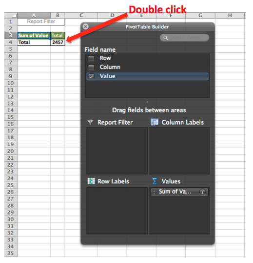

# Formatar e importar dados financeiros

Este tópico discute a melhor maneira de importar dados financeiros para análise no [!DNL Adobe Commerce Intelligence].

Uma tabela de dados bidimensional entre guias geralmente é o formato usado para dados financeiros. Com valores categorizados por rótulos em colunas e linhas, esse tipo de layout pode ser fácil de visualizar com olhos humanos e ferramentas de planilha, mas não é amigável para bancos de dados.

Para importar e analisar esses dados em [!DNL Commerce Intelligence], a tabela deve ser nivelada em uma lista unidimensional. Quando nivelado, cada valor de dados é categorizado por vários rótulos, todos em uma única linha, onde cada linha é única ou teria um identificador exclusivo, por exemplo, uma coluna de chave primária.

## Formatação de arquivos do Excel para importação

Para nivelar uma tabela bidimensional usando uma tabela dinâmica [!DNL Excel]:

1. Abra o arquivo com a tabela de dados bidimensional.
1. Abra o Assistente de Tabela Dinâmica. Em [!DNL Windows], o atalho é `Alt-D`. Em [!DNL Mac OS], digite `Command-Option-P`.
1. Selecione **[!UICONTROL Multiple consolidated ranges]** e clique em **[!UICONTROL Next]**.
1. Selecione **[!UICONTROL I will create the page fields]** e clique em **[!UICONTROL Next]**.
1. Selecione todo o conjunto de dados na tabela bidimensional, incluindo os rótulos. Verifique se `0` está selecionado para o número de campos de página desejados e clique em **[!UICONTROL Next]**.
1. Crie a tabela dinâmica em uma nova planilha e clique em **[!UICONTROL Finish]**.
1. Desmarque os campos de coluna e linha da lista de campos.
1. Clique duas vezes no valor numérico resultante para mostrar os dados de origem nivelados em uma nova planilha.
   
1. Salvar como arquivo `CSV`.

## Encapsulamento

A tabela de dados foi convertida em um formato de lista, preservando todas as suas informações originais, e agora pode ser [importada para [!DNL Commerce Intelligence]](../data-analyst/importing-data/connecting-data/using-file-uploader.md) para análise.
