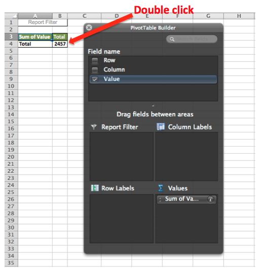

# Formatar e importar dados financeiros

Este tópico discute a melhor maneira de importar dados financeiros para análise em [!DNL MBI].

Uma tabela de dados bidimensional e entre guias geralmente é o formato usado para dados financeiros. Com valores categorizados por rótulos em colunas e linhas, esse tipo de layout pode ser fácil de visualizar com olhos humanos e ferramentas de planilha, mas não é muito amigável para bancos de dados.

Para importar e analisar esses dados em [!DNL MBI], a tabela deve ser nivelada em uma lista unidimensional. Quando nivelado, cada valor de dados é categorizado por vários rótulos que estão todos em uma única linha, onde cada linha é única ou teria um identificador exclusivo, por exemplo, uma coluna de chave primária.

## Formatação de arquivos Excel para importação

Para nivelar uma tabela bidimensional usando uma tabela dinâmica do Excel:

1. Abra o arquivo com a tabela de dados bidimensional.
1. Abra o Assistente de Tabela Dinâmica. No Windows, o atalho é `Alt-D`. No Mac OSX, digite `Command-Option-P`.
1. Selecionar **[!UICONTROL Multiple consolidated ranges]** e clique em **[!UICONTROL Next]**.
1. Selecionar **[!UICONTROL I will create the page fields]** e clique em **[!UICONTROL Next]**.
1. Selecione todo o conjunto de dados na tabela bidimensional, incluindo os rótulos. Certifique-se de que `0` está selecionada para o número de campos de página desejados e clique em **[!UICONTROL Next]**.
1. Crie a tabela dinâmica em uma nova planilha e clique em **[!UICONTROL Finish]**.
1. Desmarque a coluna e os campos de linha na lista de campos.
1. Clique duas vezes no valor numérico resultante para mostrar os dados de origem nivelados em uma nova planilha.
   
1. Salvar como um `CSV` arquivo.

Pronto! A tabela de dados foi convertida em um formato de lista, preservando todas as informações originais e agora pode ser [importado para [!DNL MBI]](../data-analyst/importing-data/connecting-data/using-file-uploader.md) para análise.
