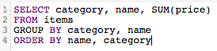

# Otimizar suas consultas de SQL

O [!DNL SQL Report Builder] permite que você execute e altere suas consultas sempre que desejar. Esse recurso é útil se você precisar atualizar uma consulta imediatamente, em vez de esperar a conclusão de um ciclo de atualização antes de corrigir uma coluna ou relatório.

Antes da execução de uma consulta, [[!DNL Commerce Intelligence] estima seu custo](https://experienceleague.adobe.com/docs/commerce-knowledge-base/kb/troubleshooting/miscellaneous/sql-queries-explain-cost-errors.html). O custo considera o tempo e o número de recursos necessários para executar uma consulta. Se esse custo for considerado muito alto ou se o número de linhas retornadas exceder os limites [!DNL Commerce Intelligence], a consulta falhará. Para consultar sua [Data Warehouse](../data-analyst/data-warehouse-mgr/tour-dwm.md), o que garante que você esteja gravando as consultas mais simples possíveis, a Adobe recomenda o seguinte.

## Utilização de SELECIONAR ou Seleção de Todas as Colunas

Selecionar todas as colunas não possibilita uma consulta oportuna e facilmente executada. As consultas que usam `SELECT *` podem demorar um pouco para serem executadas, especialmente se a tabela tiver muitas colunas.

Por isso, a Adobe recomenda que você evite usar o `SELECT *` sempre que possível e inclua apenas as colunas necessárias:

| **Em vez disso...** | **Experimente isto!** |
|-----|-----|
|  |  |

{style="table-layout:auto"}

## Uso de Junções Externas Completas

Junções externas selecionam a totalidade das duas tabelas sendo unidas, o que aumenta o custo computacional da consulta. Isso significa que sua consulta demora mais para ser executada e tem mais probabilidade de falha, pois pode levar mais tempo do que o limite de execução para retornar os resultados.

Em vez de usar esse tipo de junção, considere usar uma junção interna ou esquerda. As junções internas retornam resultados somente quando há uma correspondência de colunas entre tabelas (por exemplo, `order_id` existe em uma tabela `customers` e `orders` típicas). As junções à esquerda retornam todos os resultados da tabela à esquerda (primeira) juntamente com os resultados correspondentes na tabela à direita (segunda).

Veja como você pode reescrever uma consulta FULL OUTER JOIN:

| **Em vez disso...** | **Experimente isto!** |
|-----|-----|
|  |  |

{style="table-layout:auto"}

Essas consultas são idênticas em todos os aspectos, exceto pelo tipo de JOIN que usam.

## Uso de Várias Associações

Embora você possa incluir várias associações em sua consulta, lembre-se de que isso pode aumentar o custo da consulta. Para não atingir o limite de custo, a Adobe recomenda evitar várias associações sempre que possível.

## Utilização de filtros

Use filtros sempre que possível. As cláusulas `WHERE` e `HAVING` filtram seus resultados e fornecem apenas os dados que você realmente deseja.

## Uso de Filtros em Cláusulas JOIN

Se estiver usando um filtro ao executar uma associação, certifique-se de aplicá-lo a ambas as tabelas na associação. Mesmo que seja redundante, isso reduz o custo computacional do query e reduz o tempo de execução.

| **Em vez disso...** | **Experimente isto!** |
|-----|-----|
|  |  |

{style="table-layout:auto"}

## Uso de operadores

Ao gravar consultas, considere usar os operadores &quot;mais baratos&quot; possíveis. Cada consulta tem um custo computacional, que é determinado pelas funções, operadores e filtros que compõem a consulta. Alguns operadores exigem menos esforço computacional, o que os torna mais baratos do que outros operadores.

Os operadores de comparação (>, &lt;, = e assim por diante) são os mais baratos, seguidos por [LIKE. SEMELHANTE AOS operadores POSIX](https://www.postgresql.org/docs/9.5/functions-matching.html), que são os operadores mais caros.

## Uso de EXISTS versus IN

Usar `EXISTS` versus `IN` depende do tipo de resultados que você está tentando retornar. Se você estiver interessado apenas em um único valor, use a cláusula `EXISTS` em vez de `IN`. `IN` é usado com listas de valores separados por vírgula, o que aumenta o custo computacional da consulta.

Quando as consultas `IN` são executadas, o sistema deve primeiro processar a subconsulta (a instrução `IN`) e depois a consulta inteira com base na relação especificada na instrução `IN`. A consulta `EXISTS` é muito mais eficiente porque ela não precisa ser executada várias vezes - um valor verdadeiro/falso é retornado durante a verificação da relação especificada na consulta.

Simplificando: o sistema não precisa processar tanto ao usar o `EXISTS`.

| **Em vez disso...** | **Experimente isto!** |
|-----|-----|
|  |  |

{style="table-layout:auto"}

## Usando ORDER BY

A função `ORDER BY` é cara no SQL e pode aumentar significativamente o custo de uma consulta. Se você receber uma mensagem de erro dizendo que o custo EXPLICAR da sua consulta é muito alto, tente eliminar qualquer `ORDER BY`s da sua consulta, a menos que seja necessário.

Isso não quer dizer que `ORDER BY` não possa ser usado; apenas que ele só deve ser usado quando necessário.

## Usando GROUP BY e ORDER BY

Pode haver algumas situações em que essa abordagem não esteja em conformidade com o que você está tentando fazer. A regra geral é que, se você estiver usando um `GROUP BY` e `ORDER BY`, você deve colocar as colunas em ambas as cláusulas na mesma ordem. Por exemplo:

| **Em vez disso...** | **Experimente isto!** |
|-----|-----|
|  |  |

{style="table-layout:auto"}

## Encapsulamento

A melhor maneira de aprender a escrever SQL - e fazê-lo com eficiência - é por meio de tentativa e erro. Para descobrir o que funciona melhor para você, tente recriar alguns relatórios usando apenas o editor SQL.
