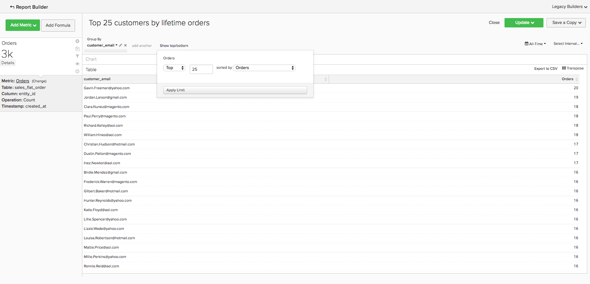

# Analytics básico

Depois de conhecer o [!DNL Adobe Commerce Intelligence] e tiver uma compreensão básica da ferramenta, você desejará começar a criar relatórios. Uma das perguntas mais comuns que você pode ter é &quot;O que eu devo estar olhando?&quot;

As informações abaixo descrevem algumas das métricas e relatórios comuns que podem ser importantes. Alguns desses relatórios existem em sua conta, portanto, analise as métricas e os relatórios que existem em sua conta para evitar a criação de duplicatas.

## Tabelas e colunas que você deseja entender

Ao criar uma métrica, você precisa conhecer quatro informações:

1. A tabela em que os dados residem,
1. A ação específica que deseja executar,
1. A coluna na qual você deseja executar essa ação e
1. O carimbo de data e hora que você deseja usar para rastrear esses dados.

Provavelmente, os nomes das tabelas usadas nesses exemplos são um pouco diferentes dos nomes das colunas e tabelas do banco de dados porque cada banco de dados é exclusivo. Consulte as definições abaixo se precisar de ajuda para identificar uma tabela ou coluna correspondente no banco de dados.

## Tabela Clientes

Essa tabela contém as principais informações sobre cada cliente, como uma ID de cliente exclusiva, um endereço de email e assim por diante. Os exemplos abaixo usam **[!UICONTROL customer_entity]** como o nome de uma tabela de cliente de exemplo.

Se alguns desses cálculos não existirem no banco de dados, qualquer usuário administrador na sua conta poderá criá-los. Além disso, verifique se essas dimensões são agrupáveis para todas as métricas aplicáveis.

**Dimension**

* **[!UICONTROL Entity_id]**: um identificador exclusivo para cada cliente. Ele também pode ser um número de cliente único ou um endereço de e-mail do cliente e deve agir como uma chave de referência para a tabela do seu pedido.
* **[!UICONTROL Created_at]**: a data em que a conta do cliente foi criada e adicionada ao banco de dados.
* **[!UICONTROL Customer's lifetime revenue]**: a receita total vitalícia gerada por um cliente.
* **[!UICONTROL Customer's first 30-day revenue]**: o valor total da receita gerada por um cliente em seus primeiros 30 dias.
* **[!UICONTROL Customer's lifetime number of orders]**: o número de pedidos feitos por um cliente durante sua vida útil.
* **[!UICONTROL Customer's lifetime number of coupons]**: o número total de cupons usados por um cliente ao longo de sua vida útil.
* **[!UICONTROL Customer's first order date]**: a data do primeiro pedido de um cliente. Isso pode ser diferente da data created_at se um cliente não tiver feito um pedido no momento de sua criação.

**Você aceita ordens de convidados?**

*Em caso afirmativo, essa tabela pode não conter todos os clientes. Entre em contato com [equipe de suporte](https://experienceleague.adobe.com/docs/commerce-knowledge-base/kb/troubleshooting/miscellaneous/mbi-service-policies.html) para garantir que suas análises de clientes incluam todos os clientes.*

*Não tem certeza se você aceita ordens de convidados? Consulte [este tópico](../data-warehouse-mgr/guest-orders.md) para saber mais!*

## Tabela Pedidos

Nessa tabela, cada linha representa uma ordem. As colunas nessa tabela contêm informações básicas sobre cada pedido, como a ID do pedido, a data de criação, o status, a ID do cliente que fez o pedido e assim por diante. Os exemplos abaixo usam **[!UICONTROL sales_flat_order]** como o nome de uma tabela pedidos de amostra.

**Dimension**

* **[!UICONTROL Customer_id]**: um identificador exclusivo do cliente que fez o pedido. Geralmente, isso é usado para mover informações entre as tabelas de clientes e pedidos. Nesses exemplos, você espera o customer_id no **[!UICONTROL sales_flat_order]** tabela para alinhar com a **[!UICONTROL entitiy_id]** no **[!UICONTROL customer_entity]** tabela.
* **[!UICONTROL Created_at]**: a data em que o pedido foi criado ou feito.
* **[!UICONTROL Customer_email]**: o endereço de email do cliente que fez o pedido. Esse também pode ser o identificador exclusivo do cliente.
* **[!UICONTROL Customer's lifetime number of orders]**: uma cópia da coluna com o mesmo nome na `Customers` tabela.
* **[!UICONTROL Customer's order number]**: o número de ordem sequencial do cliente associado à ordem. Por exemplo, se a linha que você está observando for a primeira ordem de um cliente, essa coluna será &quot;1&quot;; mas, se essa for a 15ª ordem do cliente, essa coluna mostrará &quot;15&quot; para essa ordem. Se essa dimensão não existir no seu `Customers` tabela, pergunte à [equipe de suporte](https://experienceleague.adobe.com/docs/commerce-knowledge-base/kb/troubleshooting/miscellaneous/mbi-service-policies.html) para ajudá-lo a criá-lo.
* **[!UICONTROL Customer's order number (previous-current)]**: uma concatenação de dois valores no **[!UICONTROL Customer's order number]** coluna. Ele é usado em um relatório de amostra abaixo para exibir o tempo decorrido entre dois pedidos. Por exemplo, o tempo entre a data de primeiro pedido de um cliente e a data de segundo pedido é representado como &quot;1-2&quot; com esse cálculo.
* **[!UICONTROL Coupon_code]**: mostra quais cupons foram usados em cada pedido.
* **[!UICONTROL Seconds since previous order]**: o tempo (em segundos) entre os pedidos de um cliente.

## Tabela de itens do pedido

Nesta tabela, cada linha representa um item que foi vendido. Essa tabela contém informações sobre os itens vendidos em cada pedido, como número de referência do pedido, número do produto, quantidade, etc. Os exemplos abaixo usam `sales_flat_order_item` como o nome de uma tabela itens de pedido de exemplo.

**Dimension**

* **[!UICONTROL Item_id]**: o identificador exclusivo de cada linha da tabela.
* **[!UICONTROL Order_id]**: a chave de referência para o seu `Orders` tabela que informa quais itens foram comprados na mesma ordem. Se um pedido contiver vários itens, esse valor será repetido.
* **[!UICONTROL Product_id]**: se desejar informações sobre o produto específico adquirido (como cor, tamanho etc.), use essa coluna para obter essas informações da tabela de produtos.
* **[!UICONTROL Order's created_at]**: O carimbo de data e hora em que o pedido foi feito, normalmente copiado para o `order line items` tabela do `Orders` tabela.
* **[!UICONTROL Order's coupon_code]**: Semelhante ao `Order's created_at` dimensão, essa coluna é copiada da tabela pedidos.

## Tabela de assinaturas

Essa tabela é usada para gerenciar as informações de subscrição, como id de subscrição, endereço de email do assinante, data de início da subscrição e assim por diante.

**Dimension**

* **[!UICONTROL Customer_id]**: um identificador exclusivo do cliente que fez o pedido. Essa é uma maneira comum de criar um caminho entre a tabela Clientes e a tabela Pedidos. Nesses exemplos, você espera o customer_id no **sales_flat_order** tabela para alinhar com a `entitiy_id` no `customer_entity` tabela.
* **[!UICONTROL Start date]**: a data de início da subscrição de um cliente.

## Tabela de gastos de marketing

Ao analisar seu investimento em marketing, você pode incluir [!DNL Facebook], [!DNL Google AdWords], ou em outras fontes nas análises. Se você tiver várias fontes de gastos com marketing, entre em contato com o [Equipe do Managed Services](https://business.adobe.com/products/magento/fully-managed-service.html) para obter ajuda sobre como configurar uma tabela consolidada para suas campanhas de marketing.

**Dimension**

* **[!UICONTROL Spend]**: o total gasto com anúncios. Entrada [!DNL Facebook], essa seria a coluna gasto no `facebook_ads_insights_####` tabela. Para [!DNL Google AdWords], este seria o `adCost` na `campaigns####` tabela.
* A variável `####` que está anexado a cada uma dessas tabelas se relaciona à ID de conta específica para o seu [!DNL Facebook] ou [!DNL Google AdWords] conta.
* **[!UICONTROL Clicks]**: o número total de cliques. Entrada [!DNL Facebook], essa será a coluna de cliques na variável `facebook_ads_insights_####` tabela. Entrada [!DNL Google AdWords], essa será a coluna adClicks no `campaigns####` tabela.
* **[!UICONTROL Impressions]**: o número total de impressões. Entrada [!DNL Facebook], essas seriam as impressões no `facebook_ads_insights_####` tabela. Entrada [!DNL Google AdWords], essas seriam as impressões do `campaigns####` tabela.
* **[!UICONTROL Campaign]**: o número total de cliques. Entrada [!DNL Facebook], essa será a coluna campaign_name no `facebook_ads_insights_####` tabela. Entrada [!DNL Google AdWords], essa será a coluna da campanha no `campaigns####` tabela.
* **[!UICONTROL Date]**: a hora e a data em que a atividade (gasto, cliques ou impressões) ocorreu para uma campanha específica. Entrada [!DNL Facebook], este seria o `date_start` na `facebook_ads_insights_####` tabela. Entrada [!DNL Google AdWords], essa seria a coluna de data na variável `campaigns####` tabela.
* **[!UICONTROL Customer's first order's source]**: a origem da ordem a partir da primeira ordem de um cliente. Primeiro, verifique se você tem uma coluna chamada `customer's first order's source` em sua conta. Se não vir essa coluna, você poderá criar a coluna desejada usando essas instruções.
* **[!UICONTROL Customer's first order's medium]**: a mídia do pedido no primeiro pedido de um cliente. Primeiro, verifique se você tem uma coluna chamada `customer's first order's source` em sua conta. Se não vir essa coluna, você poderá criar a coluna desejada usando essas instruções.
* **[!UICONTROL Customer's first order's campaign]**: a campanha do pedido do primeiro pedido de um cliente. Primeiro, verifique se você tem uma coluna chamada `customer's first order's source` em sua conta. Se não vir essa coluna, você poderá criar a coluna desejada usando essas instruções.

## Relatórios e métricas comuns

Estes são alguns exemplos comuns de relatórios e métricas que podem ser úteis:

* [Customer Analytics](#customeranalytics)
* [Análise de pedidos](#orderanalytics)
* [Análise de gastos de marketing](#mktgspendanalytics)

## Análise do cliente {#customeranalytics}

### Novos usuários

* **Descrição**: uma contagem do número total de usuários recém-adquiridos em um determinado período. `New Users` é diferente de `Unique Customers`, porque `New Users` tem o carimbo de data e hora que uma conta foi criada com seu serviço (isso não significa que eles necessariamente fizeram um pedido) enquanto `Unique Customers` fizeram pelo menos um pedido.
* **Definição de métrica**: Essa métrica executa uma **Contagem** de `entity_id` de `customer_entity` tabela ordenada por `created_at`.
* **Exemplo de relatório**: Número de novos usuários criados no mês passado
   * **[!UICONTROL Metric]**: `New Users`
   * **[!UICONTROL Time Range]**: `Last Month`
   * **[!UICONTROL Time Interval]**: `By Day`

<!--{: width="929"}-->

### Clientes únicos

* **Descrição**: uma contagem do número total de clientes distintos em um determinado período. Isso é diferente de `New Users`, pois rastreia apenas os clientes que fizeram pelo menos um pedido. Um relatório de cliente distinto rastreia um cliente apenas uma vez em um determinado intervalo de tempo. Se você definir o intervalo de tempo como `By Day` e um cliente fizer mais de uma compra nesse dia, ele será contado apenas uma vez. Se quiser ver o número total de compras em geral, verifique `Number of Orders`.
* **Definição de métrica**: Essa métrica executa uma **Contagem distinta** de `customer_id` de `sales_flat_order` tabela ordenada por `created_at`.
* **Exemplo de relatório**: clientes distintos por semana nos últimos 90 dias
   * **[!UICONTROL Metric]**: `Distinct Customers`
   * **[!UICONTROL Time Range]**: `Moving range > Last 90 Days`
   * **[!UICONTROL Time Interval]**: `By Day`

<!--{: width="929"}-->

### Novos assinantes

* **Descrição**: uma contagem do número total de novos assinantes adquiridos em um determinado período.
* **Definição de métrica**: Essa métrica executa uma **Contagem distinta** de `customer_id` de `subscriptions` tabela ordenada por `start_date`.
* **Exemplo de relatório**: novos assinantes este ano por mês
   * **[!UICONTROL Metric]**: `New Subscribers`
   * **[!UICONTROL Time Range]**: `1 Year Ago to 0 Days Ago`
   * **[!UICONTROL Time Interval]**: `By Month`

<!--{: width="929"}-->

### Repetir clientes

* **Descrição**: o número total de clientes que fizeram mais de um pedido em um período. Em um relatório de clientes repetidos, é possível usar a variável `Distinct Customers` e a variável `Customer's Order Number` dimensão do seu `orders` tabela.
* **Métrica usada**: `Distinct Customers`
* **Exemplo de relatório**: Número da 2ª e 3ª compras feitas no ano passado
   * **[!UICONTROL Metric]**: `Distinct Customers`
   * **[!UICONTROL Time Range]**: `Moving Range > Last Year`
   * **[!UICONTROL Time Interval]**: `By Month`
   * **[!UICONTROL Group By]**: `Customer's Order Number`e selecione `2` e `3`

  

* **Exemplo de relatório 2**: o número de clientes repetidos nos últimos anos
   * **[!UICONTROL Metric]**: `Distinct Customers`
   * **[!UICONTROL Filters]**: `Customer's Order Number Greater Than 1`
   * **[!UICONTROL Time Range]**: `Moving range > Last Year`
   * **[!UICONTROL Time Interval]**: `By Month`

  <!--{: width="929"}-->

### Principais clientes por número de ordens de vida

* **Descrição**: uma lista dos principais clientes com base em seu número total de pedidos. Isso fornece uma lista direta dos seus compradores mais frequentes.
* **Métrica usada**: `Orders`
* **Exemplo de relatório**: os 25 principais clientes por número de pedidos vitalícios
   * **[!UICONTROL Metric]**: `Orders`
   * **[!UICONTROL Time Range]**: `All Time`
   * **[!UICONTROL Time Interval]**: `None`
   * **[!UICONTROL Group By]**: `customer_email`
   * **[!UICONTROL Show Top/Bottom]**: 25 principais classificadas por Ordens

  <!--{: width="929"}-->

### Principais clientes por receita vitalícia

* **Descrição**: uma lista dos principais clientes com base na receita vitalícia.
* **Métrica usada**: `Average Lifetime Revenue`
* **Exemplo de relatório**: os 25 principais clientes por Receita vitalícia
   * **[!UICONTROL Metric]**: `Average Lifetime Revenue`
   * **[!UICONTROL Time Range]**: `All time`
   * **[!UICONTROL Time Interval]**: `None`
   * **[!UICONTROL Group By]**: `customer_email`
   * **[!UICONTROL Show Top Bottom]**: As 25 principais classificadas por receita vitalícia

  <!--{: width="929"}-->

### Receita média vitalícia por coorte

* **Descrição**: Rastreie o [receita média vitalícia de coortes distintos](../dev-reports/lifetime-rev-cohort-analysis.md) de usuários ao longo do tempo para identificar coortes com melhor desempenho. Os coortes são agrupados por uma data comum, como a data da primeira ordem ou a data de criação.
* **Métrica usada**: `Revenue`
* **Exemplo de relatório**: Receita vitalícia média do cliente por coorte
   * **[!UICONTROL Metric]**: `Revenue`
   * **[!UICONTROL Cohort Date]**: `Customer's first order date`
   * **[!UICONTROL Time Interval]**: `Month`
   * **[!UICONTROL Time Period]**: conjunto móvel de coortes das oito coortes mais recentes com pelo menos quatro meses de dados
   * **[!UICONTROL Duration]**: `12 Month(s)`
   * **[!UICONTROL Table]**: `Customer_entity`
   * **[!UICONTROL Perspective]**: Valor Médio Cumulativo Por Membro De Coorte

  <!--{: width="929"}-->

### Clientes por uso de cupom

* **Descrição**: Uma contagem do número de clientes adquiridos que usaram um código de cupom/desconto. Isso pode ajudá-lo a obter uma visão clara de seus candidatos a desconto vs. compradores de preço total.
* **Métrica usada**: `New Users`
* **Exemplo de relatório**: Clientes com e sem cupom por mês
   * **[!UICONTROL Metric A]**: `Non coupon customers`
   * **[!UICONTROL Metric]**: `New Users`
   * **[!UICONTROL Filters]**: Número de pedidos superiores a 0 e Número de cupons igual a 0 durante a vida útil do cliente
   * **[!UICONTROL Metric B]**: `Coupon customers`
   * **[!UICONTROL Metric]**: `New Users`
   * **[!UICONTROL Filters]**: Número de pedidos maiores que 0 e número de cupons maiores que 0 do cliente durante a vida útil
   * **[!UICONTROL Time range]**: `All Time`
   * **[!UICONTROL Time interval]**: `By Month`

  <!--{: width="929"}-->

* **Exemplo de relatório 2**: Porcentagem de clientes de cupom e Não de cupom por mês
   * **[!UICONTROL Metric A]**: `Non coupon customers` (ocultar métrica)
      * **[!UICONTROL Metric]**: `New Users`
      * **[!UICONTROL Filters]**: `Customer's Lifetime Number of Orders Greater Than 0` e `Customer's Lifetime Number of Coupons Equal to 0`
   * **[!UICONTROL Metric B]**: `Coupon customers`
      * **[!UICONTROL Metric]**: `New Users`
      * **[!UICONTROL Filters]**: `Customers Lifetime Number of Orders Greater Than 0` e `Customer's Lifetime Number of Coupons Greater Than 0`
   * **[!UICONTROL Time Range]**: `All Time`
   * **[!UICONTROL Time Interval]**: `By Month`
   * **[!UICONTROL Formula]**: `B/(A+B)`

>[!NOTE]
>
> **Ocultar todas as métricas**

<!--{: width="929"}-->

### Receita média dos primeiros 30 dias

* **Descrição**: a média da quantidade de receita gerada pelos clientes nos primeiros 30 dias como um cliente.
* **Descrição da métrica**: Essa métrica executa uma **Média** de `Customer's First 30 Day Revenue` de `customer_entity` tabela ordenada por `created_at`.
* **Descrição do relatório**: média contínua da receita dos primeiros 30 dias do Cliente
* **[!UICONTROL Metric]**: `Average First 30 Day Revenue`
* **[!UICONTROL Time Range]**: `All Time`
* **[!UICONTROL Time Interval]**: `None`

<!--{: width="929"}-->

### Receita média vitalícia do cliente

* **Descrição**: a quantidade média de receita gerada pelos clientes ao longo da vida útil.
* **Descrição da métrica**: Essa métrica executa uma **Média** do `Customer's Lifetime Revenue` coluna na `customer_entity` tabela com base no `created_at`.
* **Descrição do relatório**: média histórica da receita vitalícia do Cliente
   * **[!UICONTROL Metric]**: `Average Customer Lifetime Revenue`
   * **[!UICONTROL Time Range]**: `All Time`
   * **[!UICONTROL Time Interval]**: `None`

<!--{: width="929"}-->

## Análise de pedidos {#orderanalytics}

### Receita

* **Descrição**: a métrica de receita exibe a receita total ganha em um período escolhido.
* Essa métrica executa uma **sum** de `grand_total` de `sales_flat_order` tabela ordenada por `created_at`.
* **Exemplo de relatório**: Receita por mês, até a presente data
   * **[!UICONTROL Metric]**: `Revenue`
   * **[!UICONTROL Time Range]**: `1 Year Ago to 1 Month Ago`
   * **Intervalo de tempo**: `By Month`

>[!TIP]
>
>Verifique se o cálculo da métrica de receita está consistente com a definição que você discute internamente. Por exemplo, você pode querer contar a receita de ordens que foram entregues, converter moedas de regiões diferentes ou excluir impostos. Além disso, você pode usar [Conjuntos de filtros](../../data-user/reports/ess-manage-data-filters.md) para garantir a consistência em todas as métricas criadas na mesma tabela.

<!--{: width="929"}-->

### Pedidos

* **Descrição**: uma contagem do número total de pedidos em um determinado período. Um relatório de Pedidos rastreia as alterações no volume do pedido causadas por novas ofertas de produtos, promoções ou qualquer outra coisa que possa aumentar (ou diminuir) o volume de transações. Você pode querer segmentar essa métrica em algumas variáveis para responder às suas perguntas.
* **Definição de métrica**: Essa métrica executa uma **Contagem** de `entity_id` de `sales_flat_order` tabela ordenada por `created_at`.
* **Exemplo de relatório**: Pedidos por mês, YTD
   * **[!UICONTROL Metric]**: `number of orders`
   * **[!UICONTROL Time Range]**: `1 Year Ago to 1 Month Ago`
   * **[!UICONTROL Time Interval]**: `By Month`

>[!TIP]
>
>Assim como a métrica de receita, você deve ter [Conjuntos de filtros](../../data-user/reports/ess-manage-data-filters.md) em vigor para excluir pedidos incompletos, de teste ou devolvidos.

<!--{: width="929"}-->

### Produtos encomendados

* **Descrição**: a métrica de produtos solicitados informa a quantidade de itens vendidos em um período específico.
* **Definição de métrica**: Essa métrica executa uma **sum** de `qty_ordered` de `sales_flat_order_item` tabela ordenada por `created_at`.
* **Exemplo de relatório**: Itens vendidos por mês, YTD
   * **[!UICONTROL Metric]**: `Products ordered`
   * **[!UICONTROL Time Range]**: `1 Year Ago to 1 Month Ago`
   * **[!UICONTROL Time Interval]**: `By Month`

  <!--{: width="929"}-->

* Combine essa métrica com a sua métrica número de pedidos para calcular o número de itens por pedido. Em seguida, adicione códigos de cupom ao relatório para determinar como suas promoções afetam o tamanho do carrinho ou segmente por pedidos novos e repetidos para entender melhor o comportamento do cliente.
* **Exemplo de relatório**: Produtos por pedido: primeira ordem versus pedidos repetidos
   * **[!UICONTROL Metric A]**: Produtos encomendados: primeira ordem
      * **[!UICONTROL Metric]**: `Products ordered`
      * **[!UICONTROL Filter]**: `Customer's order number = 1`
   * **[!UICONTROL Metric B]**: Pedidos: primeira ordem
      * **[!UICONTROL Metric]**: `Orders`
      * **[!UICONTROL Filter]**: `Customer's order number = 1`
   * **[!UICONTROL Metric C]**: Produtos encomendados: pedidos repetidos
      * **[!UICONTROL Metric]**: `Products ordered`
      * **[!UICONTROL Filter]**: `Customer's order number > 1`
   * **[!UICONTROL Metric D]**: Pedidos: pedidos repetidos
      * **[!UICONTROL Metric]**: `Orders`
      * **[!UICONTROL Filter]**: `Customer's order number > 1`
   * **[!UICONTROL Time Range]**: `1 Year Ago to 1 Month Ago`
   * **[!UICONTROL Time Interval]**: `By Week`
   * **[!UICONTROL Formula 1]**: `A/B`
   * **[!UICONTROL Formula 2]**: `C/D`

>[!NOTE]
>
>Desmarque a `Multiple Y-Axes box` e `Hide` todas as métricas

<!--{: width="929"}-->

### Valor médio de pedido

* **Descrição**: rastreie o valor médio dos pedidos feitos em um período. Use essa métrica para determinar rapidamente como o valor médio de pedido (AOV) flutuou como resultado de seus esforços de marketing, da oferta de produtos e/ou de outras alterações em sua empresa.
* **Definição de métrica**: Essa métrica executa uma **média** de `grand_total` de `sales_flat_order` tabela ordenada por `created_at`.
* **Exemplo de relatório**: AOV versus ano anterior, acumulado no ano
   * **[!UICONTROL Metric]**: `Average order value`
   * **[!UICONTROL Time Range]**: `1 Year Ago to 1 Month Ago`
   * **[!UICONTROL Time Interval]**: `By Month`
   * **[!UICONTROL Perspective]**: `Amount Change vs Previous Year`

  <!--{: width="929"}-->

### Produtos mais comprados com cupons

* **Descrição**: esse relatório fornece informações sobre quais produtos estão sendo vendidos quando você oferece promoções ou cupons.
* **Métrica usada**: Produtos encomendados
* **Exemplo de relatório**: Produtos mais comprados com cupons
   * **[!UICONTROL Metric]**: `Products ordered`
   * **[!UICONTROL Filter]**: `Order's coupon_code Is Not \[NULL\]`
   * **[!UICONTROL Time Range]**: `All-Time`
   * **[!UICONTROL Time Interval]**: `None`
   * **[!UICONTROL Group By**]: `name` (ou `SKU`ou qualquer outro identificador de produto)
   * **[!UICONTROL Show top/bottom]**: 25 principais classificados por Produtos ordenados

  <!--{: width="929"}-->

### Tempo entre pedidos

* **Descrição**: teste as suposições e expectativas sobre os ciclos de compra dos clientes com uma **tempo entre ordens** análise que observa a média (ou mediana!) quantidade de tempo entre compras. No gráfico abaixo, você pode ver que seus melhores clientes - aqueles que fazem mais de três pedidos - fazem sua segunda compra em menos de seis meses. Os clientes que não fizeram um quarto pedido esperam 14 meses antes de fazer uma segunda compra.
* **Definição de métrica**: Essa métrica executa uma **média** de `Time since previous order` de `sales_flat_order` ordenado por `created_at`.
* **Exemplo de relatório**:
   * **Métrica 1**: ≤ 3 ordens
      * **[!UICONTROL Metric]**: `Average time between orders`
      * **[!UICONTROL Filter]**: `Customer's lifetime number of orders ≤ 3`
   * **Métrica 2**: > 3 ordens
      * **[!UICONTROL Metric]**: `Average time between orders`
      * **[!UICONTROL Filter]**: `Customer's lifetime number of orders > 3`
   * **[!UICONTROL Time Range]**: `All-Time`
   * **[!UICONTROL Time Interval]**: `None`
   * **[!UICONTROL Group By]**:` Customer's order number (previous-current)`

>[!NOTE]
>
>Desmarque a opção `Multiple Y-Axes` caixa.

<!--{: width="929"}-->

## Análise de gastos com marketing {#mktgspendanalytics}

### Gasto com anúncios

* **Descrição**: é possível analisar seu investimento em marketing em vários períodos e intervalos, por campanhas, conjuntos de anúncios ou outras segmentações.
* **Definição de métrica**: Essa métrica executa uma Soma na coluna de gastos na `Marketing Spend` tabela ordenada pelo `date` coluna.
* **Exemplo de relatório**: Anúncio gasto por campanha
   * **[!UICONTROL Metric]**: `Ad spend`
   * **[!UICONTROL Time Range]**: `All-Time`
   * **[!UICONTROL Time Interval]**: `None`
   * **[!UICONTROL Group By]**: `campaign`

<!--{: width="929"}-->

### Impressões e cliques do anúncio

* **Descrição**: além de analisar os gastos com anúncios, você pode analisar as impressões e os cliques em anúncios.
* **Definição de métrica**: essa métrica executa uma Soma nas impressões (ou cliques) na `Marketing Spend` tabela ordenada pela coluna date.
* **Exemplo de relatório**: adicione impressões e cliques em anúncios por dia
   * **[!UICONTROL Metric A]**: `Ad impressions`
   * **[!UICONTROL Metric B]**: `Ad clicks`
   * **[!UICONTROL Time Range]**: `1 Year Ago to 3 Months Ago`
   * **[!UICONTROL Time Interval]**: `By Day`

  <!--{: width="929"}-->

### Índice de click-through (CTR)

* **Descrição**: Usando as métricas de impressões de anúncios e cliques em anúncios criadas acima, você pode analisar sua taxa de cliques por diferentes campanhas ao longo do tempo.
* **Exemplo de relatório**: CTR por campanha
   * **[!UICONTROL Metric A]**: `Ad impressions`
   * **[!UICONTROL Metric B]**: `Ad clicks`
   * **[!UICONTROL Time Range]**:`All-Time`
   * **[!UICONTROL Time Interval]**: `None`
   * **[!UICONTROL Formula]**: `B/A`
   * Selecione o `%` opção.
   * **[!UICONTROL Group By]**: `campaign`

>[!NOTE]
>
>Você pode **título** a fórmula como `CTR`, e **ocultar** todas as métricas.

<!--{: width="929"}-->

### Custo por clique (CPC)

* **Descrição**: Usando as métricas de gasto e cliques no anúncio criadas acima, você pode analisar o custo por clique usando diferentes campanhas ao longo do tempo.
* **Exemplo de relatório**: CPC por campanha
   * **[!UICONTROL Metric A]**: `Ad spend`
   * **[!UICONTROL Metric B]**: `Ad clicks`
   * **[!UICONTROL Time Range]**: `All-Time`
   * **[!UICONTROL Time Interval]**: `None`
   * **[!UICONTROL Formula]**: `A/B`
   * Selecione o `currency` opção
   * **[!UICONTROL Group By]**: `campaign`

>[!NOTE]
>
>Você pode **título** a fórmula como `CPC`, e **ocultar** todas as métricas.

<!--{: width="929"}-->

### Clientes por origem de aquisição

* **Descrição**: se você rastrear a origem, a mídia e a campanha de um pedido usando [!DNL Google eCommerce], você pode analisar seus clientes por sua fonte de aquisição. Isso ajuda a identificar quais fontes de marketing estão adquirindo clientes e responder a perguntas como &quot;a maioria dos clientes está fazendo seus primeiros pedidos por meio do [!DNL Google], [!DNL Facebook]ou alguma outra fonte?&quot;
* **Exemplo de relatório**: clientes por origem de aquisição
   * **[!UICONTROL Metric Used]**: `New Customers`
   * **[!UICONTROL Time Range]**: `All-Time`
   * **[!UICONTROL Time Interval]**: `By Month`
   * **[!UICONTROL Group By]**: `Customer's first order's source`

>[!NOTE]
>
>Confira [este artigo](../analysis/most-value-source-channel.md) para obter mais exemplos de relatórios usando a origem de aquisição.

<!--{: width="929"}-->

### Clientes por meio de aquisição e campanha de aquisição

* **Descrição**: assim como analisa os clientes por fonte de aquisição, você também pode analisar seus clientes por meio e campanha de seu primeiro pedido. Isso pode ajudá-lo a responder perguntas como &quot;quais campanhas estão atraindo novos clientes?&quot;
* **Exemplo de relatório**: clientes por campanha de aquisição com mídia paga
   * **[!UICONTROL Metric Used]**: `New customers`
   * **[!UICONTROL Filter]**: `Customer's first order's medium IN ppc`
   * **[!UICONTROL Time Range]**: `All-Time`
   * **[!UICONTROL Time Interval]**: `None`
   * **[!UICONTROL Group By]**: `Customer's first order's campaign`

>[!NOTE]
>
>Para o filtro no seu `New Customers` , é possível adicionar outras mídias consideradas &quot;pagas&quot; para sua empresa, como cpc ou pesquisa paga.

<!--{: width="929"}-->

### Custo de aquisição do cliente (CAC) ou custo por aquisição (CPA)

* **Descrição**: uma maneira de analisar o custo de uma campanha é atribuir todos os custos somente aos clientes que você adquiriu por meio da campanha.
* **Exemplo de relatório**: CAC por campanha
   * **[!UICONTROL Metric A]**: `New customers`
   * **[!UICONTROL Filter]**: `Customer's first order's medium IN ppc`
   * **[!UICONTROL Metric B]**: `Ad Spend`
   * **[!UICONTROL Time Range]**: `All-Time`
   * **[!UICONTROL Time Interval]**: `None`
   * **[!UICONTROL Formula]**: `B/A`
   * Selecione o `currency` opção
   * **[!UICONTROL Group By]**:
      * Para métrica `A`, selecione `Customer's first order's campaign`
      * Para métrica `B`, selecione `campaign`

  

>[!NOTE]
>
>Você pode **título** a fórmula como `CTR`, e **ocultar** todas as métricas. Além disso, confira [este artigo](../analysis/roi-ad-camp.md) para obter mais informações.

### Valor vitalício por fonte, meio e campanha de aquisição

* **Descrição**: junto com a análise do número de clientes adquiridos por cada campanha, você pode analisar a receita média ao longo da vida útil desses clientes. Isso ajuda a identificar:
   * Se determinadas campanhas atraírem um grande volume de clientes, mas esses clientes tiverem um valor vitalício baixo.
   * Se determinadas campanhas atraírem um baixo volume de clientes, mas esses clientes tiverem um alto valor vitalício.
* **Exemplo de relatório**: Primeiro adicione o `New customers` métrica. Em seguida, adicione o `Average lifetime revenue` métrica. Selecione o intervalo de tempo desejado e escolha o `interval` as `None`. Por fim, selecione a variável `group by` opção como`Customer's first order's campaign`.
   * **[!UICONTROL Metric A]**: `New Customers`
   * **[!UICONTROL Filter A]**: `Customer's first order's source` COMO &#39;%google%&#39;
   * **[!UICONTROL Filter B]**: `Customer's first order's medium IN ppc`
   * **[!UICONTROL Metric B]**: `Average lifetime revenue`
   * **[!UICONTROL Filter A]**: `Customer's first order's source` COMO &#39;%google%&#39;
   * **[!UICONTROL Filter B]**: `Customer's first order's medium IN ppc`
   * **[!UICONTROL Time Range]**: `All-Time`
   * **[!UICONTROL Time Interval]**: `None`
   * **[!UICONTROL Group By]**: `Customer's first order's campaign`

>[!NOTE]
>
>Para os dois filtros, é possível adicionar outras mídias consideradas &quot;pagas&quot; para sua empresa (como cpc ou pesquisa paga). Você também pode adicionar outras fontes que deseja analisar, como o Facebook. Confira [este artigo](../analysis/roi-ad-camp.md) para obter mais detalhes sobre CAC, LTV e ROI.

<!--{: width="929"}-->

### Retorno do investimento (ROI)

* **Descrição**: uma maneira de calcular o ROI por campanha é analisando todos os pedidos feitos pela campanha. No entanto, um método alternativo é analisar o valor vitalício de clientes adquiridos por meio de uma campanha. Para analisar o ROI, é importante que os nomes da campanha sejam consistentes em todos os dados de gastos e dados transacionais. Se você criar o relatório a seguir e não houver valores de ROI devido a nomes de campanha incompatíveis, talvez seja necessário examinar o [Marcação UTM](../../best-practices/utm-tagging-google.md) você implementou o.
* **Exemplo de relatório**: ROI por campanha
   * **[!UICONTROL Metric A]**: `New Customers`
   * **[!UICONTROL Filter A]**: `Customer's first order's source` COMO &#39;%google%&#39;
   * **[!UICONTROL Filter B]**: `Customer's first order's medium IN ppc`
   * **[!UICONTROL Metric B]**: `Average lifetime revenue`
   * **[!UICONTROL Filter A]**: `Customer's first order's source` COMO &#39;%google%&#39;
   * **[!UICONTROL Filter B]**: `Customer's first order's medium IN ppc`
   * **[!UICONTROL Metric C]**: `Ad spend`
   * **[!UICONTROL Time Range]**: `All-Time`
   * **[!UICONTROL Time Interval]**: `None`
   * **[!UICONTROL Formula]**: `(B-(C/A))/(C/A)`
   * Selecione o `% `opção
   * **[!UICONTROL Group By]**:
      * Para métrica `A` e `B`, selecione `Customer's first order's campaign`
      * Para métrica `C`, selecione `campaign`

>[!NOTE]
>
>Você pode nomear a fórmula como &quot;ROI&quot; e Ocultar todas as métricas. Além disso, é possível ajustar os filtros nas métricas para analisar fontes e meios alternativos. Além disso, confira [este tópico](../analysis/roi-ad-camp.md) para obter mais detalhes sobre CAC, LTV e ROI.

<!--{: width="929"}-->

<!--{: width="929"}-->
