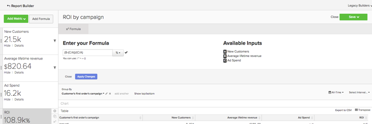

# Análise básica

Depois de conhecer o [!DNL MBI] e tiver uma compreensão básica da ferramenta, você vai querer começar a criar relatórios. Uma das perguntas mais comuns que você pode ter é &quot;O que devo estar olhando?&quot;

As informações abaixo descrevem algumas das métricas e relatórios comuns que você pode achar valiosos. Vários desses relatórios já existem em sua conta, portanto, verifique se você revisou as métricas e relatórios que existem em sua conta para evitar a criação de duplicatas.

## Tabelas e colunas que você deseja entender

Ao criar uma métrica, você precisa saber quatro informações:

1. A tabela em que os dados residem,
1. A ação específica que deseja executar,
1. A coluna na qual você deseja executar essa ação e
1. O carimbo de data e hora que deseja usar para rastrear esses dados.

Provavelmente, os nomes das tabelas que usamos nesses exemplos são um pouco diferentes dos nomes de coluna e tabela no banco de dados, pois cada banco de dados é exclusivo. Consulte as definições abaixo se precisar de ajuda para identificar uma tabela ou coluna correspondente no banco de dados.

## Tabela de clientes

Esta tabela contém as principais informações sobre cada cliente, como uma ID de cliente exclusiva, endereço de email, data de criação da conta e assim por diante. Nos exemplos abaixo, usaremos **[!UICONTROL customer_entity]** como o nome de uma tabela de cliente de exemplo.

Se alguns desses cálculos não existirem no banco de dados, qualquer usuário administrador na sua conta poderá criá-los. Além disso, verifique se essas dimensões são agrupáveis para todas as métricas aplicáveis.

**Dimension**

* **[!UICONTROL Entity_id]**: Um identificador exclusivo para cada cliente. Também pode ser um número de cliente exclusivo ou um endereço de email do cliente, e deve agir como uma chave de referência para a tabela do seu pedido.
* **[!UICONTROL Created_at]**: A data em que a conta do cliente foi criada e adicionada ao banco de dados.
* **[!UICONTROL Customer's lifetime revenue]**: A receita total da vida útil gerada por um cliente.
* **[!UICONTROL Customer's first 30-day revenue]**: A quantia total de receita gerada por um cliente em seus primeiros 30 dias.
* **[!UICONTROL Customer's lifetime number of orders]**: O número de pedidos feitos por um cliente durante sua vida útil.
* **[!UICONTROL Customer's lifetime number of coupons]**: O número total de cupons usados por um cliente durante sua vida útil.
* **[!UICONTROL Customer's first order date]**: A data do primeiro pedido de um cliente. Isso pode ser diferente da data de criação_at se um cliente não tiver feito um pedido no momento de sua criação.

**Você aceita pedidos de hóspedes?**

*Em caso afirmativo, essa tabela pode não conter todos os clientes. Entre em contato com nosso [equipe de suporte](https://support.magento.com/hc/en-us/articles/360016503692) para garantir que as análises do cliente incluam todos os clientes.*

*Não tem certeza se aceita pedidos de convidado? Consulte [este tópico](../data-warehouse-mgr/guest-orders.md) para saber mais!*

## Tabela de pedidos

Nesta tabela, cada linha representa uma ordem. As colunas nesta tabela contêm informações básicas sobre cada pedido, como a ID do pedido, a data de criação, o status, a ID do cliente que fez o pedido e assim por diante. Nos exemplos abaixo, usamos **[!UICONTROL sales_flat_order]** como o nome de uma tabela de pedidos de amostra.

**Dimension**

* **[!UICONTROL Customer_id]**: Um identificador exclusivo para o cliente que fez o pedido. Isso será usado frequentemente para mover informações entre as tabelas de clientes e de pedidos. Em nossos exemplos, esperamos a customer_id na variável **[!UICONTROL sales_flat_order]** tabela para alinhar com a **[!UICONTROL entitiy_id]** no **[!UICONTROL customer_entity]** tabela.
* **[!UICONTROL Created_at]**: A data em que o pedido foi criado ou colocado.
* **[!UICONTROL Customer_email]**: O endereço de e-mail do cliente que fez o pedido. Esse também pode ser o identificador exclusivo do cliente.
* **[!UICONTROL Customer's lifetime number of orders]**: Uma cópia da coluna com o mesmo nome em seu `Customers` tabela.
* **[!UICONTROL Customer's order number]**: O número do pedido sequencial do cliente associado ao pedido. Por exemplo, se a linha que você está procurando for o primeiro pedido de um cliente, essa coluna será &quot;1&quot;; mas, se este foi o 15º pedido do cliente, esta coluna mostra &quot;15&quot; para este pedido. Se essa dimensão não existir em sua `Customers` mesa, pergunte a nossa [equipe de suporte](https://support.magento.com/hc/en-us/articles/360016503692) para ajudá-lo a criá-lo.
* **[!UICONTROL Customer's order number (previous-current)]**: Uma concatenação de dois valores na variável **[!UICONTROL Customer's order number]** coluna. Ele é usado em um relatório de amostra abaixo para exibir o tempo decorrido entre dois pedidos. Por exemplo, o tempo entre a data do primeiro pedido de um cliente e a data do segundo pedido é representado como &quot;1-2&quot; com este cálculo.
* **[!UICONTROL Coupon_code]**: Mostra quais cupom foram usados em cada pedido.
* **[!UICONTROL Seconds since previous order]**: O tempo (em segundos) entre as ordens de um cliente.

## Tabela Itens da Ordem

Nesta tabela, cada linha representa um item que foi vendido. Esta tabela contém informações sobre os itens vendidos em cada pedido, como o número de referência do pedido, o número do produto, a quantidade e assim por diante. Nos exemplos abaixo, usamos `sales_flat_order_item` como o nome de uma tabela de itens de ordem de amostra.

**Dimension**

* **[!UICONTROL Item_id]**: O identificador exclusivo para cada linha da tabela.
* **[!UICONTROL Order_id]**: A chave de referência para sua `Orders` tabela que informa quais itens foram comprados na mesma ordem. Se um pedido contiver vários itens, esse valor será repetido.
* **[!UICONTROL Product_id]**: Se desejar informações sobre o produto específico que foi comprado (como cor, tamanho e assim por diante), use esta coluna para obter essas informações da tabela de produtos.
* **[!UICONTROL Order's created_at]**: O carimbo de data e hora em que o pedido foi feito, normalmente copiado para o `order line items` da tabela do `Orders` tabela.
* **[!UICONTROL Order's coupon_code]**: Semelhante ao `Order's created_at` , essa coluna é copiada da tabela de pedidos.

## Tabela de assinaturas

Essa tabela é usada para gerenciar suas informações de assinatura, como ID da assinatura, endereço de email do assinante, data de início da assinatura e assim por diante.

**Dimension**

* **[!UICONTROL Customer_id]**: Um identificador exclusivo para o cliente que fez o pedido. Essa é uma maneira comum de criar um caminho entre a tabela Clientes e a tabela Pedidos . Em nossos exemplos, esperamos a customer_id na variável **sales_plain_order** tabela para alinhar com a `entitiy_id` no `customer_entity` tabela.
* **[!UICONTROL Start date]**: A data em que a assinatura de um cliente foi iniciada.

## Tabela de gastos de marketing

Ao analisar seus gastos com marketing, você pode incluir [!DNL Facebook], [!DNL Google AdWords]ou outras fontes em suas análises. Se você tiver várias fontes de gastos com marketing, entre em contato com nossa [Equipe de serviços](https://business.adobe.com/products/magento/fully-managed-service.html) para obter ajuda na configuração de uma tabela consolidada para suas campanhas de marketing.

**Dimension**

* **[!UICONTROL Spend]**: O total de gastos com anúncios. Em [!DNL Facebook], essa seria a coluna de gastos na `facebook_ads_insights_####` tabela. Para [!DNL Google AdWords], este seria o `adCost` na coluna `campaigns####` tabela.
* O `####` que está anexada a cada uma dessas tabelas e está relacionada à ID de conta específica para seu [!DNL Facebook] ou [!DNL Google AdWords] conta.
* **[!UICONTROL Clicks]**: O número total de cliques. Em [!DNL Facebook], essa seria a coluna de cliques no `facebook_ads_insights_####` tabela. Em [!DNL Google AdWords], esta seria a coluna adClicks no `campaigns####` tabela.
* **[!UICONTROL Impressions]**: O número total de impressões. Em [!DNL Facebook], seriam as impressões no `facebook_ads_insights_####` tabela. Em [!DNL Google AdWords], seriam as impressões do `campaigns####` tabela.
* **[!UICONTROL Campaign]**: O número total de cliques. Em [!DNL Facebook], essa seria a coluna campaign_name na `facebook_ads_insights_####` tabela. Em [!DNL Google AdWords], essa seria a coluna de campanha na `campaigns####` tabela.
* **[!UICONTROL Date]**: O carimbo de data e hora em que os gastos, cliques ou impressões ocorreram para uma campanha específica. Em [!DNL Facebook], este seria o `date_start` na coluna `facebook_ads_insights_####` tabela. Em [!DNL Google AdWords], essa seria a coluna de data no `campaigns####` tabela.
* **[!UICONTROL Customer's first order's source]**: A origem do pedido a partir do primeiro pedido de um cliente. Primeiro, verifique se você tem uma coluna nomeada `customer's first order's source` na sua conta. Caso não veja essa coluna, é possível criar a coluna desejada usando essas instruções.
* **[!UICONTROL Customer's first order's medium]**: O suporte do pedido é obtido a partir do primeiro pedido de um cliente. Primeiro, verifique se você tem uma coluna nomeada `customer's first order's source` na sua conta. Caso não veja essa coluna, é possível criar a coluna desejada usando essas instruções.
* **[!UICONTROL Customer's first order's campaign]**: A campanha do pedido a partir do primeiro pedido de um cliente. Primeiro, verifique se você tem uma coluna nomeada `customer's first order's source` na sua conta. Caso não veja essa coluna, é possível criar a coluna desejada usando essas instruções.

## Relatórios e métricas comuns

Estes são alguns exemplos comuns de relatórios e métricas que podem ser úteis:

* [Customer Analytics](#customeranalytics)
* [Análise de pedidos](#orderanalytics)
* [Análise de gastos de marketing](#mktgspendanalytics)

## Análise do cliente {#customeranalytics}

### Novos usuários

* **Descrição**: Uma contagem do número total de usuários adquiridos recentemente em um determinado período. `New Users` é diferente de `Unique Customers`, porque `New Users` tem o carimbo de data e hora em que uma conta foi criada com seu serviço (isso não significa que ela necessariamente fez um pedido) enquanto `Unique Customers` Ter feito pelo menos um pedido.
* **Definição de métrica**: Essa métrica executa um **Contagem** de `entity_id` from `customer_entity` tabela ordenada por `created_at`.
* **Exemplo de relatório**: Número de novos usuários criados no mês passado
   * **[!UICONTROL Metric]**: `New Users`
   * **[!UICONTROL Time Range]**: `Last Month`
   * **[!UICONTROL Time Interval]**: `By Day`

<!--{: width="929"}-->

### Clientes únicos

* **Descrição**: Uma contagem do número total de clientes distintos em um determinado período. Isso é diferente de `New Users`, pois rastreia apenas clientes que fizeram pelo menos um pedido. Um relatório de clientes distintos rastreará somente um cliente uma vez em um determinado intervalo de tempo. Se você definir o intervalo de tempo como `By Day` e um cliente realizar mais de uma compra nesse dia, o cliente será contado somente uma vez. Se quiser ver um número total de compras em geral, verifique `Number of Orders`.
* **Definição de métrica**: Essa métrica executa um **Contagem distinta** de `customer_id` from `sales_flat_order` tabela ordenada por `created_at`.
* **Exemplo de relatório**: Clientes distintos por semana nos últimos 90 dias
   * **[!UICONTROL Metric]**: `Distinct Customers`
   * **[!UICONTROL Time Range]**: `Moving range > Last 90 Days`
   * **[!UICONTROL Time Interval]**: `By Day`

<!--{: width="929"}-->

### Novos assinantes

* **Descrição**: Uma contagem do número total de novos assinantes adquiridos durante um determinado período.
* **Definição de métrica**: Essa métrica executa um **Contagem distinta** de `customer_id` from `subscriptions` tabela ordenada por `start_date`.
* **Exemplo de relatório**: Novos assinantes este ano por mês
   * **[!UICONTROL Metric]**: `New Subscribers`
   * **[!UICONTROL Time Range]**: `1 Year Ago to 0 Days Ago`
   * **[!UICONTROL Time Interval]**: `By Month`

<!--{: width="929"}-->

### Repetir clientes

* **Descrição**: O número total de clientes que fizeram mais de um pedido durante um período. Em um relatório de clientes repetidos, é possível usar a variável `Distinct Customers` e a `Customer's Order Number` da sua `orders` tabela.
* **Métrica usada**: `Distinct Customers`
* **Exemplo de relatório**: Número de 2ª e 3ª compras efetuadas no ano passado
   * **[!UICONTROL Metric]**: `Distinct Customers`
   * **[!UICONTROL Time Range]**: `Moving Range > Last Year`
   * **[!UICONTROL Time Interval]**: `By Month`
   * **[!UICONTROL Group By]**: `Customer's Order Number`, em seguida selecione `2` e `3`

   

* **Exemplo de relatório 2**: Número de clientes recorrentes no ano passado
   * **[!UICONTROL Metric]**: `Distinct Customers`
   * **[!UICONTROL Filters]**: `Customer's Order Number Greater Than 1`
   * **[!UICONTROL Time Range]**: `Moving range > Last Year`
   * **[!UICONTROL Time Interval]**: `By Month`

   <!--{: width="929"}-->

### Principais clientes por número de ordens por vida

* **Descrição**: Uma lista dos principais clientes com base no número total de pedidos. Isso fornece uma lista direta dos compradores mais frequentes.
* **Métrica usada**: `Orders`
* **Exemplo de relatório**: 25 principais clientes por número de ordens por vida
   * **[!UICONTROL Metric]**: `Orders`
   * **[!UICONTROL Time Range]**: `All Time`
   * **[!UICONTROL Time Interval]**: `None`
   * **[!UICONTROL Group By]**: `customer_email`
   * **[!UICONTROL Show Top/Bottom]**: 25 principais classificadas por pedidos

   <!--{: width="929"}-->

### Principais clientes por receita vitalícia

* **Descrição**: Uma lista dos principais clientes com base na receita vitalícia.
* **Métrica usada**: `Average Lifetime Revenue`
* **Exemplo de relatório**: 25 principais clientes por receita vitalícia
   * **[!UICONTROL Metric]**: `Average Lifetime Revenue`
   * **[!UICONTROL Time Range]**: `All time`
   * **[!UICONTROL Time Interval]**: `None`
   * **[!UICONTROL Group By]**: `customer_email`
   * **[!UICONTROL Show Top Bottom]**: Os 25 principais classificados por Receita vitalícia

   <!--{: width="929"}-->

### Receita vitalícia média por coorte

* **Descrição**: Rastrear o [receita média vitalícia de coortes distintos](../dev-reports/lifetime-rev-cohort-analysis.md) dos usuários ao longo do tempo para identificar os coortes de desempenho superior. Os coortes são agrupados por uma data comum, como a data do primeiro pedido ou a data de criação.
* **Métrica usada**: `Revenue`
* **Exemplo de relatório**: Receita de Duração Média do Cliente por Coorte
   * **[!UICONTROL Metric]**: `Revenue`
   * **[!UICONTROL Cohort Date]**: `Customer's first order date`
   * **[!UICONTROL Time Interval]**: `Month`
   * **[!UICONTROL Time Period]**: Conjunto de coortes móvel dos 8 coortes mais recentes com pelo menos 4 meses de dados
   * **[!UICONTROL Duration]**: `12 Month(s)`
   * **[!UICONTROL Table]**: `Customer_entity`
   * **[!UICONTROL Perspective]**: Valor médio cumulativo por membro do coorte

   <!--{: width="929"}-->

### Clientes por uso de cupom

* **Descrição**: Uma contagem do número de clientes adquiridos que usaram um código de cupom/desconto. Isso pode ajudá-lo a obter uma visão clara de seus candidatos a desconto e de seus compradores de preço total.
* **Métrica usada**: `New Users`
* **Exemplo de relatório**: Clientes de cupom e sem cupom por mês
   * **[!UICONTROL Metric A]**: `Non coupon customers`
   * **[!UICONTROL Metric]**: `New Users`
   * **[!UICONTROL Filters]**: Número vitalício do cliente de pedidos maiores que 0 e Número de cupons vitalício do cliente igual a 0
   * **[!UICONTROL Metric B]**: `Coupon customers`
   * **[!UICONTROL Metric]**: `New Users`
   * **[!UICONTROL Filters]**: Clientes Duração Número de Pedidos Maior que 0 e Duração do Cliente Número de Cupons Maior que 0
   * **[!UICONTROL Time range]**: `All Time`
   * **[!UICONTROL Time interval]**: `By Month`

   <!--{: width="929"}-->

* **Exemplo de relatório 2**: Porcentagem de clientes de cupom e não cupom por mês
   * **[!UICONTROL Metric A]**: `Non coupon customers` (ocultar métrica)
      * **[!UICONTROL Metric]**: `New Users`
      * **[!UICONTROL Filters]**: `Customer's Lifetime Number of Orders Greater Than 0` e `Customer's Lifetime Number of Coupons Equal to 0`
   * **[!UICONTROL Metric B]**: `Coupon customers`
      * **[!UICONTROL Metric]**: `New Users`
      * **[!UICONTROL Filters]**: `Customers Lifetime Number of Orders Greater Than 0` e `Customer's Lifetime Number of Coupons Greater Than 0`
   * **[!UICONTROL Time Range]**: `All Time`
   * **[!UICONTROL Time Interval]**: `By Month`
   * **[!UICONTROL Formula]**: `B/(A+B)`

>[!NOTE]
>
> **Ocultar todas as métricas**

<!--{: width="929"}-->

### Receita média dos primeiros 30 dias

* **Descrição**: A média da quantidade de receita gerada pelos clientes em seus primeiros 30 dias como cliente.
* **Descrição da métrica**: Essa métrica executa uma **Média** de `Customer's First 30 Day Revenue` from `customer_entity` tabela ordenada por `created_at`.
* **Descrição do relatório**: Média de tempo total da receita dos primeiros 30 dias do Cliente
* **[!UICONTROL Metric]**: `Average First 30 Day Revenue`
* **[!UICONTROL Time Range]**: `All Time`
* **[!UICONTROL Time Interval]**: `None`

<!--{: width="929"}-->

### Receita média do tempo de vida do cliente

* **Descrição**: A quantidade média de receita gerada pelos clientes durante sua vida útil.
* **Descrição da métrica**: Essa métrica executa um **Média** do `Customer's Lifetime Revenue` na coluna `customer_entity` com base na tabela `created_at`.
* **Descrição do relatório**: Média de tempo de receita vitalícia do Cliente
   * **[!UICONTROL Metric]**: `Average Customer Lifetime Revenue`
   * **[!UICONTROL Time Range]**: `All Time`
   * **[!UICONTROL Time Interval]**: `None`

<!--{: width="929"}-->

## Análise de pedidos {#orderanalytics}

### Receita

* **Descrição**: A métrica de receita exibe a receita total obtida em um período escolhido.
* Essa métrica executa um **sum** de `grand_total` from `sales_flat_order` tabela ordenada por `created_at`.
* **Exemplo de relatório**: Receita por mês, YTD
   * **[!UICONTROL Metric]**: `Revenue`
   * **[!UICONTROL Time Range]**: `1 Year Ago to 1 Month Ago`
   * **Intervalo de Tempo**: `By Month`

>[!TIP]
>
>Verifique se o cálculo da sua métrica de receita está consistente com a definição que você discute internamente. Por exemplo, talvez você queira contar apenas a receita das ordens que foram entregues, talvez seja necessário converter moedas de diferentes regiões e excluir impostos. Além disso, você pode usar [Conjuntos de filtros](../../data-user/reports/ess-manage-data-filters.md) para garantir consistência em todas as métricas criadas na mesma tabela.

<!--{: width="929"}-->

### Pedidos

* **Descrição**: Uma contagem do número total de pedidos durante um determinado período. Um relatório de Pedidos rastreará as alterações no volume de pedidos causadas por novas ofertas de produtos, promoções ou qualquer outra coisa que possa aumentar (ou diminuir) o volume de transações. Geralmente, você pode segmentar essa métrica por diversas variáveis para responder suas perguntas.
* **Definição de métrica**: Essa métrica executa um **Contagem** de `entity_id` from `sales_flat_order` tabela ordenada por `created_at`.
* **Exemplo de relatório**: Pedidos por mês, YTD
   * **[!UICONTROL Metric]**: `number of orders`
   * **[!UICONTROL Time Range]**: `1 Year Ago to 1 Month Ago`
   * **[!UICONTROL Time Interval]**: `By Month`

>[!TIP]
>
>Assim como a métrica de receita, você deve ter [Conjuntos de filtros](../../data-user/reports/ess-manage-data-filters.md) em vigor para excluir pedidos incompletos, de teste ou retornados.

<!--{: width="929"}-->

### Produtos encomendados

* **Descrição**: A métrica de produtos solicitados informa a quantidade de itens vendidos em um período de tempo específico.
* **Definição de métrica**: Essa métrica executa um **sum** de `qty_ordered` from `sales_flat_order_item` tabela ordenada por `created_at`.
* **Exemplo de relatório**: Itens vendidos por mês, YTD
   * **[!UICONTROL Metric]**: `Products ordered`
   * **[!UICONTROL Time Range]**: `1 Year Ago to 1 Month Ago`
   * **[!UICONTROL Time Interval]**: `By Month`

   <!--{: width="929"}-->

* Combine essa métrica com a métrica de número de pedidos para calcular o número de itens por pedido. Em seguida, adicione códigos de cupom ao relatório para determinar como suas promoções afetam o tamanho do carrinho ou segmentar por pedidos novos ou repetidos para entender melhor o comportamento do cliente.
* **Exemplo de relatório**: Produtos por pedido: 1ª ordem vs. pedidos repetidos
   * **[!UICONTROL Metric A]**: Produtos encomendados: 1º pedido
      * **[!UICONTROL Metric]**: `Products ordered`
      * **[!UICONTROL Filter]**: `Customer's order number = 1`
   * **[!UICONTROL Metric B]**: Pedidos: 1º pedido
      * **[!UICONTROL Metric]**: `Orders`
      * **[!UICONTROL Filter]**: `Customer's order number = 1`
   * **[!UICONTROL Metric C]**: Produtos encomendados: pedidos repetidos
      * **[!UICONTROL Metric]**: `Products ordered`
      * **[!UICONTROL Filter]**: `Customer's order number > 1`
   * **[!UICONTROL Metric D]**: Pedidos: Repetir pedidos
      * **[!UICONTROL Metric]**: `Orders`
      * **[!UICONTROL Filter]**: `Customer's order number > 1`
   * **[!UICONTROL Time Range]**: `1 Year Ago to 1 Month Ago`
   * **[!UICONTROL Time Interval]**: `By Week`
   * **[!UICONTROL Formula 1]**: `A/B`
   * **[!UICONTROL Formula 2]**: `C/D`

>[!NOTE]
>
>Desmarque a opção `Multiple Y-Axes box` e `Hide` todas as métricas

<!--{: width="929"}-->

### Valor médio de pedido

* **Descrição**: Rastreie o valor médio dos pedidos feitos durante um período de tempo. Use essa métrica para determinar rapidamente como o valor médio de pedido (AOV) flutuou como resultado de suas iniciativas de marketing, oferta de produtos e/ou outras alterações em seu negócio.
* **Definição de métrica**: Essa métrica executa uma **média** de `grand_total` from `sales_flat_order` tabela ordenada por `created_at`.
* **Exemplo de relatório**: AOV vs ano anterior, YTD
   * **[!UICONTROL Metric]**: `Average order value`
   * **[!UICONTROL Time Range]**: `1 Year Ago to 1 Month Ago`
   * **[!UICONTROL Time Interval]**: `By Month`
   * **[!UICONTROL Perspective]**: `Amount Change vs Previous Year`

   <!--{: width="929"}-->

### Produtos mais comprados com cupons

* **Descrição**: Este relatório fornece informações sobre quais produtos estão sendo vendidos quando você oferece promoções ou cupons.
* **Métrica usada**: Produtos encomendados
* **Exemplo de relatório**: Produtos mais comprados com cupons
   * **[!UICONTROL Metric]**: `Products ordered`
   * **[!UICONTROL Filter]**: `Order's coupon_code Is Not \[NULL\]`
   * **[!UICONTROL Time Range]**: `All-Time`
   * **[!UICONTROL Time Interval]**: `None`
   * **[!UICONTROL Group By**]: `name` ou `SKU`ou qualquer outro identificador de produto)
   * **[!UICONTROL Show top/bottom]**: Os 25 principais classificados por produtos pedidos

   <!--{: width="929"}-->

### Tempo entre ordens

* **Descrição**: Teste suas suposições e expectativas sobre os ciclos de compra de seus clientes com uma **tempo entre ordens** análise que observa a média (ou mediana!) tempo entre compras. No gráfico abaixo, você pode ver que seus melhores clientes - aqueles que fazem mais de três pedidos - fazem sua segunda compra em menos de seis meses. Os clientes que não fizeram um quarto pedido aguardam 14 meses antes de fazer uma segunda compra.
* **Definição de métrica**: Essa métrica executa uma **média** de `Time since previous order` from `sales_flat_order` ordenado por `created_at`.
* **Exemplo de relatório**:
   * **Métrica 1**: ≤ 3 ordens
      * **[!UICONTROL Metric]**: `Average time between orders`
      * **[!UICONTROL Filter]**: `Customer's lifetime number of orders ≤ 3`
   * **Métrica 2**: > 3 ordens
      * **[!UICONTROL Metric]**: `Average time between orders`
      * **[!UICONTROL Filter]**: `Customer's lifetime number of orders > 3`
   * **[!UICONTROL Time Range]**: `All-Time`
   * **[!UICONTROL Time Interval]**: `None`
   * **[!UICONTROL Group By]**:` Customer's order number (previous-current)`

>[!NOTE]
>
>Desmarque a opção `Multiple Y-Axes` caixa.

<!--{: width="929"}-->

## Análise de gastos em marketing {#mktgspendanalytics}

### Gasto com anúncios

* **Descrição**: Você pode analisar os gastos de marketing em vários períodos e intervalos, por campanhas ou conjuntos de anúncios ou outras segmentações.
* **Definição de métrica**: Essa métrica executa uma Soma na coluna gasto na `Marketing Spend` tabela ordenada pela `date` coluna.
* **Exemplo de relatório**: Gastos com anúncios por campanha
   * **[!UICONTROL Metric]**: `Ad spend`
   * **[!UICONTROL Time Range]**: `All-Time`
   * **[!UICONTROL Time Interval]**: `None`
   * **[!UICONTROL Group By]**: `campaign`

<!--{: width="929"}-->

### Impressões de anúncio e cliques de anúncio

* **Descrição**: Além de analisar anúncios gastos, você pode analisar impressões de anúncios e cliques em anúncios.
* **Definição de métrica**: Essa métrica executa uma Soma na coluna impressões (ou cliques) no `Marketing Spend` tabela ordenada pela coluna de data.
* **Exemplo de relatório**: Adicionar impressões e cliques de anúncios por dia
   * **[!UICONTROL Metric A]**: `Ad impressions`
   * **[!UICONTROL Metric B]**: `Ad clicks`
   * **[!UICONTROL Time Range]**: `1 Year Ago to 3 Months Ago`
   * **[!UICONTROL Time Interval]**: `By Day`

   <!--{: width="929"}-->

### Índice de click-through (CTR)

* **Descrição**: Usando as métricas de impressões de anúncios e cliques de anúncios criadas acima, você pode analisar sua taxa de cliques por diferentes campanhas ao longo do tempo.
* **Exemplo de relatório**: CTR por campanha
   * **[!UICONTROL Metric A]**: `Ad impressions`
   * **[!UICONTROL Metric B]**: `Ad clicks`
   * **[!UICONTROL Time Range]**:`All-Time`
   * **[!UICONTROL Time Interval]**: `None`
   * **[!UICONTROL Formula]**: `B/A`
   * Selecione o `%` opção.
   * **[!UICONTROL Group By]**: `campaign`

>[!NOTE]
>
>Você pode **título** a fórmula como `CTR`e **ocultar** todas as métricas.

<!--{: width="929"}-->

### Custo por clique (CPC)

* **Descrição**: Usando as métricas de gastos com publicidade e cliques de anúncio criadas acima, você pode analisar seu custo por clique através de diferentes campanhas ao longo do tempo.
* **Exemplo de relatório**: CPC por campanha
   * **[!UICONTROL Metric A]**: `Ad spend`
   * **[!UICONTROL Metric B]**: `Ad clicks`
   * **[!UICONTROL Time Range]**: `All-Time`
   * **[!UICONTROL Time Interval]**: `None`
   * **[!UICONTROL Formula]**: `A/B`
   * Selecione o `currency` opção
   * **[!UICONTROL Group By]**: `campaign`

>[!NOTE]
>
>Você pode **título** a fórmula como `CPC`e **ocultar** todas as métricas.

<!--{: width="929"}-->

### Clientes por fonte de aquisição

* **Descrição**: Se você rastrear a origem, a mídia e a campanha de um pedido usando [!DNL Google eCommerce], é possível analisar seus clientes por meio da fonte de aquisição. Isso ajudará você a identificar quais fontes de marketing estão adquirindo clientes e responderá perguntas como &quot;a maioria de seus clientes está fazendo seus primeiros pedidos por meio de [!DNL Google], [!DNL Facebook]ou alguma outra fonte?&quot;
* **Exemplo de relatório**: Clientes por fonte de aquisição
   * **[!UICONTROL Metric Used]**: `New Customers`
   * **[!UICONTROL Time Range]**: `All-Time`
   * **[!UICONTROL Time Interval]**: `By Month`
   * **[!UICONTROL Group By]**: `Customer's first order's source`

>[!NOTE]
>
>Veja [este artigo](../analysis/most-value-source-channel.md) para obter mais exemplos de relatórios usando a fonte de aquisição.

<!--{: width="929"}-->

### Clientes por meio de aquisição e campanha de aquisição

* **Descrição**: Semelhante à análise de clientes por fonte de aquisição, você também pode analisar seus clientes por meio da mídia e campanha de seu primeiro pedido. Isso pode ajudá-lo a responder perguntas como &quot;quais campanhas estão atraindo novos clientes?&quot;
* **Exemplo de relatório**: Clientes por campanha de aquisição com mídia paga
   * **[!UICONTROL Metric Used]**: `New customers`
   * **[!UICONTROL Filter]**: `Customer's first order's medium IN ppc`
   * **[!UICONTROL Time Range]**: `All-Time`
   * **[!UICONTROL Time Interval]**: `None`
   * **[!UICONTROL Group By]**: `Customer's first order's campaign`

>[!NOTE]
>
>Para o filtro em seu `New Customers` , você pode adicionar outras mídias que sejam consideradas mídias &quot;pagas&quot; para sua empresa, como cpc ou pesquisa paga.

<!--{: width="929"}-->

### Custo de aquisição pelo cliente (CAC) ou custo por aquisição (CPA)

* **Descrição**: Uma maneira de analisar o custo de uma campanha é atribuir todos os custos somente aos clientes que você adquiriu por meio da campanha.
* **Exemplo de relatório**: CAC por campanha
   * **[!UICONTROL Metric A]**: `New customers`
   * **[!UICONTROL Filter]**: `Customer's first order's medium IN ppc`
   * **[!UICONTROL Metric B]**: `Ad Spend`
   * **[!UICONTROL Time Range]**: `All-Time`
   * **[!UICONTROL Time Interval]**: `None`
   * **[!UICONTROL Formula]**: `B/A`
   * Selecione o `currency` opção
   * **[!UICONTROL Group By]**:
      * Para métrica `A`, selecione `Customer's first order's campaign`
      * Para métrica `B`, selecione `campaign`

   

>[!NOTE]
>
>Você pode **título** a fórmula como `CTR`e **ocultar** todas as métricas. Além disso, confira [este artigo](../analysis/roi-ad-camp.md) para obter mais informações.

### Valor do tempo de vida por fonte de aquisição, meio e campanha

* **Descrição**: Além de analisar o número de clientes adquiridos por cada campanha, é possível analisar a receita média da vida útil desses clientes. Isso ajudará a identificar:
   * Se algumas campanhas atraem um grande volume de clientes, mas esses clientes têm um valor de vida útil baixo.
   * Se algumas campanhas atraírem um baixo volume de clientes, mas esses clientes tiverem um alto valor vitalício.
* **Exemplo de relatório**: Primeiro adicione o `New customers` métrica. Em seguida, adicione o `Average lifetime revenue` métrica. Selecione o período de tempo desejado e escolha o `interval` as `None`. Finalmente, selecione o `group by` opção como`Customer's first order's campaign`.
   * **[!UICONTROL Metric A]**: `New Customers`
   * **[!UICONTROL Filter A]**: `Customer's first order's source` LIKE &#39;%google%&#39;
   * **[!UICONTROL Filter B]**: `Customer's first order's medium IN ppc`
   * **[!UICONTROL Metric B]**: `Average lifetime revenue`
   * **[!UICONTROL Filter A]**: `Customer's first order's source` LIKE &#39;%google%&#39;
   * **[!UICONTROL Filter B]**: `Customer's first order's medium IN ppc`
   * **[!UICONTROL Time Range]**: `All-Time`
   * **[!UICONTROL Time Interval]**: `None`
   * **[!UICONTROL Group By]**: `Customer's first order's campaign`

>[!NOTE]
>
>Para os dois filtros, você pode adicionar qualquer outra mídia que seja considerada como &quot;paga&quot; para sua empresa, como cpc ou pesquisa paga, e pode adicionar outras fontes que deseja analisar, como o Facebook. Além disso, confira [este artigo](../analysis/roi-ad-camp.md) para obter mais detalhes sobre CAC, LTV e ROI.

<!--{: width="929"}-->

### Retorno do investimento (ROI)

* **Descrição**: Uma maneira de calcular o ROI por campanha é analisando todos os pedidos feitos por meio da campanha. No entanto, um método alternativo é analisar o valor vitalício dos clientes adquiridos por meio de uma campanha. Para analisar o ROI, é importante que os nomes das campanhas sejam consistentes nos dados de gasto e nos dados transacionais. Se você criar o relatório a seguir e não houver valores de ROI devido a nomes de campanha incompatíveis, talvez seja necessário examinar a [Marcação do UTM](../../best-practices/utm-tagging-google.md) você implementou o .
* **Exemplo de relatório**: ROI por campanha
   * **[!UICONTROL Metric A]**: `New Customers`
   * **[!UICONTROL Filter A]**: `Customer's first order's source` LIKE &#39;%google%&#39;
   * **[!UICONTROL Filter B]**: `Customer's first order's medium IN ppc`
   * **[!UICONTROL Metric B]**: `Average lifetime revenue`
   * **[!UICONTROL Filter A]**: `Customer's first order's source` LIKE &#39;%google%&#39;
   * **[!UICONTROL Filter B]**: `Customer's first order's medium IN ppc`
   * **[!UICONTROL Metric C]**: `Ad spend`
   * **[!UICONTROL Time Range]**: `All-Time`
   * **[!UICONTROL Time Interval]**: `None`
   * **[!UICONTROL Formula]**: `(B-(C/A))/(C/A)`
   * Selecione o `% `opção
   * **[!UICONTROL Group By]**:
      * Para métrica `A` e `B`, selecione `Customer's first order's campaign`
      * Para métrica `C`, selecione `campaign`

>[!NOTE]
>
>Você pode nomear a fórmula como &quot;ROI&quot; e Ocultar todas as métricas. Além disso, você pode ajustar os filtros nas métricas para analisar fontes e mídias alternativas. Além disso, confira [este artigo](../analysis/roi-ad-camp.md) para obter mais detalhes sobre CAC, LTV e ROI.

<!--{: width="929"}-->

<!--{: width="929"}-->
