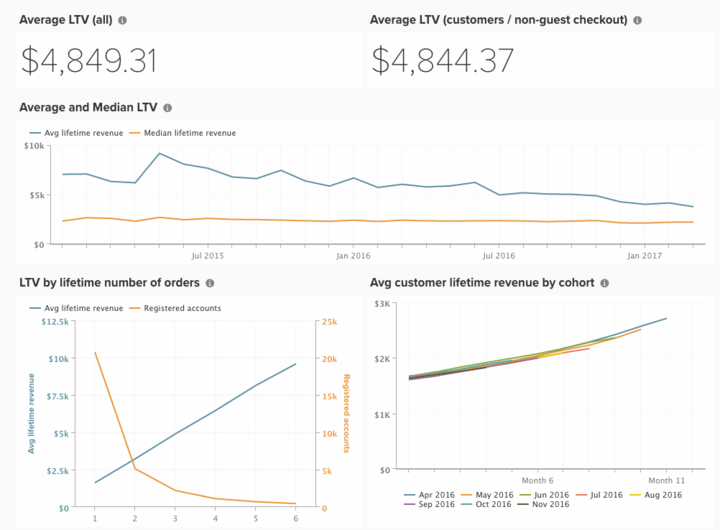

# Análise do valor vitalício esperado

Prever o valor vitalício dos clientes à medida que fazem mais pedidos é um dos aspectos mais importantes de qualquer negócio de qualquer porte.

Abaixo estão as etapas para criar análises para entender o valor vitalício de seus clientes atuais e prever como o valor vitalício aumenta com mais pedidos.

## Criar uma métrica

A primeira etapa é criar uma nova métrica com as seguintes etapas:
* Navegue até **[!UICONTROL Manage Data > Metrics]**
   * Visualizar o **[!UICONTROL Avg lifetime revenue]** existente.

  >[!NOTE]
  >
  >A tabela em que essa métrica é construída (provavelmente `customer_entity` ou `sales_order`, dependendo da capacidade da loja de aceitar o check-out de convidado).

   * Clique em **[!UICONTROL Create New Metric]** e selecione a tabela acima.
   * Esta métrica executa uma **Mediana** na coluna `Customer's lifetime revenue`, ordenada por `created_at`.
      * [!UICONTROL Filters]:
         * Adicionar o `Customers we count (Saved Filter Set)` (ou `Registered accounts we count`)

   * Nomeie a métrica, como `Median lifetime revenue`.

## Criar seu painel

Depois que a métrica for criada, você poderá **criar um painel** fazendo o seguinte:
* Navegue até **[!UICONTROL Dashboards > Dashboard Options > Create New Dashboard]**.
* Nomeie o painel como `Expected LTV`.

* É aqui que você cria e adiciona todos os relatórios.

## Criação de relatórios

>[!NOTE]
>
>Em **[!UICONTROL Time Period:]**, o período de tempo para cada relatório está listado como `All-time`. Altere isso para atender às suas necessidades de análise. A Adobe recomenda que todos os relatórios deste painel abranjam o mesmo período de tempo, como `All time`, `Year-to-date` ou `Last 365 days`.

* **[!UICONTROL Average LTV (all)]**
   * [!UICONTROL Metric]: `Avg lifetime revenue`
   * [!UICONTROL Time period]: `All time`
   * &#x200B;
     [!UICONTROL Intervalo]: `None`
   * [!UICONTROL Chart Type]: `Number (scalar)`

* **[!UICONTROL Average LTV (customers / non-guest checkout)]**
   * [!UICONTROL Metric]: `Avg lifetime revenue`
      * Adicionar [!UICONTROL filters]:
         * [`A`] `Customer's group code` **Não Igual A** `Not Logged In`
         * [`B`] `Customer's lifetime number of orders` **Maior Que**`0`

   * [!UICONTROL Time period]: `All time`
   * &#x200B;
     [!UICONTROL Intervalo]: `None`
   * [!UICONTROL Chart Type]: `Number (scalar)`

* **[!UICONTROL Average and Median LTV]**
   * Métrica `1`: `Avg lifetime revenue`
   * Métrica `2`: `Median lifetime revenue`
   * [!UICONTROL Time period]: `All time`
   * [!UICONTROL Interval]: `By Month`
   * &#x200B;
     [!UICONTROL Tipo de gráfico]: `Line`
   * Desmarcar `Multiple Y-Axes`

* **LTV por número de pedidos vitalícios**
   * Métrica `1`: `Avg lifetime revenue`
   * Métrica `2`: `New customers`
   * [!UICONTROL Time period]: `All time`
   * &#x200B;
     [!UICONTROL Intervalo]: `None`
   * [!UICONTROL Group by]: `Customer's lifetime number of orders`
   * &#x200B;
     [!UICONTROL Tipo de gráfico]: `Line`

  >[!NOTE]
  >
  >Não adicione todos os valores para `Customer's lifetime number of orders`. Em vez disso, observe um ponto em que o número de Novos clientes atinge um número pequeno e adicione manualmente o número de vida útil de cada cliente do valor do pedido a esse ponto. Por exemplo, se houver 200 clientes em um pedido, 75 em dois, 15 em três e 3 em quatro, adicione *1, 2 e 3*.

* Adicionar o relatório [!UICONTROL Avg customer lifetime revenue by cohort] existente.

Depois de criar os relatórios, consulte a imagem na parte superior deste tópico para saber como organizar os relatórios em seu painel.
