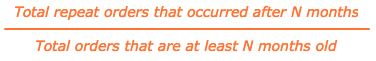

# Repetir declínio e churn de probabilidade

Se uma parte de sua receita vem de compras repetidas, você provavelmente está ciente do enorme valor de uma base de clientes fiéis. Para isso, é essencial entender como ocorre o intervalo de tempo entre os pedidos e quando se espera que os clientes abandonem a produção.

Este tópico explora as análises que podem ajudá-lo a responder às seguintes perguntas:

* Qual é a probabilidade de um cliente fazer outra compra?
* Como a probabilidade de pedido repetido varia com o tempo desde a compra mais recente do cliente?
* Quando um cliente deve ser considerado com churn? E, portanto, quando deve ser o início de uma campanha de reativação?

## Métricas recomendadas

Ao analisar o declínio e o abandono da probabilidade de repetição, considere usar ([ou construção](../../data-user/reports/ess-manage-data-metrics.md)) estas métricas:

### Probabilidade de ordem de repetição inicial

Essa medida é definida como o número total de ordens repetidas, como uma porcentagem do total de ordens. Expressa de outra forma, essa é a probabilidade de uma ordem ser seguida por outra ordem. Quando essa probabilidade está acima de 50%, implica que mais da metade de todas as ordens são seguidas por uma ordem subsequente.

### Probabilidade de ordem de repetição em determinados meses desde a ordem

Essa medida demonstra a probabilidade de um usuário fazer um pedido novamente considerando o número de meses decorridos desde o último pedido. A fórmula usada para gerar essa métrica simplifica o para:

Dependendo do seu modelo de negócios, a probabilidade de pedido repetido pode diminuir imediatamente depois que um cliente faz um pedido e continuar a diminuir nos meses seguintes, ou pode demonstrar variações sazonais e picos.

Entender a porcentagem de clientes que devem fazer compras repetidas (e como isso evolui com o tempo) permite direcionar os clientes em intervalos para maximizar a probabilidade de uma compra repetida. Assim, quando a probabilidade de compra repetida estiver diminuindo, você pode escolher um momento para identificar um cliente como com churn e alternar seus esforços de retenção para reativação.

## Exemplo de hoje

Observe o declínio de probabilidade de repetição para um negócio de comércio eletrônico típico.

### Probabilidade de ordem de repetição inicial

Neste exemplo, a probabilidade inicial de pedido repetido - ou a probabilidade de um cliente fazer uma compra repetida - é de 60%. Isso significa que 60% de todos os pedidos feitos com essa empresa são seguidos por um pedido subsequente.

### Probabilidade de ordem de repetição em determinados meses desde a ordem

Este relatório mostra a probabilidade de um cliente fazer um pedido novamente, considerando que alguns meses se passaram desde o último pedido. Embora não haja uma definição singular para o limite de churn dado esse relatório, Adobe recomenda definir churn como o ponto onde o declínio da probabilidade cruza o valor que é metade da taxa de probabilidade de repetição inicial.

Como a taxa de probabilidade de repetição inicial para este exemplo é de 60%, a data de churn seria o momento em que a probabilidade de ordem de repetição cai abaixo de 60%/2 = 30%, ou em cerca de 6 meses. Dos 60% de pedidos que deveriam ser seguidos por outro pedido, metade deles foi feita nos primeiros 6 meses.

Explicado de outra maneira, se um cliente fosse fazer um pedido de acompanhamento, é mais provável que ele o tenha feito dentro de seis meses do último pedido do que após a marca de seis meses. Se um cliente não tiver comprado novamente após seis meses, uma campanha de reativação deve ser iniciada para atrair esse cliente de volta.

Dependendo do seu modelo de negócios, talvez você queira escolher um limite diferente, como o ponto em que a probabilidade de ordem de repetição cai abaixo de 50% ou 10%. Se o seu conhecimento interno sugere um número diferente, então, por todos os meios, você deve usá-lo!

Em última análise, a meta é selecionar o limite no qual faz sentido alternar de retenção para esforços de reativação. Os esforços de retenção podem envolver emails para reengajamento com clientes existentes com sugestões de compras de acompanhamento para serem feitas, enquanto os esforços de reativação podem envolver emails para clientes obsoletos com cupons e ofertas.

## Quais perguntas devo considerar?

Para ajudá-lo a entender a probabilidade de ordem repetida conforme se aplica à sua empresa, a Adobe sugere considerar essas perguntas ao explorar seus próprios dados:

* A probabilidade inicial de repetição da ordem é esperada? Caso contrário, por que você acha que deveria ser maior ou menor?
* Existem grandes reduções na probabilidade de ordem repetida para meses específicos desde a última ordem? Em caso afirmativo, essas alterações são esperadas?
* Qual é o limite de churn atual?
* Seu limite de churn atual está alinhado a um dos valores em sua probabilidade de ordem de repetição, determinados meses desde o relatório do último pedido?
* Seu limite atual reflete seus esforços de publicidade ao alternar de retenção para reativação?
* Faz sentido para sua empresa alterar o limite para o mês em que o declínio de probabilidade cruza o valor que é metade da taxa de probabilidade de repetição inicial?

## O que mais devo analisar?

Depois de criar a análise acima e determinar um limite de churn, você pode criar mais análises para identificar tendências comuns em usuários churn. Por exemplo, os clientes com churn foram adquiridos durante o mesmo período de tempo ou compraram produtos semelhantes em seu último pedido? Depois que um limite de churn é definido, você pode se aprofundar em características específicas desses clientes churn.

Se você oferecer mais de um produto, provavelmente se perguntará como os clientes que compram um produto específico se comportam de forma diferente ao longo do tempo em comparação a outros clientes. Quer saber mais? Confira este tutorial para explorar o comportamento de compra vitalícia dos coortes de clientes com base nos produtos específicos que eles compraram.

Esta prática recomendada é fornecida por [!DNL Adobe Commerce Intelligence] Serviços de análise de dados (DAS). [Entrar em contato com o suporte](https://experienceleague.adobe.com/docs/commerce-knowledge-base/kb/troubleshooting/miscellaneous/mbi-service-policies.html) para obter mais informações.

### Relacionados

* [Análise do impacto do cupom na aquisição e retenção de clientes](../analysis/coupon-impact.md)
* [Análise do comportamento de recompra do cliente](../analysis/repurchase-behavior.md)
