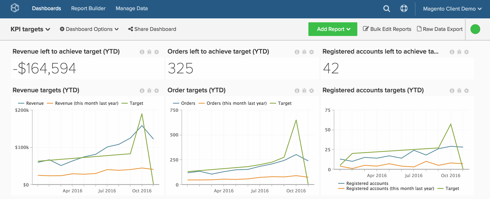

# Rastreamento De Metas Em Relação Às Métricas De Desempenho

A maioria dos clientes gostaria de acompanhar suas **metas comerciais**, mas não percebe que isso é possível em [!DNL Adobe Commerce Intelligence]. Este tópico demonstra como configurar um painel que ajudará você a controlar suas metas de negócios em relação aos dados reais, incluindo receita, novos usuários registrados e pedidos ao longo do tempo. Você também aprenderá a comparar o desempenho ano a ano, tudo em um painel como este:

Antes de começar, você deve revisar o [carregador de arquivos](../importing-data/connecting-data/using-file-uploader.md) e verificar se definiu suas metas comerciais para um determinado período.

## Introdução

Primeiro, faça upload de um arquivo contendo metas diárias/mensais/trimestrais específicas para sua empresa.

Você pode usar o [carregador de arquivos](../importing-data/connecting-data/using-file-uploader.md) e a imagem abaixo para formatar o arquivo. Os destinos mais comuns que os clientes monitoram em [!DNL Commerce Intelligence] incluem Pedidos, Receita e Novas contas registradas.

## Métricas

Crie uma nova métrica para cada target. Por exemplo, se você fizer upload dos destinos mensais de receita e pedidos, será necessário criar duas novas métricas:

* **Meta de receita mensal**
* Na tabela **`Monthly goals`**
* Esta métrica executa uma **Soma**
* Na coluna **`Revenue target`**
* Ordenado pelo carimbo de data/hora **`Month`**

* **Destino de pedidos mensais**
* Na tabela **`Monthly goals`**
* Esta métrica executa uma **Soma**
* Na coluna **`Orders target`**
* Ordenado pelo carimbo de data/hora **`Month`**

* **Público alvo mensal de novas contas registradas**
* Na tabela **`Monthly goals`**
* Esta métrica executa uma **Soma**
* Na coluna **`New registered accounts target`**
* Ordenado pelo carimbo de data/hora **`Month`**

## Relatórios

É útil ter uma combinação de valores estáticos e gráficos visuais ao analisar suas metas. Abaixo estão três relatórios de exemplo para começar a rastrear o desempenho da receita.

* **Receita restante para atingir o destino**
* Métrica `A`: `Revenue`
* &#x200B;
  [!UICONTROL Métrica]: `Revenue`

* Métrica `B`: `Target Revenue`
* [!UICONTROL Metric]: `Monthly Revenue Target`

* [!UICONTROL Formula]: `Revenue left to achieve target`
* &#x200B;
  [!UICONTROL Fórmula]: `(B-A)`
* &#x200B;
  [!UICONTROL Format]: `Number`

* [!UICONTROL Time period]: (Qualquer período de tempo relevante que você desejar)
* &#x200B;
  [!UICONTROL Interval]: `Month`
* &#x200B;
  [!UICONTROL Tipo de gráfico]: `Scalar`

* **Destinos de receita**
* Métrica `A`: `Revenue`
* &#x200B;
  [!UICONTROL Métrica]: `Revenue`

* Métrica `B`: `Target Revenue`
* [!UICONTROL Metric]: `Monthly Revenue Target`

* Métrica `C`: `Revenue (amount change since previous year)` (ocultar)
* &#x200B;
  [!UICONTROL Métrica]: `Revenue`
* [!UICONTROL Perspective]: `Amount change vs. Previous year`

* [!UICONTROL Formula]: (Este mês no ano passado)
* &#x200B;
  [!UICONTROL Fórmula]: `(A-C)`
* &#x200B;
  [!UICONTROL Format]: `Currency`

* Desligar `Multiple Y-Axes`
* [!UICONTROL Time period]: (Qualquer período relevante que você desejar)*
* &#x200B;
  [!UICONTROL Interval]: `Month`
* [!UICONTROL Chart Type]: `Line Chart`

Depois de concluir os relatórios acima para metas de receita, você pode criar relatórios idênticos para metas sobre pedidos, contas registradas ou quaisquer outros valores incluídos no upload do arquivo de metas.

Após compilar todos os relatórios, você pode organizá-los no painel conforme desejar. O resultado pode parecer com a imagem na parte superior desta página.
