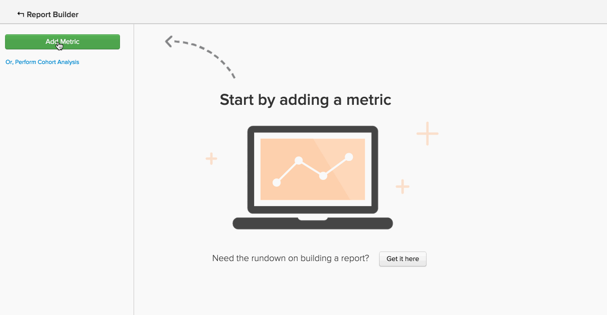

# Tipos de Coluna Calculados Avançados

Muitas análises que você pode criar envolvem o uso de uma **nova coluna** que você deseja `group by` ou `filter by`. O tutorial [Criação de colunas calculadas](../data-warehouse-mgr/creating-calculated-columns.md) aborda as noções básicas da maioria dos casos de uso, mas convém calcular uma coluna que seja um pouco mais complexa do que a que o Data Warehouse Manager pode criar.
{: #top}

Esses tipos de colunas podem ser criados pela equipe de analistas do Data Warehouse do Adobe. Para definir uma nova coluna calculada, forneça as seguintes informações:

1. O **`definition`** desta coluna (incluindo entradas, fórmulas ou formatação)
1. O **`table`** no qual você deseja criar a coluna
1. Qualquer **`example data points`** que descreva o que a coluna deve conter

Estes são alguns exemplos comuns de colunas calculadas avançadas que os usuários geralmente acham úteis:

* [Ordenar (ou classificar) evento sequencialmente](#compareevents)
* [Localizar o tempo entre dois eventos](#twoevents)
* [Comparar valores de evento sequencial](#sequence)
* [Converter moeda](#currency)
* [Converter fusos horários](#timezone)
* [Outra coisa](#else)

## Estou tentando solicitar eventos sequencialmente {#compareevents}

Isso é chamado de coluna calculada **número do evento**. Isso significa que você está tentando encontrar a sequência na qual os eventos ocorreram para um proprietário de evento específico, como um cliente ou usuário.

Veja um exemplo:

| **`event\_id`** | **`owner\_id`** | **`timestamp`** | **`Owner's event number`** |
|-----|-----|-----|-----|
| 1 | `A` | 01-01-2015 00:00:00 | 1 |
| 2 | `B` | 01-01-2015 00:30:00 | 1 |
| 3 | `A` | 01-01-2015 02:00:00 | 2 |
| 4 | `A` | 01-01-2015 13:00:00 | 3 |
| 5 | `B` | 01-01-2015 13:00:00 | 2 |

{style="table-layout:auto"}

Uma coluna calculada de número de evento pode ser usada para observar diferenças de comportamento entre eventos de primeira vez, eventos repetidos ou enésimos eventos em seus dados.

Deseja ver a coluna de número de pedido do Cliente em ação? Clique na imagem para vê-la usada como uma dimensão Agrupar por em um relatório.

<!--{: style="max-width: 500px;"}-->

Para criar esse tipo de coluna calculada, você precisa saber:

* A tabela na qual você deseja criar esta coluna
* O campo que identifica o proprietário dos eventos (`owner\_id` neste exemplo)
* O campo pelo qual você deseja ordenar os eventos (`timestamp` neste exemplo)

[Voltar ao início](#top)

## Estou tentando encontrar o tempo entre dois eventos. {#twoevents}

Isso é chamado de coluna calculada `date difference`. Isso significa que você está tentando encontrar o tempo entre dois eventos pertencentes a um único registro, com base nos carimbos de data e hora do evento.

Veja um exemplo:

| `id` | `timestamp\_1` | `timestamp\_2` | `Seconds between timestamp\_2 and timestamp\_1` |
|-----|-----|-----|-----|
| `A` | 01-01-2015 00:00:00 | 01/2015/12:30:00 | 45000 |
| `B` | 01-01-2015 08:00:00 | 01/2015/10:00:00 | 7200 |

{style="table-layout:auto"}

Uma coluna calculada de diferença de data pode ser usada para criar uma métrica que calcula o tempo médio ou mediano entre dois eventos. Clique na imagem abaixo para verificar como a métrica `Average time to first order` é usada em um relatório.

<!--{: style="max-width: 500px;"}-->

Para criar esse tipo de coluna calculada, você precisa saber:

* A tabela na qual você deseja criar esta coluna
* Os dois carimbos de data e hora entre os quais você deseja saber a diferença

[Voltar ao início](#top)

## Estou tentando comparar valores de eventos sequenciais. {#sequence}

Isso é chamado de **comparação de eventos sequenciais**. Isso significa que você está tentando encontrar o delta entre um valor (moeda, número, carimbo de data e hora) e o valor correspondente para o evento anterior do proprietário.

Veja um exemplo:

| **`event\_id`** | **`owner\_id`** | **`timestamp`** | **`Seconds since owner's previous event`** |
|-----|-----|-----|-----|
| 1 | `A` | 01-01-2015 00:00:00 | NULL |
| 2 | `B` | 01-01-2015 00:30:00 | NULL |
| 3 | `A` | 01-01-2015 02:00:00 | 7720 |
| 4 | `A` | 01-01-2015 13:00:00 | 126000 |
| 5 | `B` | 01-01-2015 13:00:00 | 217800 |

{style="table-layout:auto"}

Uma comparação de eventos sequenciais pode ser usada para encontrar o tempo médio ou mediano entre cada evento sequencial. Clique na imagem abaixo para ver as métricas **Tempo médio e mediano entre pedidos** em ação.

=<!--{: style="max-width: 500px;"}-->

Para criar esse tipo de coluna calculada, você precisa saber:

* A tabela na qual você deseja criar esta coluna
* O campo que identifica o proprietário dos eventos (`owner\_id` no exemplo)
* O campo de valor que você gostaria de ver a diferença entre para cada evento sequencial (`timestamp` neste exemplo)

[Voltar ao início](#top)

## Estou tentando converter moeda. {#currency}

Uma coluna calculada **conversão de moeda** converte valores de transação de uma moeda registrada para uma moeda de relatório, com base na taxa de câmbio no momento do evento.

Veja um exemplo:

| **`id`** | **`timestamp`** | **`transaction\_value\_EUR`** | **`transaction\_value\_USD`** |
|-----|-----|-----|-----|
| `1` | 01-01-2015 00:00:00 | 30 | 33,57 |
| `2` | 01-01-2015 00:00:00 | 50 | 55,93 |

{style="table-layout:auto"}

Para criar esse tipo de coluna calculada, você precisa saber:

* A tabela na qual você deseja criar esta coluna
* A coluna de valor da transação que você deseja converter
* A coluna que indica a moeda em que os dados foram registrados (normalmente um código ISO)
* A moeda de relatório preferencial

[Voltar ao início](#top)

## Estou tentando converter fusos horários. {#timezone}

Uma coluna calculada **conversão de fuso horário** converte os carimbos de data/hora de uma determinada fonte de dados de seu fuso horário registrado para um fuso horário de relatórios.

Veja um exemplo:

| **`id`** | **`timestamp\_UTC`** | **`timestamp\_ET`** |
|-----|-----|-----|
| `1` | 01-01-2015 00:00:00 | 2014-12-31 19:00:00 |
| `2` | 01/2015/12:00:00 | 01-01-2015 07:00:00 |

{style="table-layout:auto"}

Para criar esse tipo de coluna calculada, você precisa saber:

* A tabela na qual você deseja criar esta coluna
* A coluna de carimbo de data e hora que você deseja converter
* O fuso horário em que os dados foram registrados
* O fuso horário preferencial para relatórios

[Voltar ao início](#top)

## Estou tentando fazer algo que não está listado aqui. {#else}

Não se preocupe. Só porque não está listado aqui não significa que não seja possível. A equipe do Adobe de analistas da Data Warehouse pode ajudar.

Para definir uma nova coluna calculada, [envie um tíquete de suporte](https://experienceleague.adobe.com/docs/commerce-knowledge-base/kb/troubleshooting/miscellaneous/mbi-service-policies.html) com detalhes sobre exatamente o que deseja criar.

## Documentação relacionada

* [Criação de colunas calculadas](../data-warehouse-mgr/creating-calculated-columns.md)
* [Tipos de coluna calculados](../data-warehouse-mgr/calc-column-types.md)
* [Compilando  [!DNL Google ECommerce] dimensões com dados de ordem e cliente](../data-warehouse-mgr/bldg-google-ecomm-dim.md)
