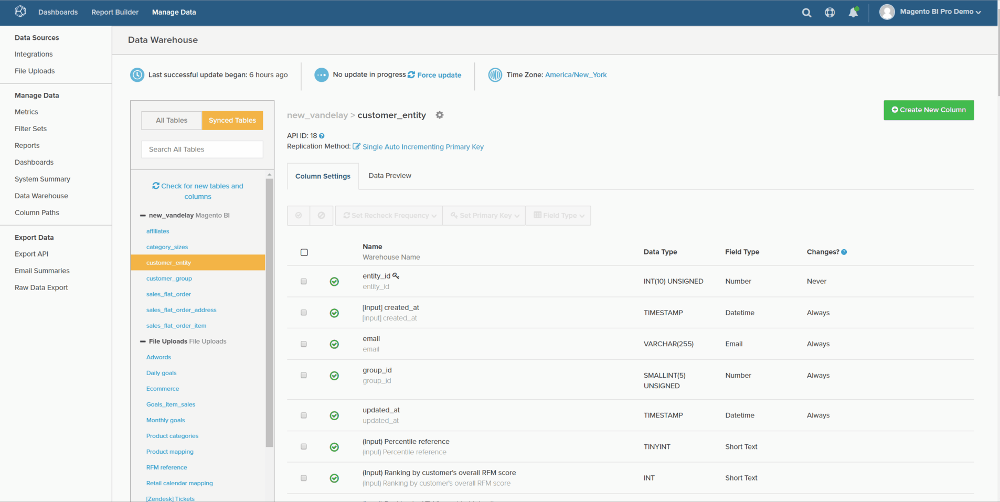

# Tipos de Colunas Calculadas

* [Mesmos cálculos de tabela](#sametable)
* [Um para muitos cálculos](#onetomany)
* [Muitos cálculos a um](#manytoone)
* [Mapa de referência útil](#map)
* [Colunas calculadas avançadas](#advanced)

No [Gerenciador de Datas Warehouse](../data-warehouse-mgr/tour-dwm.md), é possível criar colunas para aumentar e otimizar seus dados para análise. [Essa funcionalidade](../data-warehouse-mgr/creating-calculated-columns.md) pode ser acessada selecionando qualquer tabela no Gerenciador de Datas Warehouse e clicando em **[!UICONTROL Create New Column]**.

Este artigo descreve os tipos de colunas que você pode criar com o Gerenciador de Datas Warehouse, juntamente com uma descrição, uma apresentação visual dessa coluna e uma [mapa de referência](#map) de todas as entradas necessárias para criar uma coluna. Há três maneiras de criar colunas calculadas:

* [Colunas calculadas da mesma tabela](#sametable)
* [Colunas calculadas de um para muitos](#onetomany)
* [Colunas calculadas de muitas para uma](#manytoone)

## Colunas calculadas da mesma tabela {#sametable}

Essas colunas são criadas usando colunas de entrada da mesma tabela.

### Idade {#age}

Uma coluna calculada por idade retorna o número de segundos entre a hora atual e algum tempo de entrada.

No exemplo abaixo, criamos `Seconds since customer's most recent order` no `customers` tabela. Isso pode ser aproveitado para criar listas de usuários de clientes que não fizeram compras (às vezes chamadas de rotatividade) no `X days`.

### Conversor de moeda

Uma coluna calculada do conversor de moeda converte a moeda nativa de uma coluna para uma nova moeda desejada.

No exemplo abaixo, criamos `base\_grand\_total In AED`, conversão da variável `base\_grand\_total` da moeda original para o AED na variável `sales\_flat\_order` tabela. Essa coluna funciona bem em lojas com várias moedas que desejam relatar na moeda local.

Para clientes do Commerce, a variável `base\_currency\_code` normalmente armazena moedas nativas. O `Spot Time` deve corresponder à data usada em suas métricas.

## Colunas calculadas de um para muitos {#onetomany}

`One-to-Many` columns [utilizar um caminho entre duas tabelas](../../data-analyst/data-warehouse-mgr/create-paths-calc-columns.md). Esse caminho sempre implica uma única tabela, onde um atributo existe, e uma tabela muitos, na qual esse atributo é &quot;realocado&quot;. O caminho pode ser descrito como um `foreign key--primary key` relação.

### Coluna unida {#joined}

Uma coluna unida realoca um atributo em uma tabela *para* a mesa de muitos. O exemplo clássico de um/muitos é clientes (um) e pedidos (muitos).

No exemplo abaixo, a variável `Customer's group\_id` é unida à variável `orders` tabela.

## Colunas calculadas de muitas para uma {#manytoone}

Essas colunas utilizam os mesmos caminhos que as colunas de um para muitos, mas apontam os dados na direção oposta. A coluna é criada em um lado do caminho, ao contrário dos vários lados. Devido a essa relação, o valor na coluna precisa ser um agregado, ou seja, uma operação matemática executada nos pontos de dados em vários lados. Há muitos casos de uso para isso e alguns estão listados abaixo.

### Contagem {#count}

Esse tipo de coluna calculada retorna a contagem de valores na tabela de muitos *onto* a única mesa.

No exemplo abaixo, a dimensão `Customer's lifetime number of canceled orders` é criado no `customers` tabela (com um filtro para `orders.status`).

{: width=&quot;699&quot; height=&quot;351&quot;}

### Soma {#sum}

Uma coluna calculada de soma é a soma dos valores no `many` em uma mesa.

Isso pode ser usado para criar dimensões no nível do cliente como `Customer's lifetime revenue`.

### Mín. ou Máx. {#minmax}

Uma coluna calculada mín. ou máx. retorna o menor ou maior registro existente em muitos lados.

Isso pode ser usado para criar dimensões no nível do cliente como `Customer's first order date`.

### Existe {#exists}

Uma coluna calculada existe é um teste binário que determina a presença de um registro em vários lados. Em outras palavras, a nova coluna retornará uma `1` se o caminho se conectar pelo menos uma linha em cada tabela, e `0` se não for possível estabelecer conexão.

Esse tipo de dimensão pode determinar, por exemplo, se um cliente já comprou um produto específico. Uso de uma ligação entre uma `customers` tabela e `orders` tabela, um filtro para um produto específico, uma dimensão `Customer has purchased Product X?` pode ser construído.

## Mapa de referência útil {#map}

Se você estiver tendo algum problema em lembrar quais são todas as entradas ao criar uma coluna calculada, tente manter esse mapa de referência acessível ao criar:

## Colunas calculadas avançadas {#advanced}

Na sua busca para analisar e responder perguntas sobre sua empresa, você pode encontrar uma situação em que não consegue criar a coluna exata desejada. Nesses casos, nós o cobrimos!

Para garantir uma resposta rápida, recomendamos verificar o [Tipos de Colunas Calculadas Avançadas](../../data-analyst/data-warehouse-mgr/adv-calc-columns.md) guia para ver que tipo de colunas nossa equipe de suporte pode criar. Nesse artigo, também cobrimos as informações necessárias para criar a coluna - inclua-a com sua solicitação.

## Documentação relacionada

* [Criação de colunas calculadas](../../data-analyst/data-warehouse-mgr/creating-calculated-columns.md)
* [Criação/exclusão de caminhos para colunas calculadas](../../data-analyst/data-warehouse-mgr/create-paths-calc-columns.md)
* [Como entender e avaliar relações de tabela](../../data-analyst/data-warehouse-mgr/table-relationships.md)
