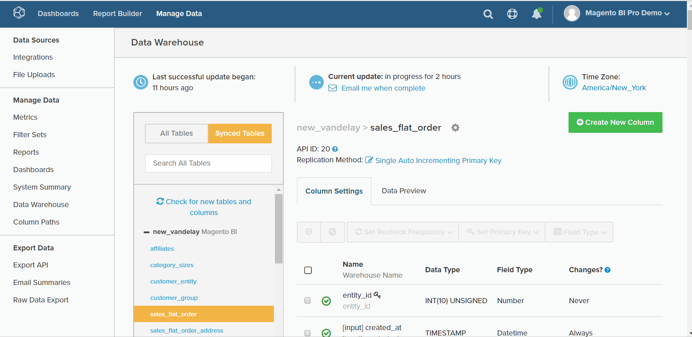
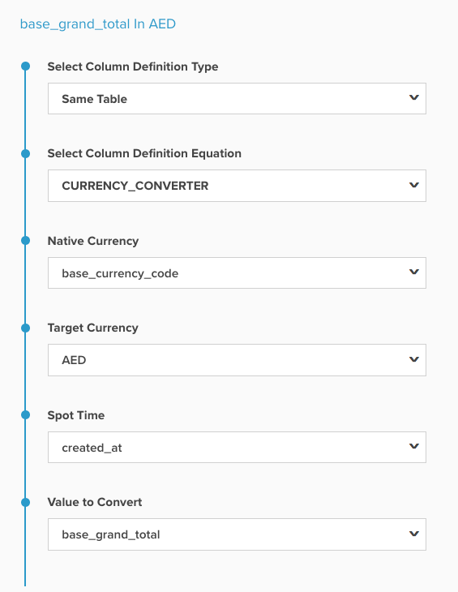
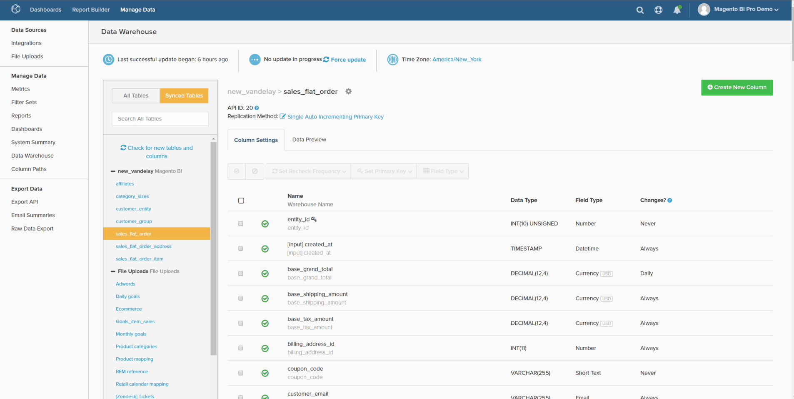
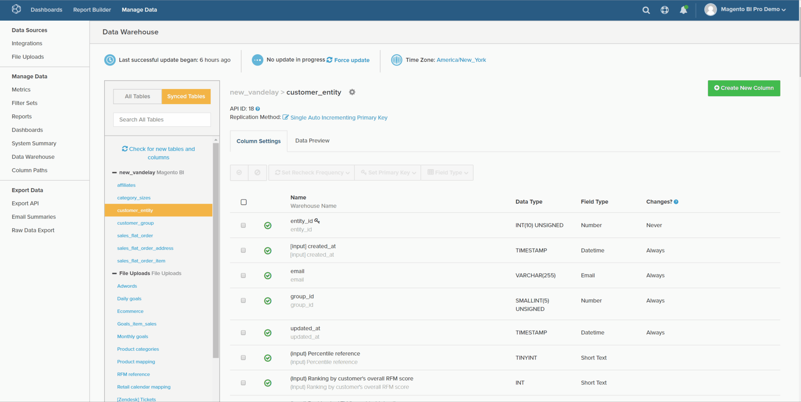
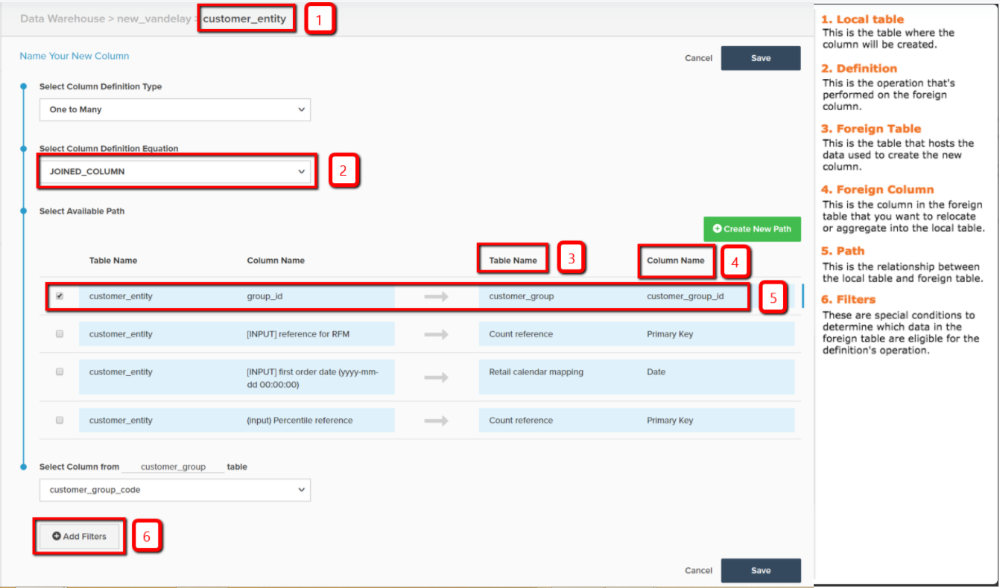

# Tipos de Colunas Calculadas

* [Mesmos cálculos de tabela](#sametable)
* [Um para muitos cálculos](#onetomany)
* [Cálculos de muitos para um](#manytoone)
* [Mapa de referência prático](#map)
* [Colunas calculadas avançadas](#advanced)

No [Data Warehouse Manager](../data-warehouse-mgr/tour-dwm.md), você pode criar colunas para aumentar e otimizar seus dados para análise. [Esta funcionalidade](../data-warehouse-mgr/creating-calculated-columns.md) pode ser acessada selecionando qualquer tabela no Data Warehouse Manager e clicando em **[!UICONTROL Create New Column]**.

Este tópico descreve os tipos de colunas que você pode criar com o Data Warehouse Manager. Também aborda a descrição, uma apresentação visual dessa coluna e um [mapa de referência](#map) de todas as entradas necessárias para criar uma coluna. Há três maneiras de criar colunas calculadas:

1. [Mesmas colunas calculadas da tabela](#sametable)
1. [Colunas calculadas de um para muitos](#onetomany)
1. [Colunas calculadas de muitos para um](#manytoone)

## Mesmas colunas calculadas da tabela {#sametable}

Essas colunas são criadas usando colunas de entrada da mesma tabela.

### Idade {#age}

Uma coluna calculada por idade retorna o número de segundos entre a hora atual e a hora de entrada.

O exemplo abaixo cria `Seconds since customer's most recent order` na tabela `customers`. Isso pode ser usado para criar listas de usuários de clientes que não fizeram compras (às vezes chamadas de churning) em `X days`.

### Conversor de moeda

Uma coluna calculada de conversor de moeda converte a moeda nativa de uma coluna para uma nova moeda desejada.

O exemplo abaixo cria `base\_grand\_total In AED`, convertendo `base\_grand\_total` de sua moeda nativa para AED na tabela `sales\_flat\_order`. Essa coluna funciona bem para lojas com várias moedas que desejam relatar em sua moeda local.

Para clientes Commerce, o campo `base\_currency\_code` geralmente armazena moedas nativas. O campo `Spot Time` deve corresponder à data usada em suas métricas.

## Colunas calculadas de um para muitos {#onetomany}

`One-to-Many` colunas [usam um caminho entre duas tabelas](../../data-analyst/data-warehouse-mgr/create-paths-calc-columns.md). Esse caminho sempre implica em uma tabela, onde vive um atributo, e em uma tabela &quot;many&quot;, onde esse atributo é &quot;realocado&quot;. O caminho pode ser descrito como uma relação `foreign key--primary key`.

### Coluna unida {#joined}

Uma coluna unida realoca um atributo em uma tabela *para* a muitas tabelas. O exemplo clássico de um/muitos é clientes (um) e pedidos (muitos).

No exemplo abaixo, a dimensão `Customer's group\_id` é unida à tabela `orders`.

## Colunas calculadas de muitos para um {#manytoone}

Essas colunas usam os mesmos caminhos que as colunas de um para muitos, mas apontam os dados na direção oposta. A coluna é criada em um lado do caminho, em vez do lado muitos. Devido a essa relação, o valor na coluna precisa ser uma agregação, ou seja, uma operação matemática executada nos pontos de dados em vários lados. Há muitos casos de uso para isso, e alguns estão listados abaixo.

### Contagem {#count}

Este tipo de coluna calculada retorna a contagem de valores em muitas tabelas *em* a uma tabela.

No exemplo abaixo, a dimensão `Customer's lifetime number of canceled orders` é criada na tabela `customers` (com um filtro para `orders.status`).

{: width="699" height="351"}

### Sum {#sum}

Uma coluna calculada de soma é a soma dos valores na tabela `many` em uma tabela.

Isso pode ser usado para criar dimensões de nível de cliente como `Customer's lifetime revenue`.

### Mínimo ou máximo {#minmax}

Uma coluna calculada mín. ou máx. retorna o menor ou o maior registro existente no lado muitos.

Isso pode ser usado para criar dimensões de nível de cliente como `Customer's first order date`.

### Existe {#exists}

Uma coluna calculada é um teste binário que determina a presença de um registro em vários lados. Em outras palavras, a nova coluna retornará um `1` se o caminho conectar pelo menos uma linha em cada tabela, e `0` se nenhuma conexão puder ser feita.

Esse tipo de dimensão pode determinar, por exemplo, se um cliente comprou um produto específico. Usando uma junção entre uma tabela `customers` e uma tabela `orders`, um filtro para um produto específico, uma dimensão `Customer has purchased Product X?` pode ser criada.

## Mapa de referência prático {#map}

Se você estiver tendo problemas para lembrar o que são todas as entradas ao criar uma coluna calculada, mantenha esse mapa de referência disponível quando estiver criando:

## Colunas calculadas avançadas {#advanced}

Em sua busca para analisar e responder perguntas sobre sua empresa, você pode se deparar com uma situação em que não é possível criar a coluna exata desejada.

Para garantir uma recuperação rápida, a Adobe recomenda consultar o guia [Tipos de Coluna Calculados Avançados](../../data-analyst/data-warehouse-mgr/adv-calc-columns.md) para ver que tipo de colunas a equipe de suporte da Adobe pode criar. Esse tópico também aborda as informações necessárias para criar a coluna; inclua-a na solicitação.

## Documentação relacionada

* [Criação de colunas calculadas](../../data-analyst/data-warehouse-mgr/creating-calculated-columns.md)
* [Criação/exclusão de caminhos para colunas calculadas](../../data-analyst/data-warehouse-mgr/create-paths-calc-columns.md)
* [Entendendo e avaliando relações de tabelas](../../data-analyst/data-warehouse-mgr/table-relationships.md)
