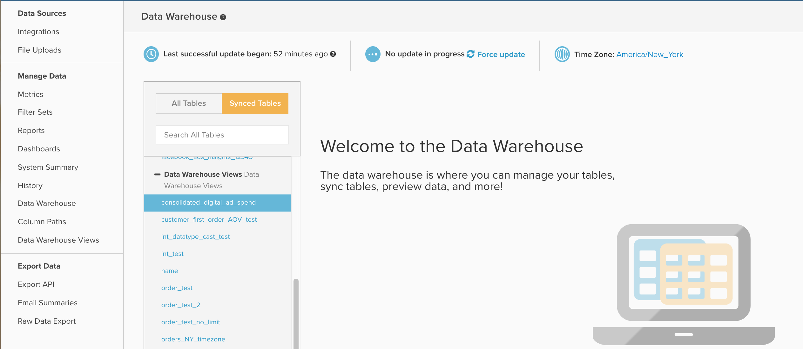

# Trabalhar com exibições de Data Warehouse

Este documento descreve a finalidade e os usos de `Data Warehouse Views` acessível navegando até **[!UICONTROL Manage Data]** > **[!UICONTROL Data Warehouse Views]**. Abaixo está uma explicação do que ele faz e como criar novas exibições, bem como um exemplo de como usar `Data Warehouse Views` para consolidar [!DNL Facebook] e [!DNL AdWords] gastar dados.

## Finalidade geral

O `Data Warehouse Views` é um método para criar novas tabelas armazenadas modificando uma tabela existente ou unindo ou consolidando várias tabelas através do uso do SQL. Uma vez `Data Warehouse View` tiver sido criada e processada por um ciclo de atualização, ela será preenchida em sua Data Warehouse como uma nova tabela na variável `Data Warehouse Views` , conforme mostrado abaixo:



A partir daqui, sua nova visualização funcionará como qualquer outra tabela, fornecendo a você o poder de criar novas colunas calculadas ou criar métricas e relatórios sobre ela.

`Data Warehouse Views` são usados principalmente para consolidar várias tabelas semelhantes, mas distintas, de modo que todos os relatórios podem ser criados em uma única nova tabela. Alguns exemplos comuns incluem a consolidação das tabelas de um banco de dados herdado e um banco de dados dinâmico para combinar dados históricos e atuais, ou combinar várias fontes de anúncios, como Facebook e AdWords, em um único `Consolidated ad spend` tabela.

Se você estiver familiarizado com o SQL, ambos os exemplos de consolidação utilizam a variável `UNION` , mas você pode usar qualquer sintaxe e função PostgreSQL ao criar uma nova visualização.

## Criação e gerenciamento de exibições de Data Warehouse

Novo `Data Warehouse Views` podem ser criadas e as exibições existentes podem ser excluídas navegando até **[!UICONTROL Manage Data]** > **[!UICONTROL Data Warehouse Views]**, conforme mostrado abaixo:


Aqui, você pode criar uma nova visualização seguindo as instruções de exemplo abaixo:

1. Se observar uma exibição existente, clique em **[!UICONTROL New Data Warehouse View]** para abrir uma janela de query em branco. Se uma janela de query em branco já estiver aberta, prossiga para a próxima etapa.
1. Dê um nome à exibição digitando no `View Name` campo. O nome fornecido aqui determinará o nome de exibição da exibição na Data Warehouse. `View names` são limitadas a letras minúsculas, números e sublinhados (_). Todos os outros caracteres são proibidos.
1. Insira seu query na janela intitulada `Select Query`, usando a sintaxe PostgreSQL padrão.
   >[!NOTE]
   >
   >Sua consulta deve fazer referência a nomes de colunas específicos. O uso da variável `*`não é permitido caractere para selecionar todas as colunas.

1. Quando terminar, clique em **[!UICONTROL Save]** para salvar sua visualização. Observe que sua exibição terá temporariamente um `Pending` status até que seja processado pelo próximo ciclo de atualização completo, em que o status será alterado para `Active`. Após ser processada por uma atualização, sua visualização estará pronta para ser usada nos relatórios.

É importante mencionar que, depois de salvar, a query subjacente usada para gerar uma `Data Warehouse View` não pode ser editado. Se por algum motivo você precisar ajustar a estrutura de um `Data Warehouse View`, será necessário criar uma nova visualização e migrar manualmente quaisquer colunas, métricas ou relatórios calculados da exibição original para a nova. Quando a migração estiver concluída, você poderá excluir com segurança a exibição original. Porque `Data Warehouse Views` não são editáveis, recomendamos que você teste a saída de seu query usando o `SQL Report Builder` antes de salvar sua consulta como uma Exibição de Data Warehouse.

## Exemplo: [!DNL Facebook] e [!DNL Google AdWords] dados

Vejamos de perto um dos exemplos mencionados anteriormente neste artigo: consolidação [!DNL Facebook] e [!DNL AdWords] gastar dados em uma nova tabela de anúncios consolidados. Geralmente, isso envolve a consolidação de duas tabelas, com amostras de conjuntos de dados abaixo:

`Ad source: Google AdWords`

`Table name: campaigns67890`

`Sample data:`

| **`_id`** | **`campaign`** | **`adClicks`** | **`date`** | **`impressions`** | **`adCost`** |
|--- |--- |--- |--- |--- |--- |
| 1 | eee | 60 | 2017-05-05 00:00:00 | 2000 | 10.2 |
| 2 | ggg | 40 | 2017-05-23 00:00:00 | 900 | 4.6 |
| 3 | aaa | 22 | 2017-06-12 00:00:00 | 400 | 2.5 |
| 4 | eee | 350 | 2017-06-30 00:00:00 | 14500 | 35 |
| 5 | fff | 280 | 2017-07-10 00:00:00 | 10200 | 28.5 |

`Ad source: Facebook`

`Table name: facebook_ads_insights_12345`

`Sample data:`

| **`_id`** | **`campaign`** | **`adClicks`** | **`date`** | **`impressions`** | **`adCost`** |
|--- |--- |--- |--- |--- |--- |
| 1 | aaa | 25 | 2017-05-01 00:00:00 | 1200 | 5 |
| 2 | ddd | 12 | 2017-05-15 00:00:00 | 800 | 2.5 |
| 3 | aaa | 40 | 2017-05-22 00:00:00 | 2000 | 7 |
| 4 | aaa | 110 | 2017-06-08 00:00:00 | 6000 | 10 |
| 5 | ccc | 5 | 2017-07-06 00:00:00 | 300 | 1.2 |

Para criar uma única tabela de gastos com anúncios contendo ambos [!DNL Facebook] e [!DNL AdWords] campanhas, precisaremos gravar uma consulta SQL e usar o `UNION ALL` . A `UNION ALL` é usada com mais frequência para combinar várias queries SQL distintas enquanto anexa os resultados de cada query a uma única saída.

Existem alguns requisitos para `UNION` declaração que vale a pena mencionar, conforme descrito no PostgreSQL [documentação](https://www.postgresql.org/docs/8.3/queries-union.html):

* Todos os queries devem retornar o mesmo número de colunas
* As colunas correspondentes devem ter tipos de dados idênticos

Ao executar um `UNION` ou `UNION ALL` , os nomes das colunas na saída final refletem o nome das colunas em sua primeira query.

Na maioria dos casos, consolida sua [!DNL Facebook] e [!DNL Google AdWords] gastar dados em um `Data Warehouse View` O exigirá a criação de uma tabela com sete colunas, com uma consulta semelhante à abaixo:

```sql
    SELECT
        "_id" as id,
        'AdWords' as ad_source,
        "date",
        "campaign",
        "adCost" as spend,
        "impressions",
        "adClicks" as clicks
    FROM campaigns67890
    UNION
    SELECT
        "_id" as id,
        'Facebook' as ad_source,
        "date_start" as date,
        "campaign_name" as campaign,
        "spend",
        "impressions",
        "clicks"
    FROM facebook_ads_insights_12345
```

Alguns pontos importantes sobre o acima:

* Por uma questão de clareza, todas as colunas são colocadas acima de modo que os nomes correspondam a todos os queries. No entanto, não se trata de um requisito. A ordem em que as colunas são chamadas nos queries SELECT determina como elas são alinhadas.
* Uma nova coluna chamada `ad_source` é criado para facilitar o filtro para [!DNL AdWords] ou [!DNL Facebook] dados. Lembre-se de que esta consulta combina todos os dados de ambas as tabelas. Se você não criar uma coluna como `ad_source`, não haverá uma maneira fácil de identificar os gastos de uma fonte específica.

Salvar a consulta acima como uma `Data Warehouse View` criará uma nova tabela com [!DNL Facebook] e [!DNL AdWords] gastos, semelhantes aos abaixo:

| **`id`** | **`ad_source`** | **`date`** | **`campaign`** | **`spend`** | **`impressions`** | **`clicks`** |
|--- |--- |--- |--- |--- |--- |--- |
| **1** | [!DNL Facebook] | 2017-05-01 00:00:00 | aaa | 5 | 1200 | 25 |
| **1** | [!DNL Google AdWords] | 2017-05-05 00:00:00 | eee | 10.2 | 2000 | 60 |
| **2** | [!DNL Facebook] | 2017-05-15 00:00:00 | ddd | 2.5 | 800 | 12 |
| **2** | [!DNL Google AdWords] | 2017-05-23 00:00:00 | ggg | 4.6 | 900 | 40 |
| **3** | [!DNL Facebook] | 2017-05-22 00:00:00 | aaa | 7 | 2000 | 40 |
| **3** | [!DNL Google AdWords] | 2017-06-12 00:00:00 | aaa | 2.5 | 400 | 22 |
| **4** | [!DNL Facebook] | 2017-06-08 00:00:00 | aaa | 10 | 6000 | 110 |
| **4** | [!DNL Google AdWords] | 2017-06-30 00:00:00 | eee | 35 | 14500 | 350 |
| **5** | [!DNL Facebook] | 2017-07-06 00:00:00 | ccc | 1.2 | 300 | 5 |
| **5** | [!DNL Google AdWords] | 2017-07-10 00:00:00 | fff | 28.5 | 10200 | 280 |

Em vez de criar um conjunto separado de métricas de marketing para cada fonte de publicidade, agora é possível criar apenas um conjunto de métricas usando a tabela acima para capturar todos os seus anúncios.

**Procurando ajuda adicional?**

Gravação de SQL e criação `Data Warehouse Views` não está incluído no Suporte técnico.  No entanto, a equipe de Serviços oferece assistência na criação de visualizações. Para tudo, desde a migração e a consolidação de um banco de dados herdado com um novo banco de dados até a criação de uma única Exibição do Data Warehouse para fins de uma análise específica, eles são capazes de preparar soluções baseadas em SQL para todos os desafios da estrutura de dados.

Na maioria dos casos, a criação de um novo `Data Warehouse View` para fins de consolidação de 2 a 3 tabelas estruturadas de forma semelhante, são necessárias 5 horas de tempo de serviços, o que se traduz em cerca de US$ 1250 de trabalho. No entanto, são seguidamente apresentados alguns fatores comuns que podem aumentar o investimento esperado necessário:

* Consolidação de mais de 3 tabelas em uma única visualização
* Criação de mais de uma visualização do data warehouse
* Lógica de união complexa ou condições de filtragem
* Consolidação de 2 ou mais tabelas com estruturas de dados diferentes
