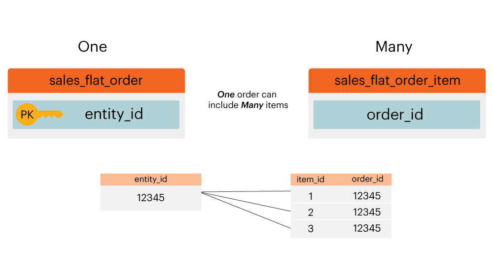

# Diagrama de Relação de Entidade

O que é uma **[!UICONTROL entity relationship (ER) diagram]**? Um [!UICONTROL ER] diagrama é uma visualização de tabelas em um banco de dados e como elas estão relacionadas umas com as outras. Este tópico contém alguns [!UICONTROL ER] diagramas para ajudar a visualizar a relação entre algumas tabelas comuns do banco de dados do Adobe Commerce.

>[!NOTE]
>
>Em todo este tópico, você verá as palavras **ingressar**, **relacionamento**, e **caminho**. Todas essas palavras são usadas para descrever como duas tabelas são conectadas.

## Comércio principal [!UICONTROL ER] Diagrama

Este `ER` O diagrama representa as relações entre as principais tabelas em um banco de dados do Commerce. Ao exibir vários relacionamentos de uma só vez, é possível ver como os dados se relacionariam em várias tabelas.

As seções abaixo contêm `ER` diagramas específicos para duas tabelas de cada vez. Para exibir um diagrama e a descrição que o acompanha, clique no cabeçalho dessa seção.

## `customer\_entity & sales\_flat\_order`

Um cliente pode fazer muitos pedidos. A relação entre essas duas tabelas é `customer\_entity.entity\_id = sales\_flat\_order.customer\_id`

>[!IMPORTANT]
>
>`customer\_entity.entity\_id` não é igual a `sales\_flat\_order.entity\_id`. O primeiro pode ser visto como um `customer\_id` e o segundo pode ser visto como um `order\_id.`

Dentro de [!DNL Commerce Intelligence], se o caminho entre essas duas tabelas não existir, você poderá [criar o caminho](../data-warehouse-mgr/create-paths-calc-columns.md) na guia Data Warehouse. Quando estiver pronto para criar o caminho, ele será definido da seguinte maneira:

## `sales\_flat\_order & sales\_flat\_order\_item`

Um pedido pode conter muitos itens. A relação entre essas duas tabelas é `sales\_flat\_order.entity\_id = sales\_flat\_order\_item.order\_id`.

Dentro de [!DNL Commerce Intelligence], se o caminho entre essas duas tabelas não existir, você poderá [criar o caminho](../data-warehouse-mgr/create-paths-calc-columns.md) na guia Data Warehouse. Quando estiver pronto para criar o caminho, defina-o conforme demonstrado abaixo.

## `catalog\_product\_entity & sales\_flat\_order\_item`

Um produto pode ser comprado por muitos itens. A relação entre essas duas tabelas é `catalog\_product\_entity.entity\_id = sales\_flat\_order\_item.product`.

Dentro de [!DNL Commerce Intelligence], se o caminho entre essas duas tabelas não existir, você poderá [criar o caminho](../data-warehouse-mgr/create-paths-calc-columns.md) na guia Data Warehouse. Quando estiver pronto para criar o caminho, defina-o conforme demonstrado abaixo.

