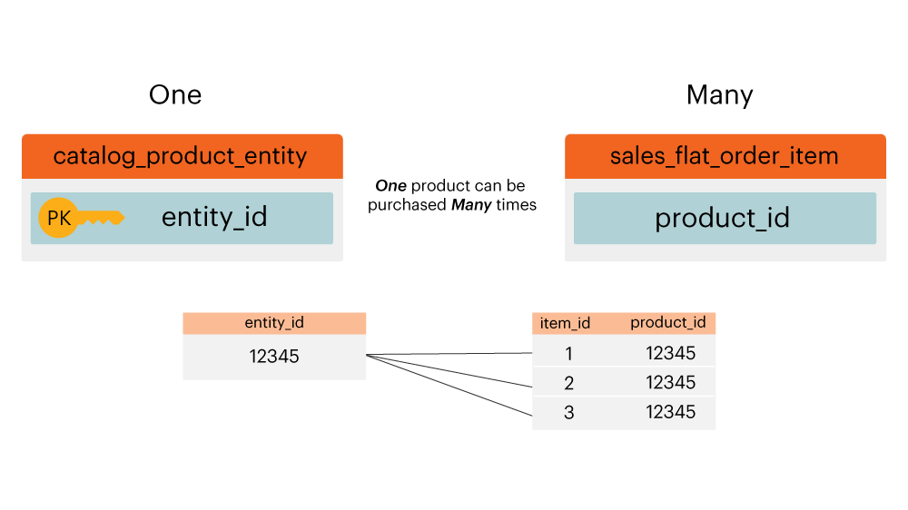

# Diagrama de Relação de Entidade

O que é um **[!UICONTROL entity relationship (ER) diagram]**? Um diagrama [!UICONTROL ER] é uma visualização de tabelas em um banco de dados e como elas se relacionam entre si. Este tópico contém alguns diagramas [!UICONTROL ER] para ajudá-lo a visualizar a relação entre algumas tabelas comuns do banco de dados do Adobe Commerce.

>[!NOTE]
>
>Neste tópico, você verá as palavras **ingressar**, **relacionamento** e **caminho**. Todas essas palavras são usadas para descrever como duas tabelas são conectadas.

## Diagrama [!UICONTROL ER] do Core Commerce

Este diagrama `ER` representa as relações entre as tabelas principais em um banco de dados do Commerce. Ao exibir vários relacionamentos de uma só vez, é possível ver como os dados se relacionariam em várias tabelas.

As seções abaixo contêm `ER` diagramas específicos para duas tabelas de cada vez. Para exibir um diagrama e a descrição que o acompanha, clique no cabeçalho dessa seção.

## `customer\_entity & sales\_flat\_order`

Um cliente pode fazer muitos pedidos. A relação entre essas duas tabelas é `customer\_entity.entity\_id = sales\_flat\_order.customer\_id`

>[!IMPORTANT]
>
>`customer\_entity.entity\_id` não é igual a `sales\_flat\_order.entity\_id`. O primeiro pode ser pensado como um `customer\_id` e o segundo como um `order\_id.`

Em [!DNL Commerce Intelligence], se o caminho entre essas duas tabelas não existir, você poderá [criar o caminho](../data-warehouse-mgr/create-paths-calc-columns.md) na guia Data Warehouse. Quando estiver pronto para criar o caminho, ele será definido da seguinte maneira:

## `sales\_flat\_order & sales\_flat\_order\_item`

Um pedido pode conter muitos itens. A relação entre essas duas tabelas é `sales\_flat\_order.entity\_id = sales\_flat\_order\_item.order\_id`.

Em [!DNL Commerce Intelligence], se o caminho entre essas duas tabelas não existir, você poderá [criar o caminho](../data-warehouse-mgr/create-paths-calc-columns.md) na guia Data Warehouse. Quando estiver pronto para criar o caminho, defina-o conforme demonstrado abaixo.

## `catalog\_product\_entity & sales\_flat\_order\_item`

Um produto pode ser comprado por muitos itens. A relação entre essas duas tabelas é `catalog\_product\_entity.entity\_id = sales\_flat\_order\_item.product`.

Em [!DNL Commerce Intelligence], se o caminho entre essas duas tabelas não existir, você poderá [criar o caminho](../data-warehouse-mgr/create-paths-calc-columns.md) na guia Data Warehouse. Quando estiver pronto para criar o caminho, defina-o conforme demonstrado abaixo.

