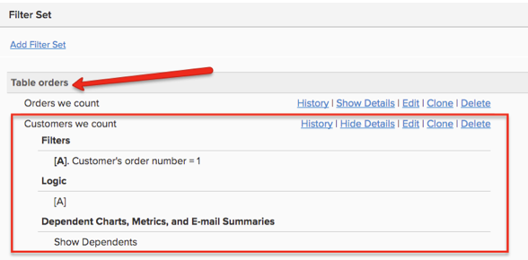

# Pedidos de convidados

Ao revisar seus pedidos, se você notar que muitos `customer\_id` valores são nulos ou não têm um valor para se associar de volta à `customers` tabela, isso indica que sua loja permite pedidos de convidados. Isso significa que o seu `customers` A tabela provavelmente não inclui todos os seus clientes.

Este tópico discute o impacto que os pedidos de convidados têm nos seus dados e quais opções você tem para contabilizar corretamente os pedidos de convidados em seus [!DNL Commerce Intelligence] Data Warehouse.

## Impacto dos pedidos de convidados nos dados

No banco de dados de comércio típico, há uma variável `orders` tabela que se associa a um `customers` tabela. Todas as linhas no `orders` a tabela tem um `customer\_id` que é exclusiva de uma linha na variável `customers` tabela.

* **Se todos os clientes estiverem registrados** e as encomendas de convidados não são permitidas, isso significa que cada registro no `orders` a tabela tem um valor no `customer\_id` coluna. Como resultado, cada pedido se junta de volta ao `customers` tabela.

  

* **Se as ordens do convidado forem permitidas**, isso significa que alguns pedidos não têm um valor no `customer\_id` coluna. Somente clientes registrados recebem um valor para a variável `customer\_id` coluna na `orders` tabela. Os clientes que não estão registrados recebem uma `NULL` (ou em branco) para esta coluna. Como resultado, nem todos os registros de pedido têm registros correspondentes no `customers` tabela.

  >[!NOTE]
  >
  >Para identificar o indivíduo único que fez o pedido, precisa haver outro atributo de usuário único ao lado `customer\_id` a um pedido. Normalmente, o endereço de email do cliente é usado.

## Como contabilizar ordens de convidado na configuração do Data Warehouse

Normalmente, o engenheiro de vendas que implementa sua conta leva em consideração os pedidos de convidados ao criar a base da sua Data Warehouse.

A melhor maneira de considerar os pedidos de convidados é basear todas as métricas de nível do cliente no `orders` tabela. Essa configuração usa uma ID de cliente exclusiva que todos os clientes têm, incluindo convidados (normalmente o email do cliente é usado). Isso ignora os dados de registro do `customers` tabela. Com essa opção, somente os clientes que tiverem feito pelo menos uma compra serão incluídos nos relatórios no nível do cliente. Os usuários registrados que ainda não fizeram uma compra não são incluídos. Com essa opção, seu `New customer` métrica é baseada na primeira data de pedido do cliente no `orders` tabela.

Você pode notar que a variável `Customers we count` o filtro definido neste tipo de configuração tem um filtro para `Customer's order number = 1`.

Em uma situação sem pedidos de convidado, cada cliente existe como uma linha exclusiva na tabela de clientes (consulte a Imagem 1). Uma métrica, como `New customers` pode simplesmente contar a id desta tabela com base em `created\_at` data para entender os Novos clientes com base na data de registro.

Em uma configuração de pedidos de convidado em que todas as métricas do cliente são baseadas no `orders` para contabilizar os pedidos de convidados, você deve se certificar de que está `not counting customers twice`. Se você contar a id da tabela de pedidos, estará contando cada pedido. Se, em vez disso, você contar a ID na variável `orders` tabela e usar um filtro, `Customer's order number = 1`, você contará cada cliente único `only one time`. Isso é aplicável para todas as métricas no nível do cliente, como `Customer's lifetime revenue` ou `Customer's lifetime number of orders`.

Você pode ver acima que há nulo `customer\_ids` no `orders` tabela. Se você usar o `customer\_email` para identificar clientes únicos, você pode ver que `erin@test.com` A fez três (3) pedidos. Portanto, você pode criar um `New customers` métrica em seu `orders` tabela com base nas seguintes condições:

* `Operation table = orders`
* `Operation column = id`
* `Operation = count`
* `Timestamp = Customer's first order date`
* `Filter = Customer's we count (where Customer's order number = 1)`
