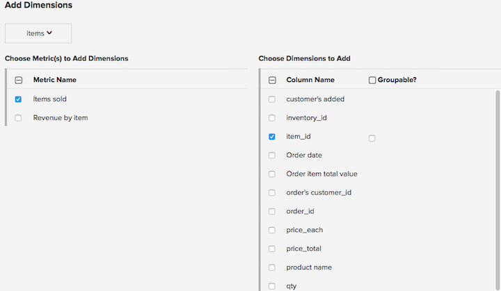

# Gerenciamento de dimensões de dados

>[!NOTE]
>
>Exige [Permissões de administrador](../../administrator/user-management/user-management.md).

Uma dimensão é um campo na mesma tabela de uma métrica que pode ser usada para filtrar ou segmentar gráficos com base nessa métrica. Por exemplo, uma métrica de receita pode conter cidade, estado, país, status do pedido, código de cupom e outros tipos de dimensões.

## Adicionar dimensões a várias métricas

Para adicionar uma ou mais dimensões a várias Métricas ao mesmo tempo:

1. Na barra de navegação principal, acesse **[!UICONTROL Manage Data > Metrics]**.

1. Na parte superior da página, clique em **[!UICONTROL Add Dimensions To Metric(s)]**.

1. Escolha a tabela que contém as dimensões.

1. No `Choose Metric(s) to Add Dimensions` selecione as métricas às quais deseja adicionar dimensões. Depois de selecionado, a variável `Choose Dimensions to Add` aparecerá à direita. Verifique as dimensões que deseja adicionar à métrica selecionada.

   

1. Se você deseja segmentar ou agrupar por qualquer uma das dimensões de dados nos relatórios, certifique-se de indicar que _Agrupável_.

1. Clique em **[!UICONTROL Add]**.

## Excluir dimensões de várias métricas

Para excluir uma ou mais dimensões de várias métricas:

1. Na barra de navegação principal, acesse **[!UICONTROL Data > Metrics]**.

1. Na parte superior da página, clique em **[!UICONTROL Remove Dimensions From Metric(s)]**.

1. Escolha a tabela que contém as dimensões.

1. Selecione as métricas que deseja remover as dimensões da à esquerda e as dimensões que deseja remover à direita.

1. Clique em **[!UICONTROL Remove]**.

1. Se as dimensões estiverem em uso nos relatórios, você receberá um aviso e uma lista de gráficos que estão usando as dimensões. Clique em **[!UICONTROL Delete]** para excluir as dimensões verificadas e todos os seus dependentes, incluindo relatórios.

## Gerenciar dimensões em métricas

**Para adicionar dimensões em uma métrica:**

1. Na barra de navegação principal, acesse **[!UICONTROL Data > Metrics]**.

1. Clique em **[!UICONTROL Edit]** na métrica que deseja ter uma nova dimensão.

1. Em `Dimensions` use a seção `Add a dimension` lista suspensa para selecionar uma dimensão para adicionar.

>[!NOTE]
>
>Qualquer dimensão que você deseja filtrar ou agrupar por já deve ser rastreada [!DNL MBI]. Se você não encontrar a dimensão desejada, talvez seja necessário começar a rastrear uma nova coluna de dados no seu banco de dados por meio do [Data Warehouse](../data-warehouse-mgr/tour-dwm.md) página.

**Para excluir dimensões de uma métrica:**

1. Na barra de navegação principal, acesse **[!UICONTROL Manage Data > Metrics]**.

1. Clique em **[!UICONTROL Edit]** na métrica que deseja ter uma nova dimensão.

1. Em `Dimensions` selecione a caixa de seleção na coluna excluir ao lado das dimensões que deseja remover.

>[!NOTE]
>
>Mesmo após excluir uma dimensão, ela ainda existe como uma coluna na tabela em nosso data warehouse. Você pode adicioná-la a qualquer métrica e criar novas métricas usando essas dimensões. Para remover a coluna de dados, uma dimensão corresponde a [!DNL MBI], basta desrastrear a coluna de dados por meio da variável [Data Warehouse](../data-warehouse-mgr/tour-dwm.md) página.

## Documentação relacionada

* [Práticas recomendadas para segmentação e filtragem](../../best-practices/segment-filter.md)
