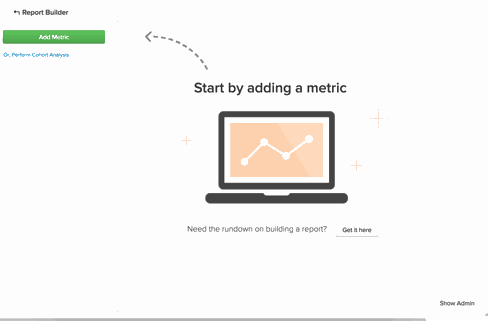

# [!DNL Google Analytics] usando fontes de aquisição

## O que são canais? {#channels}

Criar segmentos personalizados para ver como tráfego diferente funciona e observar tendências é um dos usos mais eficientes do [!DNL Google Analytics]. Uma classe de segmentos que existe por padrão em [!DNL Google Analytics] é `Channels`. Os canais são um agrupamento de maneiras comuns de as pessoas acessarem o site.  O [!DNL Google Analytics] classifica automaticamente as várias formas pelas quais você adquire um usuário - seja redes sociais, pay-per-click, email ou links de referência - e os agrupa em um balde ou Canal.

## Por que não vejo meu `channels` no Commerce Intelligence? {#nochannels}

`Channels` são compartimentos de dados simples e agregados. Para classificar suas aquisições em compartimentos de canal, o [!DNL Google] define regras e definições distintas usando parâmetros específicos: uma combinação de aquisição [Source](https://support.google.com/analytics/answer/1033173?hl=en) (a origem do tráfego) e aquisição [Medium](https://support.google.com/analytics/answer/6099206?hl=en) (a categoria geral da origem).

Embora ter esses buckets possa ajudar a entender de onde seu tráfego vem, esses dados não são marcados por canal, mas por uma combinação de Source e Medium. Como [!DNL Google] envia informações de canal como dois pontos de dados separados, os agrupamentos de canal não aparecem automaticamente em [!DNL Commerce Intelligence].

## Quais são os agrupamentos de canal padrão? Como eles são criados?

Por padrão, o [!DNL Google] configura oito canais diferentes. As regras que determinam como os canais são criados estão abaixo.

| **Canal** | **O que é?** | **Como ele é criado?** |
|---|---|---|
| Direto | Qualquer pessoa que entre diretamente no seu site. | Source = `Direct` E Medium = `(not set); OR Medium = (none)` |
| Pesquisa orgânica | Tráfego que foi classificado organicamente em mecanismos de pesquisa não pagos. | Medium = `organic` |
| Referência | Tráfego que vem de um link externo que não é Pesquisa orgânica ou de sites que não são redes sociais. | Medium = `referral` |
| Pesquisa paga | Tráfego que tem um Código de rastreamento UTM em que a mídia é &quot;cpc&quot;, &quot;ppc&quot; ou &quot;paidsearch&quot; E é uma rede de distribuição de anúncios que não corresponde a &quot;Conteúdo&quot;. | Medium = `^(cpc`\|`ppc`\|`paidsearch)$` AND Ad Distribution Network ≠ `Content` |
| Social | Tráfego de referência que vem de qualquer uma das aproximadamente 400 redes sociais e não são marcadas como anúncios. | Referência do Social Source = `Yes` OU Medium = `^(social`\|`social-network`\|`social-media`\|`sm`\|`social network`\|`social media)$` |
| Email | Tráfego de sessões que são marcadas com uma mídia de &quot;email&quot;. | Código de rastreamento UTM do Medium = `email` |
| Exibir | Tráfego que tem um Código de rastreamento UTM em que a mídia é exibição ou cpm. Também inclui a interação do AdWords em que a rede de distribuição de anúncios corresponde a &quot;Conteúdo&quot; | Medium = `^(display`\|`cpm`\|`banner)$` OU Rede de Distribuição de Anúncios = `Content` E Formato de Anúncios ≠ `Text` |
| Outro | Sessões de outros canais de publicidade (sem incluir Pesquisa paga) marcadas com uma mídia &quot;cpc&quot;, &quot;ppc&quot;, &quot;cpm&quot;, &quot;cpv&quot;, &quot;cpa&quot;, &quot;cpp&quot;, &quot;afiliate&quot;. | Medium = `^(cpv`\|`cpa`\|`cpp`\|`content-text)$` |

{style="table-layout:auto"}

## Como posso recriar esses agrupamentos de canal no meu Data Warehouse? {#recreate}

Agora que você sabe que os canais são apenas combinações de fontes e mídias, é um processo fácil de 3 etapas para recriar esses agrupamentos no Data Warehouse.

1. **Habilitar sua[!DNL Google ECommerce]integração**

   [Quando habilitado](../importing-data/integrations/google-ecommerce.md), certifique-se de [sincronizar](tour-dwm.md#syncing) os campos **mídia** e **origem** em sua Data Warehouse. Depois que isso for concluído, os dados de aquisição de mídia e fonte serão trazidos para a Data Warehouse.

1. **Carregar um mapeamento dos agrupamentos de canais da Google**

   O Adobe Commerce cria uma tabela com os agrupamentos padrão mapeados como um arquivo que você pode [baixar](../../assets/ga-channel-mapping.csv).

   Se você é um profissional do [!DNL Google Analytics] e criou seus próprios canais, deseja adicionar suas regras específicas à tabela de mapeamento antes de carregar o arquivo no [!DNL Commerce Intelligence].

   Traga-o para sua Data Warehouse como um [Upload de arquivo](../importing-data/connecting-data/using-file-uploader.md).

   

1. **Estabelecer uma relação entre[!DNL Google ECommerce]e o Carregamento de Arquivo de Mapeamentos**

   Para estabelecer uma relação entre o [!DNL Google ECommerce] e a tabela de mapeamento, [envie uma solicitação de suporte](../../guide-overview.md#Submitting-a-Support-Ticket) para sua equipe de Data Analyst e faça referência a este tópico. O analista cria uma nova coluna calculada chamada **Canal** na tabela ECommerce. **Após um ciclo completo de atualização**, esta coluna estará pronta para uso em um `Filter` ou `Group by`.

Agora você tem [!DNL Google Analytics Channel] agrupamentos em sua Data Warehouse, o que significa que você pode analisar seus dados de uma nova perspectiva:

Neste exemplo, você começou simples com a segmentação da métrica **Número de pedidos** pelo **Canal**. Teste a nova coluna e veja quais tendências você pode identificar nos dados do [!DNL Google Analytics Channel]!

## Documentação relacionada

* [Uso do Report Builder](../../tutorials/using-visual-report-builder.md)
* [Dados [!DNL Google ECommerce] esperados](../importing-data/integrations/google-ecommerce-data.md)
* [Compilando [!DNL Google ECommerce]dimensões com dados de ordem e cliente](../data-warehouse-mgr/bldg-google-ecomm-dim.md)
* [Quais são suas fontes e canais de aquisição mais valiosos?](../analysis/most-value-source-channel.md)
