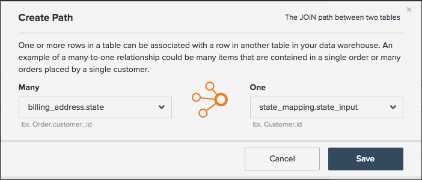

# Padronizar Dados com Tabelas de Mapeamento

Imagine isso: você está no `Report Builder`, criando um `Revenue by State` relatório. Você está na zona. Tudo vai bem até que você adicione um `billing state` ao seu relatório e você verá isto:

## Como isso pode acontecer?

Infelizmente, a falta de padronização pode, às vezes, causar confusão nos dados e dores de cabeça ao criar relatórios. Neste exemplo, pode não ter havido um menu suspenso ou um modo padronizado para seus clientes inserirem suas informações de estado de faturamento. Isso leva a vários valores - `pa`, `PA`, `penna`, `pennsylvania`, e `Pennsylvania` - tudo pelo mesmo estado, o que leva a alguns resultados estranhos na `Report Builder`.

É possível que haja um recurso técnico que possa ajudar você a limpar os dados ou inserir as colunas necessárias diretamente no banco de dados. Caso contrário, há outra solução: **a tabela de mapeamento**. Uma tabela de mapeamento permite limpar e padronizar de forma rápida e fácil quaisquer dados confusos, mapeando os dados para uma única saída.

>[!NOTE]
>
>Não é possível criar uma tabela de mapeamento para tabelas consolidadas sem a ajuda da equipe de suporte do Adobe.

## Como criá-lo? {#how}

**Atualizador da formatação de dados:**

* Certifique-se de que sua planilha tenha uma linha de cabeçalho.
* Evite usar vírgulas! Isso causa problemas quando você faz upload do arquivo.
* Usar o formato de data padrão `(YYYY-MM-DD HH:MM:SS)` para datas.
* As porcentagens devem ser inseridas como decimais.
* Verifique se os zeros à esquerda ou à direita estão retidos corretamente.

Antes de mergulhar, o Adobe recomenda que você [exportar os dados brutos da tabela](../../tutorials/export-raw-data.md). Observar os dados brutos primeiro significa que você pode explorar todas as combinações possíveis para os dados que precisam ser limpos, garantindo que a tabela de mapeamento cubra tudo.

Para criar uma tabela de mapeamento, você precisa criar uma planilha de duas colunas que siga o [regras de formatação para uploads de arquivo](../../data-analyst/importing-data/connecting-data/using-file-uploader.md).

Na primeira coluna, insira os valores armazenados em seu banco de dados com **somente um valor em cada linha**. Por exemplo, `pa` e `PA` não pode estar na mesma linha - cada entrada precisa ter sua própria linha. Veja um exemplo abaixo.

Na segunda coluna, insira quais desses valores **deve ser**. Continuando com o exemplo de estado de faturamento, se desejar `pa`, `PA`, `Pennsylvania`, e `pennsylvania` para ser `PA`, você digitaria `PA` nesta coluna para cada valor de entrada.

## O que preciso fazer em [!DNL MBI] para usá-lo? {#use}

Após concluir a criação da tabela de mapeamento, será necessário [fazer upload do arquivo](../../data-analyst/importing-data/connecting-data/using-file-uploader.md) em [!DNL MBI] e [criar uma coluna unida](../../data-analyst/data-warehouse-mgr/calc-column-types.md) que realoca o novo campo na tabela desejada. Você pode fazer isso depois que o arquivo for sincronizado com a Data Warehouse.

Este exemplo move a coluna criada na variável `mapping_state` tabela (`state_input`) para o `customer_address` tabela usando uma coluna unida. Isso nos permite agrupar pela limpeza `state_input` em seus relatórios em vez da `state` coluna.

Para criar o `joined` navegue até a tabela na qual o campo será realocado no Gerenciador de Datas Warehouse. Neste exemplo, este seria o `customer_address` tabela.

1. Clique em **[!UICONTROL Create a Column]**.
1. Selecionar `Joined Column` do `Definition` lista suspensa.
1. Nomeie a coluna de forma a diferenciá-la da variável `state` no banco de dados. Nomeie a coluna `billing state (mapped)` assim, você pode saber qual coluna usar ao segmentar no report builder.
1. O caminho necessário para conectar as tabelas não existe, portanto, é necessário criar um. Clique em **[!UICONTROL Create new path]**  no `Select a table and column` lista suspensa.

   Se você não tiver certeza sobre qual é a relação da tabela ou como definir corretamente as chaves primária e externa, verifique [o tutorial](../../data-analyst/data-warehouse-mgr/create-paths-calc-columns.md) para obter ajuda.

   * No `Many` lado, selecione a tabela para a qual você está realocando o campo (novamente, para nós é `customer_address`) e o `Foreign Key` ou `state` no exemplo.
   * No `One` selecione a variável `mapping` tabela e o `Primary key` coluna. Nesse caso, você selecionaria o `state_input` coluna da `mapping_state` tabela.
   * Veja como o caminho se parece:

      

1. Quando terminar, clique em **[!UICONTROL Save]** para criar o caminho.
1. O caminho pode não ser preenchido imediatamente após salvar - se isso acontecer, clique no link `Path` e selecione o caminho criado.
1. Clique em **[!UICONTROL Save]** para criar a coluna.

Pronto!

## O que eu faço agora? {#wrapup}

Depois que um ciclo de atualização for concluído, você poderá usar sua nova coluna unida para segmentar corretamente os dados em vez da coluna confusa do banco de dados. Olhe para suas opções de agrupamento agora - sem mais confusão de estresse:

As tabelas de mapeamento são úteis a qualquer momento em que você desejar limpar alguns dados potencialmente confusos na Data Warehouse. No entanto, as tabelas de mapeamento também podem ser usadas para alguns outros casos de uso interessantes, como [replicação de canais do Google Analytics no MBI](../data-warehouse-mgr/rep-google-analytics-channels.md).

### Relacionados

* [Entendendo e avaliando relações de tabelas](../data-warehouse-mgr/table-relationships.md)
* [Criação/exclusão de caminhos para colunas calculadas](../data-warehouse-mgr/create-paths-calc-columns.md)
