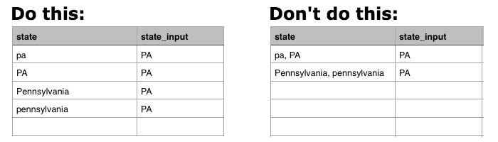

# Padronizar dados com tabelas de mapeamento

Imaginem isto: você está no `Report Builder`, criando um `Revenue by State` relatório. Você está na zona. Tudo vai aguentosamente até você adicionar um `billing state` agrupar o relatório e você verá o seguinte:

## Como isso poderia acontecer?

Infelizmente, a falta de normalização pode, por vezes, levar a dados confusos e a dores de cabeça na elaboração de relatórios. Em nosso exemplo, pode não ter havido um menu suspenso ou uma maneira padronizada para nossos clientes inserirem suas informações de estado de faturamento. Isso leva a uma variedade de valores - `pa`, `PA`, `penna`, `pennsylvania`e `Pennsylvania` - tudo para o mesmo Estado, o que certamente levará a alguns resultados estranhos no `Report Builder`.

É possível que haja um recurso técnico que possa ajudar você a limpar os dados ou inserir as colunas necessárias diretamente no banco de dados, mas caso contrário, teremos outra solução: **a tabela de mapeamento**. Uma tabela de mapeamento permite limpar e padronizar de forma rápida e fácil quaisquer dados confusos, mapeando dados para uma única saída.

>[!NOTE]
>
>Não é possível criar uma tabela de mapeamento para tabelas consolidadas sem a ajuda da nossa equipe de suporte. Entre em contato conosco para obter mais informações.

## Como criá-lo? {#how}

**Atualizador de formatação de dados:**

* Certifique-se de que sua planilha tenha uma linha de cabeçalho.
* Evite usar vírgulas! Isso causará problemas ao carregar o arquivo.
* Usar o formato de data padrão `(YYYY-MM-DD HH:MM:SS)` para datas.
* As porcentagens devem ser inseridas como decimais.
* Verifique se os zeros à esquerda ou à direita estão retidos corretamente.

Antes de entrar, recomendamos que você [exportar os dados brutos da tabela](../../tutorials/export-raw-data.md). Olhar para os dados brutos primeiro significa que você pode explorar todas as combinações possíveis para os dados que precisa limpar, garantindo assim que a tabela de mapeamento cubra tudo.

Para criar uma tabela de mapeamento, é necessário criar uma planilha de duas colunas que siga o [regras de formatação para uploads de arquivo](../../data-analyst/importing-data/connecting-data/using-file-uploader.md).

Na primeira coluna, digite os valores armazenados no banco de dados com **somente um valor em cada linha**. Por exemplo, `pa` e `PA` não pode estar na mesma linha - cada entrada precisa ter sua própria linha. Veja abaixo um exemplo.

Na segunda coluna, digite os valores **deve ser**. Continuando com nosso exemplo de estado de faturamento, se desejarmos `pa`, `PA`, `Pennsylvania`e `pennsylvania` simplesmente `PA`, deveríamos inserir `PA` nesta coluna para cada valor de entrada.

## O que preciso fazer [!DNL MBI] para usá-lo? {#use}

Após terminar de criar a tabela de mapeamento, será necessário [fazer upload do arquivo](../../data-analyst/importing-data/connecting-data/using-file-uploader.md) em [!DNL MBI] e [criar uma coluna unida](../../data-analyst/data-warehouse-mgr/calc-column-types.md) que reloca o novo campo na tabela desejada. Você pode fazer isso depois que o arquivo for sincronizado com seu data warehouse.

No nosso exemplo, moveremos a coluna que criamos no `mapping_state` tabela (`state_input`) à `customer_address` tabela usando uma coluna unida. Isso nos permitirá agrupar pela limpeza `state_input` nos relatórios em vez de `state` coluna.

Para criar o `joined` navegue até a tabela para a qual o campo será realocado no Gerenciador de Datas Warehouse. No nosso exemplo, este seria o `customer_address` tabela.

1. Clique em **[!UICONTROL Create a Column]**.
1. Selecionar `Joined Column` do `Definition` lista suspensa.
1. Dê um nome à coluna que a diferencie do `state` no banco de dados. Vamos com `billing state (mapped)` assim, podemos saber qual coluna usar ao segmentar no construtor de relatórios.
1. O caminho que precisamos para conectar as tabelas não existe, então precisamos criar um novo. Clique em **[!UICONTROL Create new path]**  no `Select a table and column` lista suspensa.

   Se não tiver certeza do que é a relação da tabela ou como definir corretamente as chaves primárias e estrangeiras, confira [nosso tutorial](../../data-analyst/data-warehouse-mgr/create-paths-calc-columns.md) para obter ajuda.

   * No `Many` no lado, selecione a tabela na qual você está realocando o campo (novamente, para nós, é `customer_address`) e o `Foreign Key` coluna, ou `state` no nosso exemplo.
   * No `One` no lado, selecione a `mapping` e a `Primary key` coluna. Nesse caso, selecionamos a variável `state_input` da coluna `mapping_state` tabela.
   * Veja a aparência do nosso caminho:

      

1. Quando terminar, clique em **[!UICONTROL Save]** para criar o caminho.
1. O caminho pode não ser preenchido imediatamente após a gravação - se isso acontecer, clique no botão `Path` e selecione o caminho que acabou de criar.
1. Clique em **[!UICONTROL Save]** para criar a coluna.

Pronto!

## O que devo fazer agora? {#wrapup}

Depois que um ciclo de atualização for concluído, você poderá usar sua nova coluna unida para segmentar seus dados corretamente, em vez da coluna bagunça do banco de dados. Dê uma olhada nas nossas opções de agrupamento agora - sem mais confusão de estresse:

As tabelas de mapeamento são úteis a qualquer momento em que você desejar limpar alguns dados potencialmente confusos no data warehouse. No entanto, tabelas de mapeamento também podem ser usadas para alguns outros casos de uso interessantes, como [replicação de seus canais Google Analytics no MBI](../data-warehouse-mgr/rep-google-analytics-channels.md).

### Relacionado

* [Como entender e avaliar relações de tabela](../data-warehouse-mgr/table-relationships.md)
* [Criação/exclusão de caminhos para colunas calculadas](../data-warehouse-mgr/create-paths-calc-columns.md)
