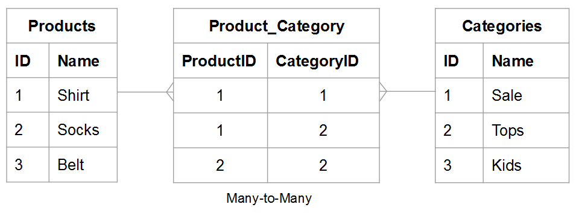
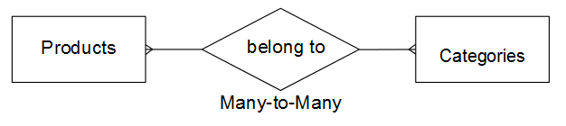
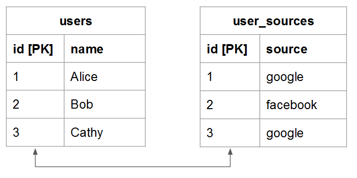

# Entender e avaliar as relações de tabela

Ao avaliar a relação entre duas determinadas tabelas, você precisa entender quantas ocorrências possíveis em uma tabela poderiam pertencer a uma entidade em outra, e vice-versa. Por exemplo, use uma tabela `users` e uma tabela `orders`. Neste caso, você quer saber quantos **pedidos** um determinado **usuário** fez e a quantos **usuários** e **pedidos** possíveis podem pertencer.

Entender relacionamentos é vital para manter a integridade dos dados, pois isso afeta a precisão das [colunas calculadas](../data-warehouse-mgr/creating-calculated-columns.md) e [dimensões](../data-warehouse-mgr/manage-data-dimensions-metrics.md). Para saber mais, consulte [tipos de relacionamento](#types) e [como avaliar as tabelas em sua Data Warehouse.](#eval)

## Tipos de relacionamento {#types}

Há três tipos de relações que podem existir entre duas tabelas:

1. [&quot;um para um&quot;](#onetoone)
1. [&quot;de um para muitos&quot;](#onetomany)
1. [`muitos para muitos`](#manytomany)

### `One-to-One` {#onetoone}

Em uma relação `one-to-one`, um registro na tabela `B` pertence a apenas um registro na tabela `A`. E um registro na Tabela `A` pertence a apenas um registro na Tabela `B`.

Por exemplo, no relacionamento entre pessoas e números de carteira de motorista, uma pessoa pode ter apenas um número de carteira de motorista, e um número de carteira de motorista pertence a apenas uma pessoa.

### `One-to-Many` {#onetomany}

Em uma relação `one-to-many`, um registro na tabela `A` pode pertencer a vários registros na tabela `B`. Pense na relação entre `orders` e `items` - um pedido pode conter muitos itens, mas um item pertence a um único pedido. Nesse caso, a tabela `orders` é o um lado e a tabela `items` é o muitos lado.

### `Many-to-Many` {#manytomany}

Em uma relação `many-to-many`, um registro na tabela `B` pode pertencer a vários registros na tabela `A`. E vice-versa, um registro na tabela `A` pode pertencer a vários registros na tabela `B`.

Pense na relação entre **produtos** e **categorias**: um produto pode pertencer a muitas categorias, e uma categoria pode conter muitos produtos.

## Avaliando Suas Tabelas {#eval}

Dados os tipos de relações que existem entre tabelas, você pode aprender a avaliar as tabelas em sua Data Warehouse. Como essas relações moldam como colunas calculadas de várias tabelas são definidas, é importante que você entenda como identificar relações de tabela e a que lado - `one` ou `many` - a tabela pertence.

Há dois métodos que podem ser usados para avaliar os relacionamentos de um determinado par de tabelas dentro da Data Warehouse. O primeiro método emprega uma [estrutura conceitual](#concept) que considera como as entidades da tabela interagem entre si. O segundo método usa o [esquema da tabela](#schema).

### Uso da Estrutura Conceitual {#concept}

Esse método usa uma estrutura conceitual para descrever como as entidades nas duas tabelas podem interagir entre si. É importante entender que esse arcabouço avalia o que é possível, dada a relação.

Por exemplo, ao pensar em usuários e pedidos, considere tudo o que é possível no relacionamento. Um usuário registrado não pode fazer pedidos, fazer apenas um pedido ou fazer vários pedidos durante sua vida útil. Se você iniciou sua empresa e nenhum pedido foi feito, é possível que um determinado usuário possa fazer muitos pedidos ao longo de sua vida útil. As tabelas são criadas para acomodar isso.

Para usar este método:

1. Identifique a entidade que está sendo descrita em cada tabela. **Dica: geralmente é um substantivo**. Por exemplo, as tabelas `user` e `orders` estão descrevendo explicitamente usuários e pedidos.

1. Identifique um ou mais verbos que descrevam como essas entidades interagem. Por exemplo, ao comparar usuários a pedidos, os usuários &quot;fazem&quot; pedidos. Indo na outra direção, os pedidos &quot;pertencem&quot; aos usuários.

Esse tipo de estrutura pode ser aplicado a qualquer par de tabelas na Data Warehouse. Isso permite identificar facilmente o tipo de relação e qual tabela está em um lado e qual tabela está em vários lados.

Depois de identificar a terminologia que descreve como as duas tabelas interagem, enquadre a interação em ambas as direções considerando como uma determinada instância da primeira entidade se relaciona com a segunda. Estes são alguns exemplos de cada relação:

### `One-to-One`

Uma determinada pessoa só pode ter um número de carteira de motorista. Um determinado número de carteira de motorista pertence a apenas uma pessoa.

Esta é uma relação `one-to-one` em que cada tabela é um lado.

### `One-to-Many`

Uma determinada ordem pode conter muitos itens. Um determinado item pertence a apenas um pedido.

Esta é uma relação `one-to-many` em que a tabela de pedidos é um lado e a tabela de itens é o lado muitos.

### `Many-to-Many`

Um determinado produto pode possivelmente pertencer a muitas categorias. Uma determinada categoria pode conter muitos produtos.

Esta é uma relação `many-to-many` em que cada tabela é um lado múltiplo.

### Usando o Esquema da Tabela {#schema}

O segundo método usa o schema da tabela. O esquema define quais colunas são as chaves [`Primary`](https://en.wikipedia.org/wiki/Unique_key) e [`Foreign`](https://en.wikipedia.org/wiki/Foreign_key). Você pode usar essas chaves para vincular tabelas e ajudar a determinar os tipos de relacionamento.

Depois de identificar as colunas que vinculam duas tabelas, use os tipos de coluna para avaliar o relacionamento da tabela. Veja alguns exemplos:

### `One-to-one`

Se as tabelas estiverem vinculadas usando o `primary key` de ambas as tabelas, a mesma entidade exclusiva estará sendo descrita em cada tabela e a relação será `one-to-one`.

Por exemplo, uma tabela `users` pode capturar a maioria dos atributos de usuário (como nome), enquanto uma tabela `user_source` complementar captura fontes de registro de usuário. Em cada tabela, uma linha representa um usuário.

### `One-to-many`

>[!NOTE]
>
>Você aceita ordens de convidados? Consulte [Pedidos de Convidados](../data-warehouse-mgr/guest-orders.md) para saber como os pedidos de convidados podem afetar seus relacionamentos de tabela.

Quando tabelas são vinculadas usando um `Foreign key` apontando para um `primary key`, esta configuração descreve uma relação `one-to-many`. O lado um é a tabela contendo o `primary key` e o lado muitos é a tabela contendo o `foreign key`.

### `Many-to-many`

Se qualquer uma das opções a seguir for verdadeira, a relação será `many-to-many`:

* `Non-primary key` colunas estão sendo usadas para vincular duas tabelas
  
* Parte de um `primary key` composto é usada para vincular duas tabelas

## Próximas etapas

A avaliação correta das relações de tabela é essencial para a modelagem precisa dos dados. Agora que você entende como as tabelas estão relacionadas entre si, consulte [o que você pode fazer com o Gerenciador de Datas Warehouse](../data-warehouse-mgr/tour-dwm.md).
