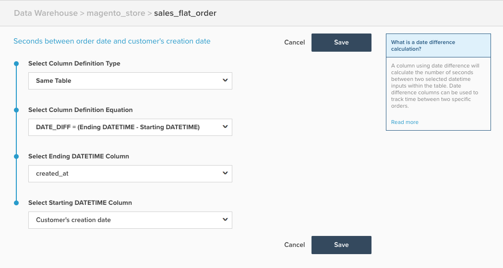

# Coluna Calculada de Diferença de Data

Este tópico descreve a finalidade e os usos da coluna calculada `Date Difference` disponível na página **[!DNL Manage Data > Data Warehouse]**. Abaixo está uma explicação do que ele faz, seguido por um exemplo, e os mecanismos para criá-lo.

**Explicação**

O tipo de coluna `Date Difference` calcula o tempo entre dois eventos pertencentes a um único registro, com base nos carimbos de data e hora do evento. O valor bruto calculado nessa coluna está em segundos, mas é convertido automaticamente em minutos, horas, dias e assim por diante, para exibição em relatórios. No entanto, quando usado como um filtro/grupo por, você deseja usar o valor em segundos.

Uma coluna calculada `date difference` pode ser usada para criar uma métrica que calcula o tempo médio ou mediano entre dois eventos, como o tempo médio entre o registro do cliente e seus primeiros pedidos.

**Exemplo**

| **`id`** | **`timestamp_1`** | **`timestamp_2`** | **`Seconds between timestamp_2 and timestamp_1`** |
|--- |--- |--- |--- |
| `A` | 01-01-2015 00:00:00 | 01/2015/12:30:00 | 45000 |
| `B` | 01-01-2015 08:00:00 | 01/2015/10:00:00 | 7200 |

{style="table-layout:auto"}

No exemplo acima, a coluna `Date Difference` é `Seconds between timestamp_2 and timestamp_1`. Ele executa o cálculo `timestamp_2 minus timestamp_1`.

**Mecânica**

As etapas a seguir descrevem como criar uma coluna `Date Difference`.

1. Navegue até a página **[!DNL Manage Data > Data Warehouse]**.
1. Navegue até a tabela em que deseja criar essa coluna.
1. Clique em **[!UICONTROL Create a Column]** e configure sua coluna da seguinte maneira:
   * Selecionar `Column Definition Type` > `Same Table`
   * Selecionar `Column Definition Equation` > `DATE_DIFF = (Ending DATETIME - Starting DATETIME)`
   * Selecione a coluna `Ending DATETIME` > Escolha o campo de data e hora de término, que normalmente é o evento que ocorre mais tarde
   * Selecione a coluna `Starting DATETIME`** > Escolha o campo de data e hora inicial, que normalmente é o evento que ocorre mais cedo

1. Forneça um nome para a coluna e clique em **[!UICONTROL Save]**.
1. A coluna está disponível para uso *imediatamente*.

Como exemplo, o exemplo a seguir é configurado para calcular o `Seconds between order date and customer's creation date`:

