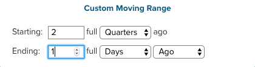

# Filtragem em todo o painel

Com a filtragem em todo o painel, é possível fazer edições em massa de todos os relatórios em um painel específico. É possível visualizar rapidamente a mesma análise em diferentes períodos de tempo ou para diferentes armazenamentos. É possível comparar facilmente o desempenho de um ano, mês ou semana anterior por loja. Você pode atualizar um painel inteiro para acomodar uma campanha recém-lançada.

## Filtros de data

Para alterar o intervalo de datas ou o intervalo de relatórios em um painel, clique no ícone de calendário no canto superior direito ().

É possível optar por exibir dados usando um `Fixed Date Range` ou vários valores pré-calculados `Moving Date Ranges`:

A variável `Last Full...` as opções de intervalo móvel representam o intervalo concluído mais recentemente, enquanto `This...` é o intervalo atual em andamento. Por exemplo, se for junho, o `Last Full Month` é _1º de maio - 31 de maio_, enquanto `This Month` é _1 de junho - Agora_.

Ou crie o seu próprio `Custom Moving Range`\:

Escolha alterar o intervalo também. Selecionar o botão padrão () significa que somente o intervalo de datas muda:

Para restaurar todos os relatórios para o intervalo de datas e datas iniciais, clique em **[!UICONTROL Restore Defaults]** ou clique em **[!UICONTROL Cancel]**.

Ao especificar um filtro de datas para um painel, esse filtro é aplicado somente a esse painel. Não é aplicado quando você navega para outros painéis.

>[!NOTE]
>
>Atualmente, `Cohort Reports` e `SQL Reports` não são incluídos ao aplicar alterações no nível do painel.

## Armazenar filtros

Para analisar o desempenho de uma loja específica, clique no ícone lojas no canto superior direito (). Por padrão, `Store Filter` está definida como `All Stores`, que exibe os dados de todos [exibições de loja](https://experienceleague.adobe.com/docs/commerce-admin/stores-sales/site-store/store-views.html) disponível em seu site do Commerce.

>[!NOTE]
>
>Um filtro de armazenamento é ativado ou desativado para um [!DNL Commerce Intelligence] conta. Se um painel contiver relatórios que não são afetados pelo filtro (como relatórios que não são criados em qualquer [!DNL Adobe Commerce] dados), esses relatórios não são atualizados quando o filtro de armazenamento é aplicado. Você pode [entre em contato com o suporte](https://experienceleague.adobe.com/docs/commerce-knowledge-base/kb/troubleshooting/miscellaneous/mbi-service-policies.html) se você acredita que um relatório deve ser atualizado com base na seleção de armazenamento ou se acredita que seu filtro de armazenamento de conta foi desabilitado por engano.

Ao selecionar um armazenamento na lista `Store Filter`, o filtro retém sua seleção ao navegar entre painéis. Manter a seleção permite ver os dados do armazenamento selecionado em todos os lugares até que você selecione `All Stores`.

## Filtros para painéis compartilhados

Para painéis compartilhados, se um usuário configurar o filtro de data, outros usuários com acesso ao painel verão o mesmo filtro aplicado. No entanto, o filtro de armazenamento não se aplica nesse caso. Se o proprietário do painel configurar o filtro de armazenamento e compartilhar o painel, o filtro de armazenamento configurado não persistirá para outro usuário. Um usuário deve ter [editar acesso](../../data-user/dashboards/share-dashboard-with-users.md) a um painel para ajustar os filtros do painel.
