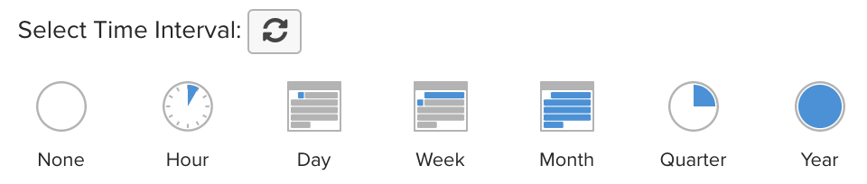
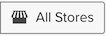

# Filtragem em todo o painel

Com a filtragem em todo o painel, é possível fazer edições em massa de todos os relatórios em um painel específico. É possível visualizar rapidamente a mesma análise em diferentes períodos de tempo ou para diferentes armazenamentos. É possível comparar facilmente o desempenho de um ano, mês ou semana anterior por loja. Você pode atualizar um painel inteiro para acomodar uma campanha recém-lançada.

## Filtros de data

Para alterar o intervalo de datas ou o intervalo de relatórios em um painel, clique no ícone de calendário no canto superior direito ().

Você pode optar por exibir dados usando um `Fixed Date Range` ou vários `Moving Date Ranges` pré-calculados:

As opções de intervalo móvel `Last Full...` representam o intervalo concluído mais recentemente, enquanto `This...` é o intervalo atual em andamento. Por exemplo, se for junho, o `Last Full Month` será de _1º de maio a 31_ de maio, enquanto `This Month` será de _1º de junho a Agora_.

Ou crie o seu próprio `Custom Moving Range`\:

Escolha alterar o intervalo também. Selecionar o botão padrão () significa que somente o intervalo de datas é alterado:

Para restaurar todos os relatórios para o intervalo de datas e intervalo iniciais, clique em **[!UICONTROL Restore Defaults]** ou em **[!UICONTROL Cancel]**.

Ao especificar um filtro de datas para um painel, esse filtro é aplicado somente a esse painel. Não é aplicado quando você navega para outros painéis.

>[!NOTE]
>
>Atualmente, `Cohort Reports` e `SQL Reports` não estão incluídos ao aplicar alterações no nível do painel.

## Armazenar filtros

Para analisar o desempenho de um armazenamento específico, clique no ícone de armazenamentos no canto superior direito (). Por padrão, `Store Filter` está definido como `All Stores`, que exibe os dados de todas as [exibições de loja](https://experienceleague.adobe.com/docs/commerce-admin/stores-sales/site-store/store-views.html) disponíveis no site do Commerce.

>[!NOTE]
>
>Um filtro de repositório está habilitado ou desabilitado para uma conta [!DNL Commerce Intelligence] inteira. Se um painel contiver relatórios que não são afetados pelo filtro (como relatórios que não são criados em nenhum dado [!DNL Adobe Commerce]), esses relatórios não serão atualizados quando o filtro de armazenamento for aplicado. Você pode [contatar o suporte](https://experienceleague.adobe.com/docs/commerce-knowledge-base/kb/troubleshooting/miscellaneous/mbi-service-policies.html) se achar que um relatório deve ser atualizado com base na seleção de armazenamento ou se achar que o filtro de armazenamento da sua conta foi desabilitado por engano.

Quando você seleciona um armazenamento no `Store Filter`, o filtro retém sua seleção ao navegar entre painéis. Manter a seleção permite ver os dados do armazenamento selecionado em todos os lugares até que você selecione `All Stores`.

## Filtros para painéis compartilhados

Para painéis compartilhados, se um usuário configurar o filtro de data, outros usuários com acesso ao painel verão o mesmo filtro aplicado. No entanto, o filtro de armazenamento não se aplica nesse caso. Se o proprietário do painel configurar o filtro de armazenamento e compartilhar o painel, o filtro de armazenamento configurado não persistirá para outro usuário. O usuário deve ter [acesso de edição](../../data-user/dashboards/share-dashboard-with-users.md) a um painel para ajustar os filtros do painel.
