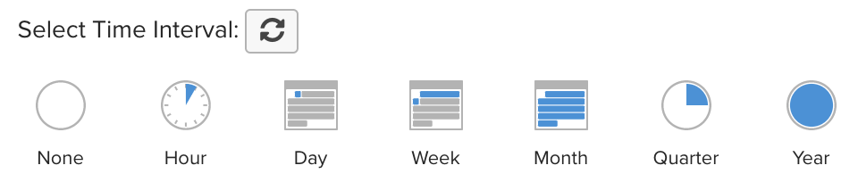

# Filtragem ampla do painel

Com a filtragem ampla do painel, é possível fazer edições em massa de todos os relatórios em um painel específico. Você pode visualizar rapidamente a mesma análise em diferentes períodos de tempo ou para diferentes armazenamentos. Você pode comparar facilmente o desempenho de um ano, mês ou semana anterior por loja. Além disso, você pode atualizar um painel inteiro para acomodar uma campanha recém-lançada.

## Filtros de data

Para alterar o intervalo de datas ou o intervalo dos relatórios em um painel, clique no ícone do calendário no canto superior direito ().

Você pode optar por exibir os dados usando uma `Fixed Date Range` ou uma variedade de pré-calculadas `Moving Date Ranges`:

O `Last Full...` as opções de intervalo móvel representam o intervalo totalmente concluído mais recentemente, enquanto `This...` será o intervalo em andamento atual. Por exemplo, se estiver em junho, a variável `Last Full Month` é _1 de maio a 31 de maio_, enquanto `This Month` é _1° de junho - Agora_.

Ou crie seu próprio `Custom Moving Range`\:

Opte por alterar o intervalo também. Selecionar o botão padrão () significa que somente o intervalo de datas será alterado:

Para restaurar todos os relatórios para o intervalo de datas e intervalo iniciais, clique em **[!UICONTROL Restore Defaults]** ou clique em **[!UICONTROL Cancel]**.

Ao especificar um filtro de datas para um painel, esse filtro é aplicado somente a esse painel. Não é aplicado quando você navega para outros painéis.

>[!NOTE]
>
>Nesse momento, `Cohort Reports` e `SQL Reports` não são incluídas ao aplicar alterações em um nível de painel.

## Armazenar filtros

Para analisar o desempenho de uma loja específica, clique no ícone lojas no canto superior direito (). Por padrão, `Store Filter` está definida como `All Stores`, que exibe os dados de todos [exibições de loja](https://experienceleague.adobe.com/docs/commerce-admin/stores-sales/site-store/store-views.html) disponível no seu site do Commerce.

>[!NOTE]
>
>Um filtro de loja está ativado ou desativado para um todo [!DNL MBI] conta. Se um painel contém relatórios que não são afetados pelo filtro, como relatórios que não são criados em nenhum dado do Commerce, esses relatórios não são atualizados quando o filtro de loja é aplicado. Você pode [entrar em contato com o suporte](https://experienceleague.adobe.com/docs/commerce-knowledge-base/kb/troubleshooting/miscellaneous/mbi-service-policies.html?lang=en) se você achar que um relatório deve ser atualizado com base na seleção de loja ou se achar que o filtro de armazenamento da conta está desabilitado por engano.

Ao selecionar uma loja na `Store Filter`, o filtro retém a seleção ao navegar entre os painéis. A retenção da seleção permite que você veja os dados da loja selecionada em todos os lugares, até que você selecione `All Stores`.

## Filtros para painéis compartilhados

Para painéis compartilhados, se um usuário configurar o filtro de datas, outros usuários com acesso ao painel verão esse mesmo filtro aplicado. No entanto, o filtro de loja não se aplica nesse caso. Se o proprietário do painel configurar o filtro de loja e compartilhar o painel, o filtro de loja configurado não persistirá em outro usuário. Um usuário deve ter [editar acesso](../../data-user/dashboards/share-dashboard-with-users.md) para um painel para ajustar os filtros do painel.
