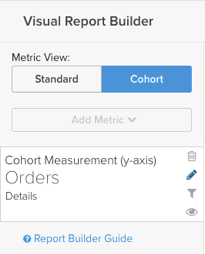

# Report Builder de coorte

Você já quis estudar como diferentes subconjuntos de usuários se comportam ao longo do tempo? Por exemplo, você já se perguntou se os usuários que se registram durante um período promocional têm uma receita média vitalícia maior do que aqueles que não têm? Se a resposta for `Yes`, depois o `Cohort Report Builder` O é a ferramenta perfeita para você. [!DNL MBI] O é otimizado para realizar essa análise e torná-la relevante para sua empresa.

## O que é a análise de coorte? {#what}

`Cohort` a análise pode ser definida amplamente como a análise de grupos de usuários que compartilham características semelhantes em seus ciclos de vida. Ele permite identificar tendências comportamentais em diferentes grupos de usuários.

Para obter uma introdução mais detalhada sobre `cohort` análise, [olhe aqui](https://www.cohortanalysis.com/).

No seu [!DNL MBI] é fácil criar um usuário `cohorts` com base em um `cohort` data e uma métrica em sua conta.

## Bem, por que a análise de coorte é importante? {#important}

Tal como acima referido, `cohort` A análise permite identificar tendências comportamentais entre diferentes grupos de usuários. Com uma sólida compreensão de como determinados grupos se comportam, você pode adaptar suas decisões e gastos para maximizar suas vendas. Considere, por exemplo, uma receita vitalícia `cohort` análise - embora esse tipo de análise seja benéfico por vários motivos, a imediata é a adoção de melhores decisões de aquisição de clientes.

## Como criar o meu próprio `cohort` análise?

### Nova arquitetura

Estas são as instruções para usar a variável `Cohort Report Builder` no [Nova arquitetura](../../administrator/account-management/new-architecture.md).

1. Clique em **[!UICONTROL Report Builder]** na guia esquerda ou **[!UICONTROL Add Report** > **Create Report]** em qualquer painel.

1. No `Report Builder` seleção, clique em **[!UICONTROL Create Report]** ao lado da `Visual Report Builder` opção.

**Adicionar uma métrica**

Agora que você está no `Report Builder`, adicione a métrica em que deseja executar a análise (exemplo: `Revenue` ou `Orders`).

>[!NOTE]
>
>Nativo [!DNL Google Analytics] as métricas não são compatíveis com o `Cohort Report Builder`.

**Alternar a exibição de métrica para`Cohort`**

Isso abre uma nova janela para configurar os detalhes do `Cohort` Relatório.

### São necessárias cinco especificações para `Cohort` relatório:

1. Como agrupar a variável `cohorts`
1. A variável `cohort` período
1. O número de `cohorts` para exibir
1. A quantidade mínima de dados a cada `cohort` deve conter
1. Intervalo de tempo depois `cohort` ocorrência

#### 1. Agrupamento `cohorts`

`Cohorts` são agrupados por um carimbo de data e hora, como **data de registro** ou **data da primeira ordem**.

>[!NOTE]
>
>Não é possível usar o mesmo carimbo de data e hora em que a métrica foi criada para o `cohort` data. Para uma análise que exija isso, é possível usar o `Standard report builder` em vez disso.

#### 2. `Cohort` período

Escolha o período de tempo a ser agrupado `cohorts` por. Em outras palavras, qual parte do carimbo de data e hora que você selecionou acima é mais importante; a variável `week`, `month`, `quarter`ou `year`? Seu relatório exibe os dados em qualquer intervalo selecionado aqui

#### 3. e 4. Defina o número de `cohorts` para visualizar e a quantidade de dados que cada `cohort` deve ter

Esses parâmetros ajudam a exibir somente a `cohorts` no qual você está interessado e a `Preview` na parte inferior da janela mostra exatamente quais coortes são exibidos no relatório.

Por padrão, a variável atual `cohort` não é incluído, a menos que você altere a quantidade mínima de dados necessária para cada `cohort` para `0`. Neste caso, o `cohort` para o período atual inclui apenas dados parciais.

#### 5. Intervalo de tempo após `Cohort` Ocorrência

Esse recurso permite definir o intervalo de tempo de dados que você visualiza para o `cohorts`. Por exemplo, se você deseja exibir 24 por mês `cohorts` baseado em `customer's first order date`, mas você só estará interessado nos primeiros 3 meses de dados para cada `cohort`, você pode definir a variável `number of cohorts to view` para `24` e a variável `time range after cohort occurrence` para `3`.

O intervalo desse valor muda com o que você selecionou na variável `cohort time period` e o valor for definido como `12` por padrão; o valor não é alterado a menos que você clique no ícone de calendário para editá-lo.

#### Outras observações

* [!UICONTROL Filters]: aplicadas às suas métricas permanecem intactas ao alternar entre `Standard` e `Cohort` exibições.

* Consulte [`Perspectives`](#perspectives).

#### Exemplo

Aqui está um exemplo para reunir tudo. Neste exemplo, quero verificar o comportamento do pedido depois de um `cohort`A primeira compra do para ver se esse coorte voltará a fazer compras repetidas nos próximos seis meses.

### Arquitetura herdada

#### Arquitetura herdada {#personalinfo}

Abaixo estão as instruções específicas para a versão herdada do `Cohort Report Builder`. Se estiver interessado em usar a nova versão, consulte [Nova arquitetura](../../administrator/account-management/new-architecture.md) para obter mais informações sobre como migrar para uma [!DNL MBI] Nova conta de arquitetura.

#### Como criar o meu próprio `cohort` análise? {#create}

`Cohort` análise em ação! Aqui, você pode ver a receita crescendo ao longo do tempo de forma cumulativa e por usuário.

Esta seção o orienta na criação da sua própria `cohort` análise. Para obter exemplos (e GIF animados demonstrando o processo), verifique a [Seção Exemplos](#examples) deste artigo.

1. Clique em **[!UICONTROL Report Builder]** na guia esquerda ou **[!UICONTROL Add Report** > **Create Report]** em qualquer painel.

1. No `Report Builder Selection` clique em **[!UICONTROL Create Report]** ao lado da `Cohort Analysis` opção.

#### Adição de uma métrica

Agora que você está no `Cohort Report Builder`, adicione a métrica (exemplo: `Revenue` ou `Number of orders`) em que deseja realizar a análise.

>[!NOTE]
>
>Nativo [!DNL Google Analytics] as métricas não são compatíveis com o `Cohort Report Builder`.

#### Seleção da data de coorte {#date}

A próxima etapa é especificar o `cohort date`. Essa é a data na qual seus usuários são agrupados. Por exemplo, pode ser `User's first order date` ou `User's registration date`.

>[!NOTE]
>
>Você não pode usar a mesma data em que a métrica foi criada (exemplo: `created at`) como a `cohort date`.

#### Definição do intervalo e do período de tempo

Em seguida, defina o `Interval` e `Time Period`.

`Interval`
A variável `Interval` permite definir a variável `length` do seu `cohorts`. Por exemplo, se estiver definido como `Month`, seu relatório é medido em meses.

Você pode alterar como esses intervalos são exibidos no eixo x usando a variável **Duração** menu.

`Time Period`
Use o `Time Period` para escolher o usuário específico `cohorts` para analisar. Você pode mostrar cada `cohort`, escolha em uma lista, especifique um intervalo de tempo ou defina um intervalo de tempo de rolagem de `cohorts` para incluir. Por exemplo, se você usou a variável `Specific Cohorts` você pode selecionar meses específicos para incluir na análise:

Se estiver agrupando você `cohorts` por data de registro e, em seguida, selecionados abril, maio e junho no `Specific Cohorts` todos os usuários registrados nesses meses seriam incluídos.

#### Definição do eixo X

Em `duration`, você pode definir as configurações do eixo X do gráfico. Ou seja, quantos períodos cada ponto de dados representa e quantos pontos de dados devem ser incluídos na análise.

#### Selecionar o `counting members` tabela

Se você optou por agrupar usuários por um `cohort date` que foi unido a partir de outra tabela, você pode ver um `counting members in the … table` opção.

Veja um exemplo para entender essa configuração. Suponha que você criou um relatório de coorte a `Revenue` métrica por `Customer's registration date`. Você também queria usar a perspectiva `Average value per cohort member` para ver a receita por comprador ao longo do tempo. Para encontrar o valor médio por comprador, você precisa decidir pelo número de compradores para dividir. É o número de clientes registrados em seu `customers` ou é o número de compradores distintos na sua `orders table` pelo mesmo período?

Esta configuração responde a essa pergunta. Contagem de membros no `customers` A tabela inclui todos os clientes (independentemente de terem feito uma compra, nunca) na média. Contagem de membros no `orders` A tabela inclui apenas clientes que fizeram uma compra.

#### Seleção de uma perspectiva {#perspective}

Após definir a métrica e como deseja analisá-la, você pode selecionar a variável `perspective` que você deseja usar.

Logo acima da visualização do relatório, há uma lista suspensa de `perspective` configurações.

Consulte [Perspectivas](#perspectives).

## Exemplos de análise de coorte {#examples}

Agora que você aprendeu a criar um `cohort` análise, veja alguns exemplos.

### Quero saber como meu usuário `cohorts` estão crescendo com o tempo.

Neste exemplo, você analisou a variável `Revenue` , seus coortes foram agrupados pela variável `customer's first order date`e selecionou os 8 mais recentes `cohorts` (definido na variável `Time Period` para incluir na análise. Para ver como os coortes cresciam ao longo do tempo, você usou o `Cumulative Average Value per Cohort Member` `perspective`.

### Quero saber, em média, quantos pedidos um usuário faz em pontos diferentes de sua vida.

! na análise. Para ver o número médio de pedidos para cada coorte, você alterou o `perspective` para `Average Value per Cohort Member`.

### Quero entender como a atividade de compra futura de um usuário se compara à atividade do primeiro mês com a empresa.

## `Perspectives` {#perspectives}

`Standard`
Ela mostra a contribuição incremental de um determinado grupo de coorte em qualquer ponto do ciclo de vida. (Exemplo: o ponto &quot;Semana 6&quot; exibe todos os pontos de dados feitos pelos usuários na sexta semana.)

`Average Value per Cohort Member`
Isso divide a `Standard cohort` análise na (1) pelo número de usuários em cada `cohort` grupo. Isso pode ser útil para comparar desempenhos de coorte de maçã para maçã, pois nem todos os grupos de coorte podem incluir o mesmo número de usuários. Por exemplo, a receita média da semana 6 por usuário de um determinado `cohort`.

`Cumulative`
Este `perspective` mostra o tradicional `cohort` análise em uma `cumulative` base. Em outras palavras, mostra a contribuição total de um determinado coorte até o momento em qualquer ponto do ciclo de vida. Por exemplo, a receita cumulativa de usuários de um determinado coorte após seis semanas.

`Cumulative Average Value per Cohort Member`
Isso divide a `Cumulative` análise na (3) pelo número de usuários em cada `cohort` grupo. Mostra a contribuição média vitalícia (geralmente receita média vitalícia) por `cohort` membro em cada período no `cohort's` vida. Por exemplo, a receita média por vida útil após seis meses dos usuários que ingressaram em junho.

`Percent of First Value (show first value)`
Isso analisa o agregado `cohort` contribuição em um momento específico em um `cohort's` ciclo de vida como uma porcentagem de sua contribuição no primeiro período. Por exemplo, a receita do mês 6 dividida pela receita do mês 1 dos usuários que ingressaram em junho.

`Percent of First Value (hide first value)`
Isso é o mesmo que o `perspective` acima, exceto que o valor do primeiro período de tempo de 100% está oculto.

## Encapsulamento {#finish}

A variável `Cohort Report Builder` é otimizado para agrupar usuários por uma `cohort date`. Talvez você esteja interessado em agrupar os usuários por uma atividade ou atributo semelhante. O Adobe recomenda fazer check-out [este tutorial sobre coortes qualitativas](../dev-reports/create-qual-cohort-analysis.md) para começar.
