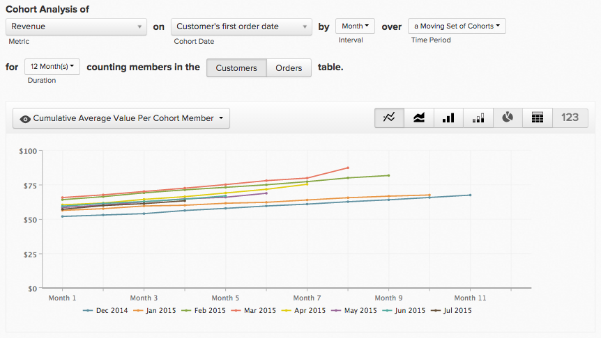

# Report Builder de coorte

Você já quis estudar como diferentes subconjuntos de usuários se comportam ao longo do tempo? Por exemplo, você já se perguntou se os usuários que se registram durante um período promocional têm uma receita média vitalícia maior do que aqueles que não têm? Se a resposta for `Yes`, então `Cohort Report Builder` é a ferramenta perfeita para você. O [!DNL Adobe Commerce Intelligence] foi otimizado para executar esta análise e torná-la relevante para a sua empresa.

## O que é a análise de coorte? {#what}

A análise do `Cohort` pode ser amplamente definida como a análise de grupos de usuários que compartilham características semelhantes em seus ciclos de vida. Ele permite identificar tendências comportamentais em diferentes grupos de usuários.

Para um manual detalhado sobre a análise de `cohort`, revise [esta página](https://www.cohortanalysis.com/).

No painel do [!DNL Commerce Intelligence], é fácil criar o usuário `cohorts` com base em uma data `cohort` e uma métrica em sua conta.

## Bem, por que a análise de coorte é importante? {#important}

Como mencionado acima, a análise de `cohort` permite identificar tendências comportamentais entre diferentes grupos de usuários. Com uma sólida compreensão de como determinados grupos se comportam, você pode adaptar suas decisões e gastos para maximizar suas vendas. Por exemplo, faça uma análise de `cohort` de receita vitalícia - embora esse tipo de análise seja benéfico por vários motivos, a imediata é a tomada de melhores decisões de aquisição do cliente.

## Como faço para criar minha própria análise de `cohort`?

### Nova arquitetura

Estas são as instruções para usar a `Cohort Report Builder` na [Nova Arquitetura](../../administrator/account-management/new-architecture.md).

1. Clique em **[!UICONTROL Report Builder]** na guia esquerda ou em **[!UICONTROL Add Report** > **Create Report]** em qualquer painel.

1. Na tela de seleção `Report Builder`, clique em **[!UICONTROL Create Report]** ao lado da opção `Visual Report Builder`.

**Adicionando uma métrica**

Agora que você está no `Report Builder`, adicione a métrica em que deseja executar a análise (exemplo: `Revenue` ou `Orders`).

>[!NOTE]
>
>Métricas [!DNL Google Analytics] nativas não são compatíveis com `Cohort Report Builder`.

**Alternar o Modo de Exibição de Métrica para`Cohort`**

Isso abre uma nova janela para configurar os detalhes do Relatório `Cohort`.

### Cinco especificações são necessárias para criar um relatório `Cohort`:

1. Como agrupar o `cohorts`
1. O período de tempo `cohort`
1. O número de `cohorts` para exibir
1. A quantidade mínima de dados que cada `cohort` deve conter
1. Intervalo de tempo após `cohort` ocorrência

#### &#x200B;1. Agrupamento `cohorts`

`Cohorts` são agrupados por um carimbo de data e hora, como **data de registro** ou **data da primeira ordem**.

>[!NOTE]
>
>Você não pode usar o mesmo carimbo de data e hora em que a métrica foi criada para a data `cohort`. Para uma análise que exige isso, você pode usar o `Standard report builder`.

#### &#x200B;2. Período de `Cohort`

Escolha o período pelo qual agrupar `cohorts`. Em outras palavras, qual parte do carimbo de data/hora você selecionou acima é mais importante: a `week`, `month`, `quarter` ou `year`? Seu relatório exibe os dados em qualquer intervalo selecionado aqui

#### &#x200B;3. e 4. Defina o número de `cohorts` para exibir e a quantidade de dados que cada `cohort` deve ter

Esses parâmetros ajudam a exibir apenas o `cohorts` no qual você está interessado, e a útil caixa `Preview` na parte inferior da janela mostra exatamente quais coortes são exibidas em seu relatório.

Por padrão, o `cohort` atual não é incluído, a menos que você altere a quantidade mínima de dados necessária para cada `cohort` para `0`. Nesse caso, o `cohort` do período atual inclui apenas dados parciais.

#### &#x200B;5. Intervalo de tempo após a ocorrência de `Cohort`

Este recurso permite que você defina o intervalo de tempo de dados que você visualiza para o `cohorts` selecionado. Por exemplo, se você deseja exibir `cohorts` mensal baseado em `customer's first order date`, mas só está interessado nos primeiros 3 meses de dados para cada `cohort`, você pode definir o `number of cohorts to view` como `24` e o `time range after cohort occurrence` como `3`.

O intervalo desse valor muda de acordo com o que você selecionou no `cohort time period` e o valor é definido como `12` por padrão; o valor não muda a menos que você clique no ícone de calendário para editá-lo.

#### Outras observações

* [!UICONTROL Filters]: aplicado às suas métricas permanece intacto quando você alterna entre as visualizações de `Standard` e `Cohort`.

* Consulte [`Perspectives`](#perspectives).

#### Exemplo

Aqui está um exemplo para reunir tudo. Neste exemplo, desejo verificar o comportamento do pedido após a primeira compra de um `cohort` para ver se esse coorte está voltando a fazer compras repetidas nos próximos seis meses.

### Arquitetura herdada

#### Arquitetura herdada {#personalinfo}

Abaixo estão as instruções específicas para a versão herdada do `Cohort Report Builder`. Se você estiver interessado em usar a nova versão, consulte [Nova arquitetura](../../administrator/account-management/new-architecture.md) para obter mais informações sobre como migrar para uma conta de Nova Arquitetura do [!DNL Commerce Intelligence].

#### Como faço para criar minha própria análise de `cohort`? {#create}

Análise de `Cohort` em ação! Aqui, você pode ver a receita crescendo ao longo do tempo de forma cumulativa e por usuário.

Esta seção mostra como criar sua própria análise do `cohort`. Para ver exemplos (e GIFs animados demonstrando o processo), consulte a [seção Exemplos](#examples) deste tópico.

1. Clique em **[!UICONTROL Report Builder]** na guia esquerda ou em **[!UICONTROL Add Report** > **Create Report]** em qualquer painel.

1. Na tela `Report Builder Selection`, clique em **[!UICONTROL Create Report]** ao lado da opção `Cohort Analysis`.

#### Adição de uma métrica

Agora que você está no `Cohort Report Builder`, adicione a métrica (exemplo: `Revenue` ou `Number of orders`) em que deseja realizar a análise.

>[!NOTE]
>
>Métricas [!DNL Google Analytics] nativas não são compatíveis com `Cohort Report Builder`.

#### Seleção da data de coorte {#date}

A próxima etapa é especificar o `cohort date`. Essa é a data na qual seus usuários são agrupados. Por exemplo, pode ser `User's first order date` ou `User's registration date`.

>[!NOTE]
>
>Você não pode usar a mesma data em que a métrica foi criada (exemplo: `created at`) como `cohort date`.

#### Definição do intervalo e do período de tempo

Em seguida, defina o `Interval` e `Time Period`.

`Interval`
A opção `Interval` permite definir o `length` de seu `cohorts`. Por exemplo, se estiver definido como `Month`, seu relatório será medido em meses.

Você pode alterar como esses intervalos são exibidos no eixo x usando o menu **Duração**.

`Time Period`
Use o menu `Time Period` para escolher o usuário específico `cohorts` a ser analisado. Você pode exibir cada `cohort`, escolher de uma lista, especificar um intervalo de tempo ou definir um intervalo de tempo de acumulado de `cohorts` para incluir. Por exemplo, se você usou a opção `Specific Cohorts`, é possível selecionar meses específicos para incluir na análise:

Se você estiver agrupando `cohorts` por data de registro e selecionar abril, maio e junho na lista `Specific Cohorts`, todos os usuários que se registraram nesses meses serão incluídos.

#### Definição do eixo X

Em `duration`, você pode definir as configurações do eixo X do gráfico. Ou seja, quantos períodos cada ponto de dados representa e quantos pontos de dados devem ser incluídos na análise.

#### Selecionando a tabela `counting members`

Se você optou por agrupar usuários por um `cohort date` que foi unido a partir de outra tabela, você pode ver uma opção `counting members in the … table`.

Veja um exemplo para entender essa configuração. Suponha que você tenha criado um relatório de coorte de uma métrica `Revenue` por `Customer's registration date`. Você também queria usar a perspectiva `Average value per cohort member` para ver a receita por comprador ao longo do tempo. Para encontrar o valor médio por comprador, você precisa decidir pelo número de compradores para dividir. É o número de clientes registrados na tabela `customers` ou é o número de compradores distintos na `orders table` para o mesmo período?

Esta configuração responde a essa pergunta. A contagem de membros na tabela `customers` inclui todos os clientes (tenham eles feito uma compra, nunca) na média. A contagem de membros na tabela `orders` inclui apenas clientes que fizeram uma compra.

#### Seleção de uma perspectiva {#perspective}

Após definir a métrica e saber como analisá-la, você pode selecionar o `perspective` que deseja usar.

Logo acima da visualização do relatório há uma lista suspensa de configurações de `perspective`.

Consulte [Perspectivas](#perspectives).

## Exemplos de análise de coorte {#examples}

Agora que você concluiu a criação de uma análise `cohort`, veja alguns exemplos.

### Quero saber como meu usuário `cohorts` está crescendo ao longo do tempo.

Neste exemplo, você analisou a métrica `Revenue`, agrupou seus coortes por `customer's first order date` e selecionou os 8 `cohorts` mais recentes (definidos no menu `Time Period`) para incluir na análise. Para ver como os coortes cresceram ao longo do tempo, você usou o `Cumulative Average Value per Cohort Member` `perspective`.

### Quero saber, em média, quantos pedidos um usuário faz em pontos diferentes de sua vida.

(../../assets/cohort2.gif)

Neste exemplo, você analisou a métrica `Number of orders`, agrupou suas coortes por `customer's first order date` e incluiu as oito coortes mais recentes (definidas no menu `Time Period`) na análise. Para ver o número médio de pedidos para cada coorte, você alterou o `perspective` para `Average Value per Cohort Member`.

### Quero entender como a atividade de compra futura de um usuário se compara à atividade do primeiro mês com a empresa.

## `Perspectives` {#perspectives}

`Standard`
Ela mostra a contribuição incremental de um determinado grupo de coorte em qualquer ponto do ciclo de vida. (Exemplo: o ponto &quot;Semana 6&quot; exibe todos os pontos de dados feitos pelos usuários na sexta semana.)

`Average Value per Cohort Member`
Isso divide a análise `Standard cohort` em (1) pelo número de usuários em cada grupo `cohort`. Isso pode ser útil para comparar desempenhos de coorte de maçã para maçã, pois nem todos os grupos de coorte podem incluir o mesmo número de usuários. Por exemplo, a receita média da semana 6 por usuário de um determinado `cohort`.

`Cumulative`
Esta `perspective` mostra a análise tradicional `cohort` com base em `cumulative`. Em outras palavras, mostra a contribuição total de um determinado coorte até o momento em qualquer ponto do ciclo de vida. Por exemplo, a receita cumulativa de usuários de um determinado coorte após seis semanas.

`Cumulative Average Value per Cohort Member`
Isso divide a análise `Cumulative` em (3) pelo número de usuários em cada grupo `cohort`. Ela mostra a contribuição média de duração (geralmente receita média de duração) por membro `cohort` em cada período da vida `cohort's`. Por exemplo, a receita média por vida útil após seis meses dos usuários que ingressaram em junho.

`Percent of First Value (show first value)`
Isso analisa a contribuição `cohort` agregada em um momento específico em um ciclo de vida `cohort's` como uma porcentagem de sua contribuição no primeiro período. Por exemplo, a receita do mês 6 dividida pela receita do mês 1 dos usuários que ingressaram em junho.

`Percent of First Value (hide first value)`
É o mesmo que `perspective` acima, exceto que o valor do primeiro período de 100% está oculto.

## Encapsulamento {#finish}

O `Cohort Report Builder` é otimizado para agrupar usuários por um `cohort date` comum. Talvez você esteja interessado em agrupar os usuários por uma atividade ou atributo semelhante. A Adobe recomenda conferir [este tutorial sobre coortes qualitativas](../dev-reports/create-qual-cohort-analysis.md) para começar.
