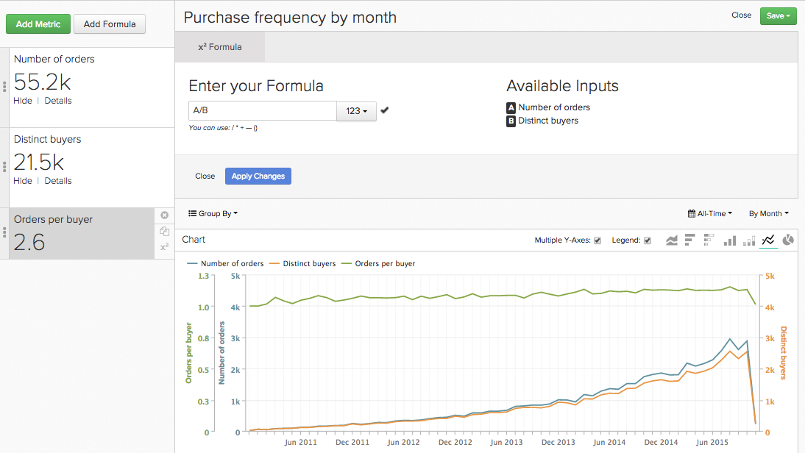
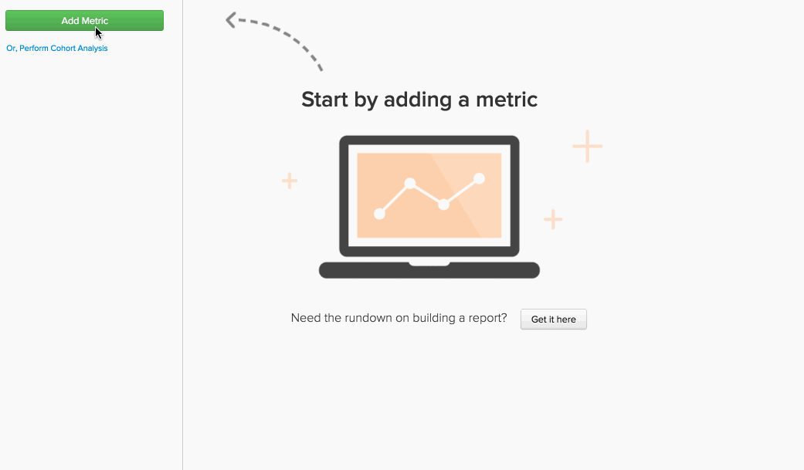

# Fórmulas em `Report Builder`

No [`Report Builder`](../../tutorials/using-visual-report-builder.md), você pode criar visualizações poderosas usando as [métricas definidas](../../data-user/reports/ess-manage-data-metrics.md) em sua conta. Combinar essas métricas em uma fórmula permite obter mais insights dos seus dados. Este tópico aborda como as fórmulas podem ser usadas no `Report Builder` - vamos começar!

## O que é um `formula`? {#what}

No `Report Builder`, um `formula` é apenas uma combinação de uma ou mais métricas baseadas em alguma lógica matemática. Um exemplo típico tem esta aparência:

Neste exemplo, você usa um `Number of orders metric (A)` e um `Distinct buyers metric (B)`, e o objetivo é responder à pergunta: qual é o número médio de pedidos que meus compradores estão fazendo a cada mês? Os parâmetros da fórmula são:

* `Definition`: Aqui, você aplica matemática nas métricas de entrada. Neste exemplo, dividir o número de pedidos pelo número de compradores distintos nos diz o número médio de pedidos. Portanto, a definição é (A/B).

* `Format`: sua fórmula está retornando um número, um período ou um valor de moeda? Ao lado da definição da fórmula há uma lista suspensa, que pode ser usada para especificar o formato do retorno. Nesse caso, é um número.

* `Miscellaneous`: O carimbo de data/hora, os agrupamentos, as perspectivas e os filtros da fórmula são herdados por suas métricas de entrada. Não há nada para fazer aqui!

## Como posso usar o `formulas` em meus relatórios? {#how}

Agora que já abordou as noções básicas, veja alguns exemplos.

### Exemplo: quero descobrir qual porcentagem da minha receita pode ser atribuída a pedidos iniciais.

Neste exemplo, você usou as métricas `Revenue` e `Revenue (first time orders)`. Dividindo a métrica `Revenue (first time orders)(B)` pela `Revenue metric (A)` e definindo o formato de retorno para `Percent`, você pode encontrar a porcentagem da receita que pode ser atribuída aos pedidos feitos pela primeira vez.

### Exemplo: eu quero saber qual é a receita média por pedido quando faço e não ofereço um `promo code`.

Neste exemplo, você usou as métricas `Revenue` e `Number of orders`. A resposta para esta pergunta envolve duas etapas - dividir `Revenue (A)` por `Number of orders (B)` e definir o formato de retorno como `Currency`. Em seguida, você só permitiu que o resultado da fórmula (`Avg. Revenue per order`) exibisse e agrupasse os resultados por `Promo code`.

### Exemplo: quero saber a distribuição das fontes de UTM dos novos clientes.

A resposta para essa pergunta envolve algumas etapas:

1. Primeiro você adicionou a métrica `New Customers` e depois agrupou por `utm_source - all`. Esta é a métrica `A` ou `New Customers (grouped)`.

1. Em seguida, você duplica a métrica `New Customers (grouped)` e a configura para usar uma dimensão independente. Métrica `B` - `New customers (ungrouped)` - mostra o número total de novos clientes.

1. Depois de ocultar ambas as métricas, você define a definição da fórmula como `A/B`. Isso divide o `New customers (grouped)` pelo `New Customers (ungrouped)`.

1. Em seguida, você define o formato de resultados como `Percent`.

Neste exemplo, você usou a perspectiva `Stacked Columns` para exibir os resultados por mês. Isso nos permite comparar a distribuição de novos clientes a cada mês.

## Encapsulamento {#wrapup}

Você observou nos exemplos acima que os `timestamp`, `groupings`, `perspectives` e `filters` da fórmula são herdados de suas métricas de entrada? Lembre-se de que as fórmulas podem ser usadas para usar `perspectives` e [opções de tempo independentes](../../tutorials/time-options-visual-rpt-bldr.md){: target="_blank"}, da mesma forma que as métricas.

Se você tiver mais perguntas sobre o uso de fórmulas no `Report Builder`, [contate o suporte](https://experienceleague.adobe.com/docs/commerce-knowledge-base/kb/troubleshooting/miscellaneous/mbi-service-policies.html?lang=pt-BR).
