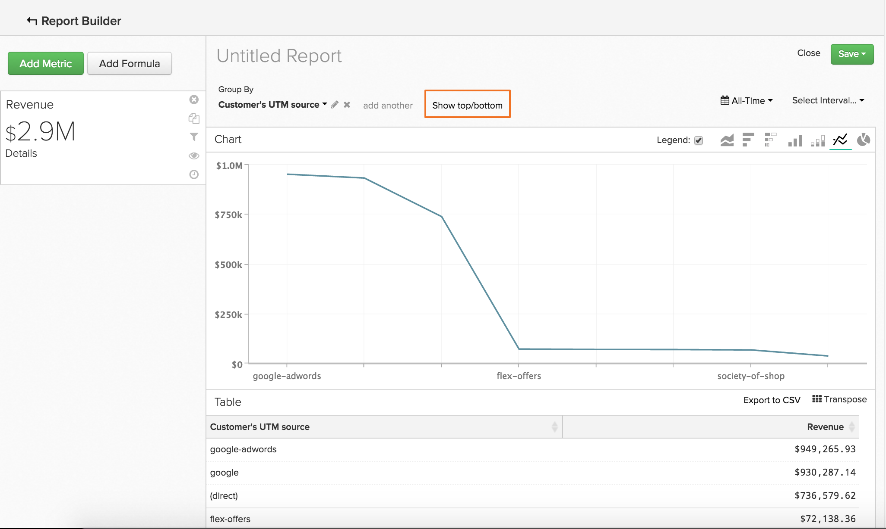
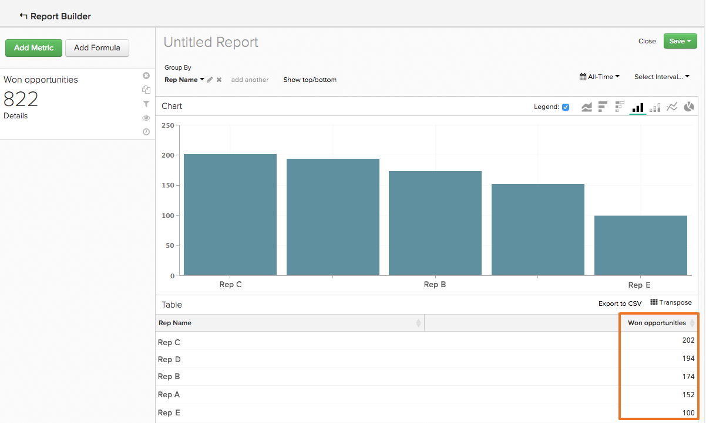

# Ordenando Dados usando o recurso `Show Top/Bottom`

Você pode fazer mais no `Visual Report Builder` do que criar análises de tendência ao longo do tempo. Por exemplo, você pode criar um relatório para mostrar o valor de seus canais de aquisição e marketing, mas também pode criar um relatório que mostre apenas os cinco principais desempenhos. Da mesma forma, é possível redirecionar seus esforços de marketing criando um relatório que mostra quais estados geram mais receita.

Esse tipo de classificação e ordenação de dados pode ser feito em relatórios que usam um `Group By` e um `Time Interval of None`. Quando ambos os elementos estão em um relatório, o recurso `Show Top/Bottom` é exibido acima da visualização do gráfico. Esse recurso permite que você veja os pontos de dados superior (do mais alto ao mais baixo) e inferior (do mais baixo ao mais alto) com base nos parâmetros definidos.

## Como faço para usá-lo? {#how}

Clique em **[!UICONTROL Show Top/Bottom link]** para definir os parâmetros de exibição e classificação. O número na caixa de texto pode ser um número inteiro (como `5`) ou `ALL`. Em seguida, você pode optar por classificar o relatório pela métrica OU pelo agrupamento.

Por exemplo, se você quiser exibir as cinco fontes de referência que geraram mais receita, esta é a maneira como você faz isso:

1. Adicionar a métrica `Revenue` ao relatório.

1. Adicione um `Group By` para segmentar a métrica por fonte de referência.

1. Defina `Time Interval` como `None`.

1. Nas configurações de `Show Top/Bottom`, defina a exibição para `5` para que somente as fontes de referência com os cinco principais valores de receita total sejam incluídas no relatório.

>[!NOTE]
>
>Como o relatório não tem um `Time Interval`, os valores - neste caso, as cinco principais fontes de referência - podem mudar com o tempo. Se uma origem de referência ultrapassar outra em termos de receita, a ordem em que as origens são exibidas será alterada.

## E quanto ao uso de várias métricas? {#multiplemetrics}

O uso desse recurso fica complicado quando há mais de uma métrica em um relatório porque cada métrica só pode ser classificada sozinha ou por um dos agrupamentos.

Digamos que você tenha criado um relatório com as métricas `Revenue` e `Number of orders`, agrupadas por fonte de referência. `Revenue` só pode ser classificado por `Revenue` ou fonte de referência e `Number of orders` só pode ser classificado por `Number of orders` ou fonte de referência.

Isso significa que, embora você possa mostrar `Revenue` somente das `5` principais fontes de referência geradoras de receita, você não pode mostrar o número de pedidos também pelas `5` principais fontes de referência geradoras de receita. Simplificando: quando há várias métricas, a melhor opção é classificar cada métrica pelo agrupamento.

Abaixo está um exemplo de um gráfico que classificou a métrica `Revenue` por ela mesma, em vez de pelo agrupamento. Como você pode ver, não classificar a métrica pelo agrupamento criou um relatório estranho (e, em última análise, inútil):

Se você tivesse classificado ambas as métricas pelo agrupamento, o gráfico seria semelhante a:

## Como os valores são classificados por padrão? {#defaultsorting}

Quando apenas uma métrica é incluída em um relatório com um `Group by` e um `Time Interval` de `None`, a ordenação padrão no `Visual Report Builder` é mostrar os valores principais com base na métrica. Nesta instância, o recurso `Show Top/Bottom` pode não ser necessário se isso atender às suas necessidades.

Este exemplo analisa quantas oportunidades seus representantes de vendas fecharam. Esta tabela é classificada automaticamente da mais alta para a mais baixa com base na métrica, neste caso `Won Opportunities`.

No entanto, quando uma segunda métrica é adicionada, o padrão é ordenar a parte superior com base no agrupamento. À medida que métricas e agrupamentos são adicionados, a classificação padrão é baseada no primeiro agrupamento, depois no segundo agrupamento e assim por diante.

## Encapsulamento {#wrapup}

Embora alguns recursos básicos sejam abordados aqui, esse recurso tem muitos usos interessantes.

Pense no exemplo de oportunidades e do representante de vendas anterior. Remover o `Time Interval`, aplicar um `Group By` e classificar os dados com base no agrupamento nos permitiu obter uma visão detalhada do número de oportunidades ganhas de cada representante. Além disso, o uso do recurso `Show Top/Bottom` permite descobrir quem são os melhores desempenhos.
