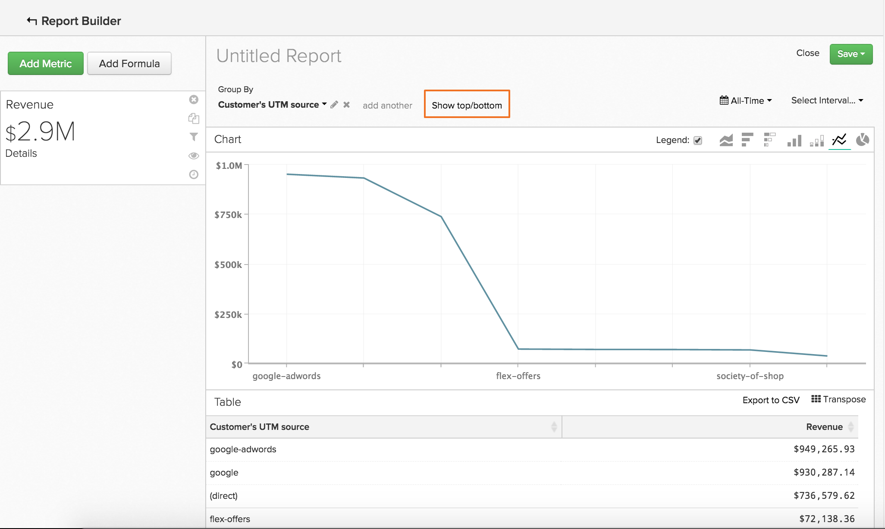

# Ordenação de dados usando `Show Top/Bottom` recurso

Você pode fazer mais no `Visual Report Builder` do que criar análises com tendência ao longo do tempo. Por exemplo, você pode criar um relatório para mostrar o valor de seus canais de aquisição e marketing, mas também pode criar um relatório que mostre apenas os cinco principais desempenhos. Da mesma forma, é possível redirecionar seus esforços de marketing criando um relatório que mostra quais estados geram mais receita.

Esse tipo de classificação e ordem de dados pode ser feito em relatórios que usam uma `Group By` e uma `Time Interval of None`. Quando ambos os elementos estão em um relatório, a variável `Show Top/Bottom` é exibido acima da visualização do gráfico. Esse recurso permite que você veja os pontos de dados superior (do mais alto ao mais baixo) e inferior (do mais baixo ao mais alto) com base nos parâmetros definidos.

## Como faço para usá-lo? {#how}

Clique em **[!UICONTROL Show Top/Bottom link]** para definir os parâmetros de exibição e classificação. O número na caixa de texto pode ser um número inteiro (como `5`ou `ALL`. Em seguida, você pode optar por classificar o relatório pela métrica OU pelo agrupamento.

Por exemplo, se você quiser exibir as cinco fontes de referência que geraram mais receita, esta é a maneira como você faz isso:

1. Adicione o `Revenue` para o relatório.

1. Adicionar um `Group By` para segmentar a métrica por fonte de referência.

1. Definir `Time Interval` para `None`.

1. No `Show Top/Bottom` , defina a exibição como `5` portanto, somente as fontes de referência com os cinco principais valores de receita total são incluídas no relatório.

>[!NOTE]
>
>Como o relatório não tem uma `Time Interval`, os valores - neste caso, as cinco principais fontes de referência - podem mudar com o tempo. Se uma origem de referência ultrapassar outra em termos de receita, a ordem em que as origens são exibidas será alterada.

## E quanto ao uso de várias métricas? {#multiplemetrics}

O uso desse recurso fica complicado quando há mais de uma métrica em um relatório porque cada métrica só pode ser classificada sozinha ou por um dos agrupamentos.

Digamos que você criou um relatório com os `Revenue` e `Number of orders` métricas, agrupadas por fonte de referência. `Revenue` só pode ser classificado por `Revenue` ou fonte de referência e `Number of orders` só pode ser classificado por `Number of orders` ou fonte de referência.

Isso significa que, embora você possa mostrar a `Revenue` somente no início `5` fontes de referência geradoras de receita, não é possível mostrar o número de pedidos também pela parte superior `5` fontes de referência geradoras de receita. Simplificando: quando há várias métricas, a melhor opção é classificar cada métrica pelo agrupamento.

Veja abaixo um exemplo de um gráfico que classificou a `Revenue` por si só, em vez de pelo agrupamento. Como você pode ver, não classificar a métrica pelo agrupamento criou um relatório estranho (e, em última análise, inútil):

Se você tivesse classificado ambas as métricas pelo agrupamento, o gráfico seria semelhante a:

## Como os valores são classificados por padrão? {#defaultsorting}

Quando apenas uma métrica é incluída em um relatório com um `Group by` e uma `Time Interval` de `None`, a ordenação padrão no `Visual Report Builder` é para mostrar os valores principais com base na métrica. Neste caso, o `Show Top/Bottom` Esse recurso pode não ser necessário se atender às suas necessidades.

Este exemplo analisa quantas oportunidades seus representantes de vendas fecharam. Essa tabela é classificada automaticamente da mais alta para a mais baixa com base na métrica, nesse caso `Won Opportunities`.

No entanto, quando uma segunda métrica é adicionada, o padrão é ordenar a parte superior com base no agrupamento. À medida que métricas e agrupamentos são adicionados, a classificação padrão é baseada no primeiro agrupamento, depois no segundo agrupamento e assim por diante.

## Encapsulamento {#wrapup}

Embora alguns recursos básicos sejam abordados aqui, esse recurso tem muitos usos interessantes.

Pense no exemplo de oportunidades e do representante de vendas anterior. Remover o `Time Interval`, aplicando um `Group By`e classificar os dados com base no agrupamento nos permitiu obter uma imagem detalhada do número de oportunidades ganhas de cada representante. Além disso, usando o `Show Top/Bottom` O recurso permite descobrir quem são os melhores desempenhos.
