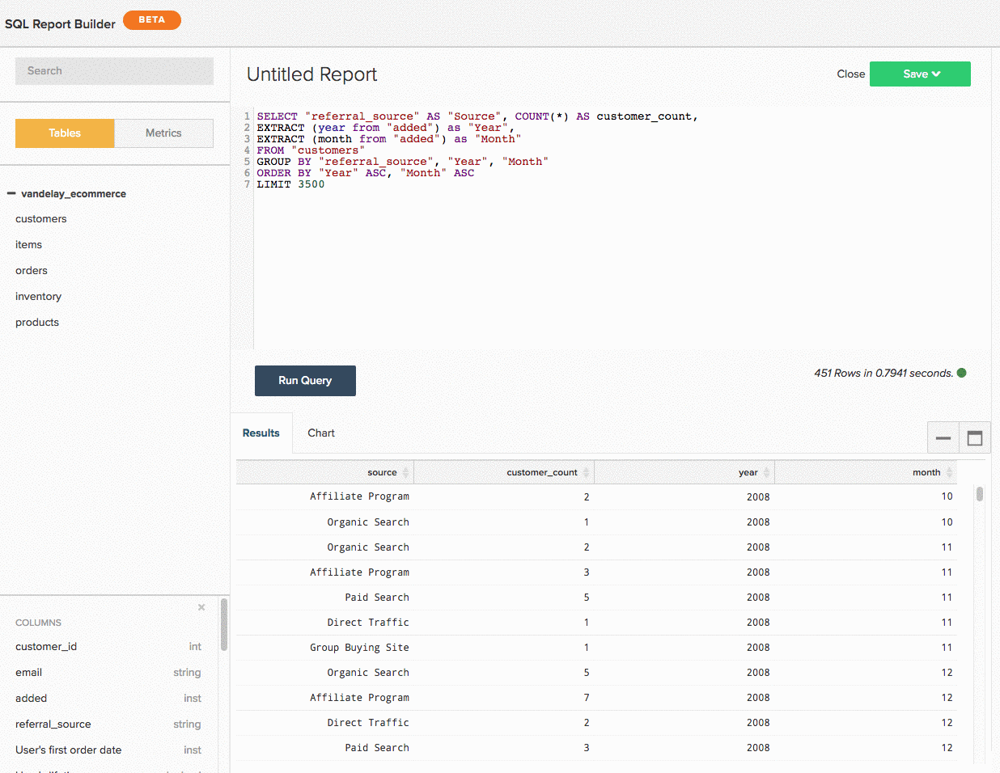

# Usando o [!DNL SQL Report Builder]

>[!NOTE]
>
>Exige [permissões de administrador](../../administrator/user-management/user-management.md) para criar e editar gráficos SQL. `Standard` usuários podem reorganizar esses gráficos em painéis, e `Read-only` usuários têm a mesma experiência que têm com gráficos tradicionais. Além disso, `Read-only` usuários não têm acesso ao texto da consulta.

Veja o [vídeo de treinamento](https://experienceleague.adobe.com/docs/commerce-knowledge-base/kb/how-to/mbi-training-video-sql-report-builder.html?lang=pt-BR) para saber mais.

[!DNL SQL], ou Linguagem de Consulta Estruturada, é uma linguagem de programação usada para se comunicar com bancos de dados. No [!DNL Commerce Intelligence], o [!DNL SQL] é usado para consultar ou recuperar dados da sua Data Warehouse. Examine os relatórios em seu painel - nos bastidores, cada um é alimentado por uma consulta [!DNL SQL].

Você pode usar o [[!DNL SQL Report Builder]](../dev-reports/sql-rpt-bldr.md) para consultar diretamente a Data Warehouse, visualizar os resultados e transformá-los em um gráfico. Você pode começar a criar um relatório com o [!DNL SQL Report Builder] clicando em **[!UICONTROL Report Builder** > **[!DNL SQL Report Builder]]**.

Veja o [vídeo de treinamento](https://experienceleague.adobe.com/docs/commerce-knowledge-base/kb/how-to/mbi-training-video-sql-report-builder.html?lang=pt-BR) para saber mais.

O [!DNL SQL Report Builder] permite consultar diretamente a Data Warehouse, visualizar os resultados e transformá-los rapidamente em um gráfico. A melhor parte do uso do [!DNL SQL] para criar relatórios é que você não precisa esperar nos ciclos de atualização para iterar nas colunas que criar. Se os resultados não parecerem corretos, você poderá editar e executar novamente a query rapidamente até que tudo corresponda às suas expectativas.

Este tópico mostra como usar o [!DNL SQL Report Builder]. Depois de conhecer sua alternativa, confira o tutorial do [!DNL SQL] para visualizações ou tente otimizar algumas das consultas que você escreveu.

Abrangido neste artigo:

1. [Gravação de uma consulta](#writing)

1. [Execução da consulta e exibição dos resultados](#runquery)

1. [Criação de uma visualização](#createviz)

1. [Salvamento do relatório](#save)

## [!DNL SQL Report Builder] Integrações

[[!DNL Google Analytics]](../importing-data/integrations/google-analytics.md) é a única integração não disponível para uso com o [[!DNL SQL Report Builder]](../dev-reports/sql-rpt-bldr.md). Essa funcionalidade está em desenvolvimento.

Para começar a criar um relatório de [!DNL SQL], clique em **[!UICONTROL Report Builder]** ou **[!UICONTROL Add Report]** na parte superior de qualquer painel. Na tela [!DNL Report Picker], clique em **[!UICONTROL SQL Report Builder]** para abrir o editor [!DNL SQL].

## Introdução

Para editar um relatório, clique no ícone de engrenagem () no canto superior direito de um gráfico baseado em [!DNL SQL] e clique em **[!UICONTROL Edit]**.

## Gravação de uma consulta {#writing}

>[!NOTE]
>
>[!DNL SQL Report Builder] consultas diferenciam maiúsculas de minúsculas. Verifique se está usando as letras maiúsculas e minúsculas corretas ao escrever consultas ou você pode acabar com resultados inesperados ou erros.

Seguindo as [diretrizes de otimização de consulta](../../best-practices/optimizing-your-sql-queries.md), escreva uma consulta no editor [!DNL SQL].

>[!IMPORTANT]
>
>**Métricas em [!DNL SQL] relatórios** - Quando você insere uma métrica em um relatório SQL, o `current definition` da métrica é usado.

Se a métrica for atualizada no futuro, o relatório SQL *não* refletirá as alterações. Você deve editar o relatório manualmente para que as alterações entrem em vigor.

Usando os botões na parte superior da barra lateral, você pode alternar entre listas de tabelas e métricas disponíveis para uso no [!DNL SQL Report Builder]. Se você não vir o que está procurando na lista, tente pesquisá-lo usando a barra de pesquisa na parte superior da barra lateral.

Você também pode usar a barra lateral no editor [!DNL SQL] para inserir métricas, tabelas e colunas diretamente nas consultas, passando o mouse sobre elas e clicando em **[!UICONTROL Insert]**:

![Inserindo uma tabela no editor [!DNL SQL].](../../assets/SQL_RB_Insert_Table.png)

>[!NOTE]
>
>Qualquer [função SELECT](https://www.postgresql.org/docs/9.5/sql-select.html#SQL-SELECT-LIST), ou qualquer função que não altere dados, que seja suportada pelo PostgreSQL, é suportada no Report Builder SQL. Isso inclui, mas não está limitado a, MÉDIA, CONTAGEM, CONTAGEM DISTINTA, MÍN/MAX e SOMA.

Além disso, qualquer tipo `JOIN` é suportado, mas o Adobe recomenda usar somente INNER JOIN, pois é o mais barato dos tipos `JOIN`.

## Execução da consulta e exibição dos resultados {#runquery}

Quando terminar de gravar sua consulta, clique em **[!UICONTROL Run Query]**. Os resultados são exibidos em uma tabela abaixo do editor SQL:

Se algo parecer incorreto nos resultados, você poderá editar a consulta e executá-la novamente até que esteja satisfeito.

Às vezes, você pode ver [mensagens abaixo do editor com EXPLICAR nelas](../../best-practices/optimizing-your-sql-queries.md). Se você vir um desses, significa que o query não foi executado e precisa de um pouco de ajuste.

Após concluir a edição do query, você pode criar uma visualização ou salvar o trabalho em um painel.

## Criação de uma visualização {#createviz}

Para criar uma visualização com os resultados da consulta, clique na guia **[!UICONTROL Chart]** no painel `Results`. Nesta guia, você seleciona:

* O `Series` ou a coluna que você deseja medir, como **Itens vendidos**.
* A `Category` ou a coluna que você deseja usar para segmentar seus dados, como **fonte de aquisição**.
* Os valores do eixo `Labels` ou X.

Veja abaixo como é o processo de visualização:

Para obter uma apresentação detalhada de como criar uma visualização, consulte o [Tutorial de criação de visualizações de consultas SQL](../../tutorials/create-visuals-from-sql.md){: target=&quot;_blank&quot;}.

## Salvamento do relatório {#save}

Antes de salvar seu trabalho, você deve dar um nome ao relatório. Lembre-se de seguir as [diretrizes de práticas recomendadas para nomenclatura](../../best-practices/naming-elements.md){: target=&quot;_blank&quot;} e escolher algo que transmita claramente o que é o relatório!

Clique em **[!UICONTROL Save]** no canto superior direito do editor [!DNL SQL] e selecione o relatório `Type` (`Chart` ou `Table`). Para finalizar, selecione o painel no qual salvar o relatório e clique em **[!UICONTROL Save to Dashboard]**.

### Analisar seus dados

#### [!DNL SQL Report Builder]

O [[!DNL SQL Report Builder]](../dev-reports/sql-rpt-bldr.md) possibilita consultar diretamente a Data Warehouse, visualizar os resultados e transformá-los rapidamente em um relatório. Usar o [!DNL SQL] também permite que você [use [!DNL SQL] funções que não estão disponíveis](https://docs.aws.amazon.com/redshift/latest/dg/c_SQL_functions.html) nos `Visual` ou `Cohort` Report Builder, dando a você maior controle sobre seus dados.

As colunas calculadas criadas usando [!DNL SQL] não dependem dos ciclos de atualização, o que significa que você pode iterar nelas da maneira que desejar e ver os resultados imediatamente.

>[!NOTE]
>
>Isso se aplica somente à estrutura da coluna, não à atualização dos dados. Os dados atualizados ainda dependem dos ciclos de atualização concluídos com êxito.

| **Perfeito para...** | **Isso não é tão bom para...** |
|---|---|
| Analistas intermediários/avançados | Iniciantes - você precisa saber [!DNL SQL]. |
| O especialista [!DNL SQL] | Análises simples - escrever uma consulta pode ser mais trabalhoso que simplesmente usar o [!UICONTROL Visual Report Builder]. |
| Criação de colunas calculadas de uso único | Compartilhamento com outras pessoas - considere seu público-alvo: eles entendem [!DNL SQL]? Caso contrário, eles podem se confundir com a forma como o relatório é construído. |
| Dados com `one-to-many` relações |  |
| Teste de uma nova coluna ou análise |  |

#### Resultados do Editor de Banco de Dados vs SQL

Na maioria das vezes, as diferenças nos resultados podem ser atribuídas aos ciclos de atualização. Se [!DNL Commerce Intelligence] estiver replicando dados do banco de dados para a Data Warehouse, você poderá ver resultados diferentes mesmo ao usar a mesma consulta.

Problemas de conexão também podem resultar em discrepâncias. Navegue até a página `Connections` clicando em **[!DNL Manage Data** > **Connections]** para fazer o check-out - há um erro para a integração de banco de dados em questão? Em caso afirmativo, talvez seja necessário [reautenticar a integração](https://experienceleague.adobe.com/docs/commerce-knowledge-base/kb/how-to/mbi-reauthenticating-integrations.html?lang=pt-BR) para executar as tarefas novamente.

Se todas as suas integrações forem conectadas com êxito e você não estiver no meio de um ciclo de atualização, talvez haja algo errado.

#### A exclusão de um relatório [!DNL SQL] também exclui as colunas subjacentes da minha Data Warehouse?

Não, você não perde nenhuma coluna da Data Warehouse, independentemente de como as criou.

As colunas criadas usando `Data Warehouse Manager` não serão afetadas se você excluir um relatório ou consulta que as utiliza.

As colunas criadas usando o [!DNL SQL Report Builder] não são salvas na Data Warehouse.

#### `Report Builder` versus `SQL Report Builder`

O [!DNL SQL Report Builder] oferece mais flexibilidade ao criar e estruturar seus gráficos - você pode, por exemplo, selecionar quais valores devem ser mostrados nos eixos `X` e `Y`. Para obter mais informações sobre como criar gráficos no [!DNL SQL Report Builder], confira o tutorial [Criação de visualizações de [!DNL SQL] consultas](../../tutorials/create-visuals-from-sql.md).

#### `Cohort Report Builder` {#cohortrb}

Ao contrário do [!DNL Visual Report Builder], o [[!DNL Cohort Report Builder]](../dev-reports/cohort-rpt-bldr.md) é destinado a um único propósito - analisar e identificar tendências comportamentais de grupos de usuários semelhantes ao longo do tempo. O uso do [!DNL Cohort Report Builder] não requer nenhum conhecimento do [!DNL SQL], portanto, você pode mergulhar imediatamente, sem hesitar, se estiver apenas começando.

| **Perfeito para...** | **Isso não é tão bom para...** |
|---|---|
| Analistas intermediários/avançados | Iniciantes - você precisa de coortes que definam práticas. |
| Identificação de tendências comportamentais ao longo do tempo | Análise qualitativa - pode ser [concluído](../dev-reports/create-qual-cohort-analysis.md), mas requer assistência para Adobe. |

## Reconstrução de Consultas após o Ciclo de Atualização

Não é necessário recriar as consultas. Os relatórios criados usando o [[!DNL SQL Report Builder]](../dev-reports/sql-rpt-bldr.md) são salvos como os criados no `Report Builder` tradicional. O processo de atualização dos gráficos de [!DNL SQL] é o mesmo - depois que os dados forem atualizados, os valores nos gráficos serão recalculados e exibidos novamente.

>[!NOTE]
>
>Ao excluir um relatório/consulta [!DNL SQL], as colunas subjacentes não são excluídas da sua Data Warehouse. Você não perde nenhuma coluna, independentemente de como as criou.

* As colunas criadas usando o Gerenciador de Datas Warehouse não serão afetadas se você excluir um relatório ou consulta que as utiliza.

* As colunas criadas usando o Report Builder SQL não são salvas na Data Warehouse.

## Encapsulamento {#wrapup}

Se você deseja tentar algo um pouco mais desafiador, por que não tentar escrever uma consulta otimizada para visualização? Confira o [Tutorial de criação de visualizações de [!DNL SQL] consultas](../../tutorials/create-visuals-from-sql.md){: target=&quot;_blank&quot;} para começar.
