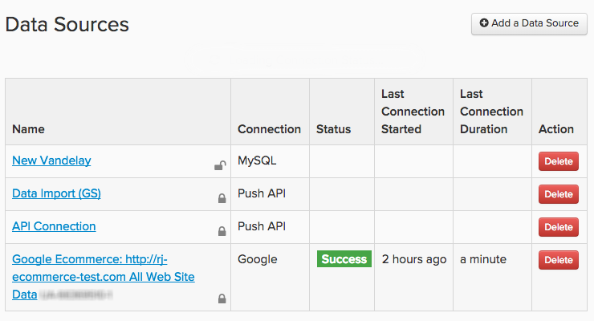

# Conectar seus dados

Em [!DNL Adobe Commerce Intelligence], as fontes de dados são chamadas `integrations`. Depois que um `integration` for conectado com êxito, você poderá procurar as tabelas disponíveis para sincronização no Gerenciador de Datas Warehouse.

As integrações são adicionadas e gerenciadas usando a página `Connections`, que pode ser acessada clicando em **[!UICONTROL Manage Data** > **Connections]**. Aqui, você vê:

* uma lista de todas as integrações conectadas à sua conta

* o tipo de integração

* ([!DNL Google Analytics] e [!DNL Data Import API] conexões têm campos de status em branco)

* a última vez que um teste de conexão (`Last Connection Started` coluna) foi executado

## Tipos de integrações

Há quatro maneiras de obter seus dados no [!DNL Commerce Intelligence]: conectar um banco de dados, conectar uma integração SaaS, carregar um arquivo `.csv` ou usar a API Adobe.

## Integrações de banco de dados

[!DNL Commerce Intelligence] dá suporte a bancos de dados NoSQL e baseados em SQL, como [MySQL](../../importing-data/integrations/mysql-via-ssh-tunnel.md), [Microsoft SQL](../integrations/microsoft-sql-server.md), [MongoDB](../integrations/mongodb-via-ssh-tunnel.md) e [PostgreSQL](../integrations/postgresql.md).

Embora você possa conectar seu banco de dados diretamente ao [!DNL Commerce Intelligence] usando as credenciais do banco de dados, o Adobe recomenda que você use um método de criptografia comprovado, como um túnel SSH. Isso garante que seus dados permaneçam seguros à medida que são enviados para sua Data Warehouse.

Dependendo do método de conexão e do tipo de banco de dados, talvez seja necessário algum conhecimento técnico para concluir a configuração.

## `SaaS` Integrações

spree-commerce-logo.png

`SaaS` integrações são serviços como [[!DNL Google Adwords]](../integrations/google-adwords.md), [[!DNL Salesforce]](../integrations/salesforce.md) e [[!DNL Zendesk]](../integrations/zendesk.md). Como os dados de terceiros residem no servidor do fornecedor, não é possível acessá-los diretamente como é possível com os dados no banco de dados.

Normalmente, configurar uma integração no [!DNL Commerce Intelligence] é tão fácil quanto simplesmente inserir suas credenciais de conta. Alguns serviços podem exigir uma chave de API para concluir a autorização. Confira a [seção de integrações](../integrations/integrations.md) para obter instruções sobre como gerar as credenciais necessárias.

## Upload de arquivo

Não tem certeza de como obter dados de uma fonte complementar na sua Data Warehouse? [Usar o recurso `File Upload`](../connecting-data/using-file-uploader.md) é uma boa maneira de obter dados que você não precisa para tomar decisões diárias. Seguindo as regras de formatação, você pode carregar rapidamente arquivos do `.csv` na Data Warehouse e juntá-los a outras fontes de dados.

## [!DNL Commerce Intelligence] `Import API`

Se você preferir automatizar a recuperação de dados de uma de suas próprias fontes, poderá usar o [!DNL Commerce Intelligence] `Import API`. Basicamente, se não estiver em um banco de dados ou em uma integração do `SaaS`, a função `Import API` será a sua melhor opção.

O uso da API requer um pouco de conhecimento técnico - alguém que esteja familiarizado com a escrita e manutenção de um pequeno script Ruby ou PHP é mais do que qualificado.

Para saber mais sobre a introdução ao `Import API`, verifique o [site do desenvolvedor](https://developer.adobe.com/commerce/services/reporting/) e [como gerar uma chave de API](https://developer.adobe.com/commerce/services/reporting/import-api/).

## Adicionar uma integração

Para adicionar uma integração, clique em **[!UICONTROL Manage Data** > **Connections]** e em **[!UICONTROL Add a New Data Source]**. Clique no ícone da integração que deseja adicionar e siga as instruções nos tópicos de ajuda para configurar:

* [Perguntas frequentes sobre integração](https://support.magento.com/hc/en-us/sections/360003161871-Integration-FAQ)
* [Disponível ](../integrations/integrations.md)
* [Consolidação de tabelas](../../../best-practices/consolidating-your-tables.md)
* [Restrição do acesso ao banco de dados](../../../administrator/account-management/restrict-db-access.md)

**Não está vendo uma integração desejada?** Algumas integrações devem ser ativadas para que fiquem visíveis em sua conta. Se você estiver procurando algo como [!DNL Facebook], mas ele não está listado, [envie um tíquete de suporte](https://experienceleague.adobe.com/docs/commerce-knowledge-base/kb/troubleshooting/miscellaneous/mbi-service-policies.html).

**Se você vir um status de erro para uma integração**, confira a [seção Solução de problemas](https://support.magento.com/hc/en-us/sections/360003078151) para obter ajuda.
