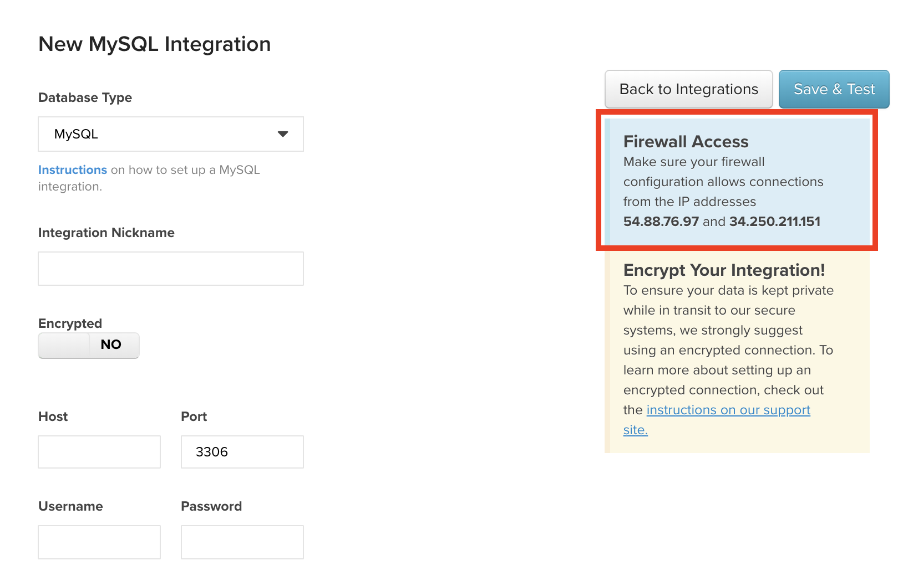

# Conectar Amazon RDS

O Amazon Relational Database Services (RDS) é um serviço de banco de dados gerenciado que é executado em mecanismos de banco de dados que você provavelmente já conhece - [[!DNL MySQL]](../integrations/mysql-via-a-direct-connection.md), [[!DNL Microsoft SQL]](../integrations/microsoft-sql-server.md)e [[!DNL PostgreSQ]](../integrations/postgresql.md).

As etapas para conectar a instância do RDS variam um pouco dependendo do tipo de banco de dados que você está usando (use os links acima para obter instruções detalhadas para cada banco de dados) e se você está usando ou não uma conexão criptografada (como uma [`SSH tunnel for MySQL`](../integrations/mysql-via-ssh-tunnel.md)), mas aqui estão os conceitos básicos:

## Autorizar [!DNL MBI] para acessar seu banco de dados

Na página credenciais (**[!UICONTROL Manage Data** > **Integrations]**) para cada banco de dados, você verá uma caixa contendo os endereços IP que precisará autorizar para conectar o RDS ao MBI: `54.88.76.97` e `34.250.211.151`. Veja a seguir a `MySQL credentials` , onde destacamos a caixa de endereço IP:

Para [!DNL MBI] para se conectar com êxito à instância do RDS, será necessário adicionar esses endereços IP ao grupo de segurança de banco de dados apropriado por meio do console de gerenciamento do AWS. Esses endereços IP podem ser adicionados a um grupo existente ou você pode criar um novo - o importante é que o grupo esteja autorizado a acessar a instância à qual deseja se conectar [!DNL MBI].

Ao adicionar o [!DNL MBI] Endereços IP, certifique-se de adicionar um `/32` ao final do endereço para indicar à Amazon que é um endereço IP exato. Não se preocupe; a interface do AWS deixará claro que isso é necessário.

## Crie um `Linux` usuário para [!DNL MBI] {#linux}

>[!NOTE]
>
>Essa etapa só é necessária se você estiver usando uma conexão criptografada. Para obter instruções sobre como fazer isso, consulte o artigo de configuração do banco de dados que você está usando (por exemplo: MySQL). O `Linux` O usuário permitirá que criemos um `SSH tunnel`, que é o método mais seguro de enviar dados pela Internet.

## Criar um usuário de banco de dados para MBI

Essa é a parte do processo em que, dependendo do banco de dados que você está usando, as etapas variam. A ideia é a mesma, no entanto: você criará um usuário para [!DNL MBI] que será usada para acessar seu banco de dados. Instruções para criação de um banco de dados [!DNL MBI] O usuário pode ser encontrado no artigo de configuração do banco de dados que você está usando.

## Inserir informações de conexão no MBI

Depois de conceder [!DNL MBI] acesso à sua instância e criação de um usuário para nós, a última coisa que você precisa fazer é inserir as informações de conexão em [!DNL MBI].

As páginas de credenciais para `MySQL`, `Microsoft SQL`e `PostgreSQL` são acessadas por meio do `Integrations` página (**[!UICONTROL Manage Data** > **Integrations]**) clicando em **[!UICONTROL Add Integration]**. Quando a lista de integrações for exibida, clique no ícone do banco de dados que você está usando para ir para a página de credenciais. Se, atualmente, você não tem acesso à integração necessária, entre em contato com seu CSM.

Para concluir a criação da conexão, precisaremos das seguintes informações:

* O endereço público da sua instância do RDS: Isso pode ser encontrado no console de gerenciamento do AWS.
* A porta que sua instância de banco de dados usa: Alguns bancos de dados têm uma porta padrão, que preencherá automaticamente a variável `Port` campo. Essas informações também podem ser encontradas na documentação de configuração do banco de dados.
* O nome de usuário e a senha do usuário criado para o [!DNL MBI].

Se estiver usando uma conexão criptografada, altere a variável `Encrypted` alternar a página credenciais do banco de dados para `Yes`. Isso exibirá um formulário adicional para configurar a criptografia:

Isso é tudo! A conexão da instância do RDS foi concluída.
