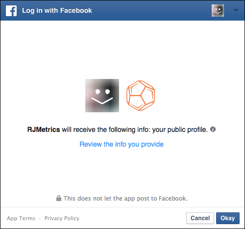

# Connect [!DNL Facebook Ads]

>[!NOTE]
>
>Exige [Permissões de administrador](../../../administrator/user-management/user-management.md).

Você fez sua pesquisa, criou seus anúncios, lançou sua campanha [!DNL Facebook]. Agora é hora de analisar os dados de gastos com publicidade e ver se seu dinheiro está sendo gasto de maneira eficaz. Com os dados de gastos com sua publicidade, você pode [avalie o ROI da campanha relacionando-se com seu custo de publicidade e o valor da vida útil do cliente (CLV)](../../../data-analyst/analysis/roi-ad-camp.md) de usuários adquiridos em suas campanhas.

Conectar seus dados de anúncio do Facebook ao [!DNL MBI] O é um processo simples de três etapas:

1. [Adicionar [!DNL Facebook] como uma fonte de dados em [!DNL MBI]](#stepone)
1. [Permitir [!DNL MBI] acesso ao seu [!DNL Facebook Ads] dados](#steptwo)
1. [Selecionar [!DNL Facebook Ads] Contas para extração de dados](#stepthree)

## Adicionar [!DNL Facebook] como uma fonte de dados em [!DNL MBI] {#stepone}

1. Para adicionar o [!DNL Facebook] para sua conta do , navegue até o `Connections` página abaixo **[!UICONTROL Manage Data** > **Integrations]**.
1. Clique em **[!UICONTROL Add Integration]**, localizado no lado direito da tela acima dos dados `Sources` tabela.
1. Clique no botão [!DNL Facebook] ícone . Isso exibirá a variável [!DNL Facebook] página de autorização.
1. Clique em **[!UICONTROL Authorize]**.

## Permitir [!DNL MBI] acesso ao seu [!DNL Facebook Ads] dados {#steptwo}

Depois de clicar **[!DNL Facebook Authorize]**, uma pequena janela pop-up será exibida:

Você seguirá uma série de etapas para permitir [!DNL MBI] para acessar dados do seu Perfil público, [!DNL Facebook Ads] e estatísticas relacionadas. Clique em **[!UICONTROL OK]** nestas etapas para continuar.

## Selecionar [!DNL Facebook Ads] Contas para extração de dados {#stepthree}

1. Depois que a autenticação for concluída, você será solicitado a selecionar a variável [!DNL Facebook Ads] Contas das quais você deseja extrair dados. Selecione as contas desejadas clicando na caixa de seleção na `Connect` coluna.

   

1. Clique em **[!UICONTROL Save Connections]**.

   Se a conexão for bem-sucedida, uma *Conexão bem-sucedida!* será exibida na parte superior da página.

## o que vem a seguir? {#next}

Certifique-se de que você esteja rastreando [!DNL Facebook] campanhas em [!DNL Google Analytics] de acordo com este [tutorial](https://www.facebook.com/business/google-analytics). Isso garantirá que a `utm\_campaign` em [!DNL Google Analytics] for preenchido corretamente para o [!DNL Facebook] campanhas.

## Relacionado

* [Reautenticação de integrações](https://support.magento.com/hc/en-us/articles/360016733151)
* [Conecte seu [!DNL Google Adwords] account](../integrations/google-ecommerce.md)
* [Rastrear origem de referência do pedido via [!DNL Google eCommerce]](../integrations/google-ecommerce.md)
* [Rastrear a fonte de referência do usuário no seu banco de dados](../../analysis/google-track-user-acq.md)
* [Rastrear dados do dispositivo do usuário, do navegador e do SO no seu banco de dados](../../analysis/track-usr-dev-browser.md)
* [Descubra as fontes e os canais de aquisição mais valiosos](../../analysis/most-value-source-channel.md)
* [Aumente o ROI em suas campanhas publicitárias](../../analysis/roi-ad-camp.md)
* [Como [!DNL Google Analytics] A atribuição de UTM funciona?](../../analysis/utm-attributes.md)
