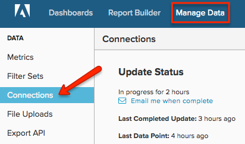

# Conectar o Servidor [!DNL Microsoft SQL]

>[!NOTE]
>
>Requer [permissões de administrador](../../../administrator/user-management/user-management.md).

Este tópico explica como conectar o banco de dados do [!DNL Microsoft SQL] ao [!DNL Commerce Intelligence] em um processo de quatro etapas. Esse processo requer alguma experiência técnica relacionada às conexões do servidor e ao SQL, e pode exigir suporte de desenvolvedores em sua equipe.

[!DNL Commerce Intelligence] dá suporte a [!DNL Amazon RDS], [!DNL EC2], [!DNL Microsoft SQL Azure] e à maioria dos outros provedores de servidor de nuvem. Se você tiver uma dúvida sobre o seu host específico, [envie um tíquete de suporte](https://experienceleague.adobe.com/docs/commerce-knowledge-base/kb/troubleshooting/miscellaneous/mbi-service-policies.html) solicitando que forneçamos essas informações.

O sistema precisa executar consultas SELECT no banco de dados. Isso é feito inicialmente para obter um instantâneo da estrutura do banco de dados e, em seguida, regularmente ao longo do tempo para manter seus dados atualizados. Suas atualizações são incrementais e a Adobe restringe a frequência e o tempo de atualização para evitar qualquer carga indesejada no servidor.

A melhor maneira de fazer isso é conectarmos ao seu servidor de banco de dados via TCP/IP. Crie um usuário que possa apenas executar consultas SELECT (e, opcionalmente, só possa selecionar dados das tabelas especificadas). Isso deve ser feito para cada um dos servidores aos quais você está se conectando o [!DNL Commerce Intelligence].

## Conectando `Microsoft SQL` a [!DNL Commerce Intelligence]:

1. Verifique se o servidor permite conexões por TCP/IP e autenticação de modo misto.

1. Certifique-se de que o firewall permite a conexão do IP dedicado do servidor.

   Você pode encontrar o endereço IP usado para se conectar ao servidor na seção de conexões da página `Settings`.

1. Crie um usuário para fazer logon no servidor de banco de dados. Você tem duas opções: via `UI` ou via `query`:
   * `UI`
   * `Query`

1. Insira o endereço IP, o nome de usuário e a senha do servidor em [!DNL Commerce Intelligence] em **[!UICONTROL Manage Data** > **Connections]**.

   

1. Clique em **[!UICONTROL Add a Data Source]**.

1. Selecione para conectar um banco de dados `Microsoft SQL` e inserir suas credenciais nos campos da nova página `Connections`.

   Se você estiver usando `Windows Azure`, também deverá especificar um nome de banco de dados.
