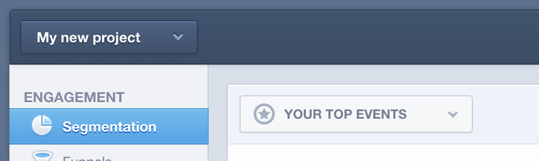

# Validação de dados no `Mixpanel`

Quando [!DNL MBI] primeiro se conecta ao seu [!DNL Mixpanel] seus dados, seu Gerente de conta ou Analista pode solicitar que você forneça exportações de dados do Mixpanel para fins de validação. Isso permite confirmar que você sincronizou todos os mesmos dados que estão disponíveis diretamente no [!DNL Mixpanel].

## Processo de exportação de dados: `Events`

1. Visite seu `Segmentation` seção e visualização `Your Top Events`.

   

1. Selecionar `Past 96 Hours` para o intervalo de tempo

   

1. Role para a parte inferior direita do relatório e exporte uma `.csv` arquivo:

   

1. Envie o `.csv` para o gerente de conta ou analista com o qual você está trabalhando neste processo de validação.
