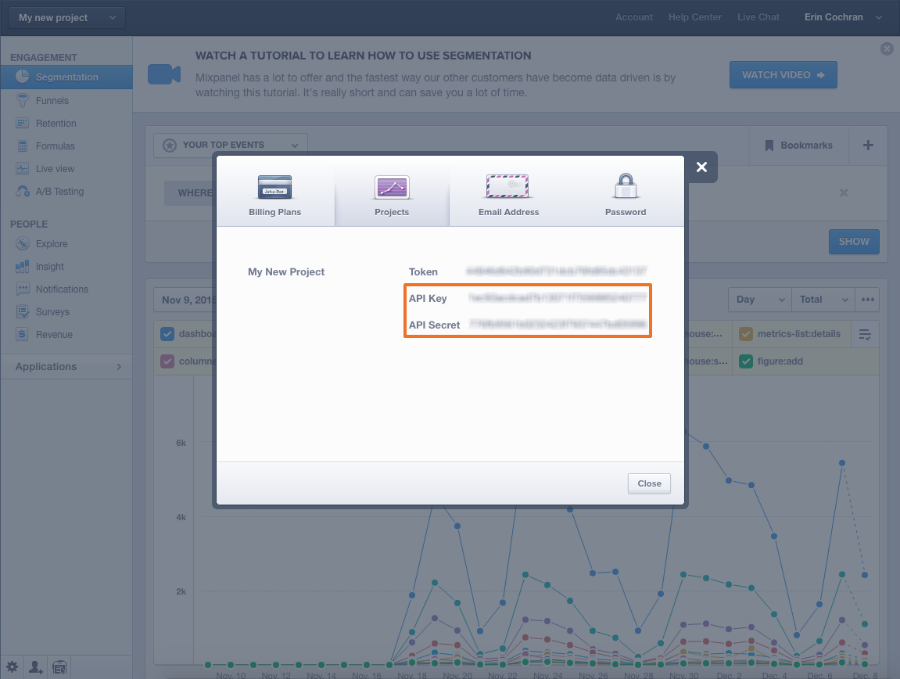

# Conectar [!DNL Mixpanel]

>[!NOTE]
>
>Requer [permissões de administrador](../../../administrator/user-management/user-management.md).

Com o [!DNL Mixpanel], você pode analisar como os usuários navegam e usam seus sites e aplicativos. Analisar de perto os dados de comportamento do usuário leva a decisões de design e desenvolvimento mais inteligentes, o que significa um produto melhor em geral. Conectar [!DNL Mixpanel] a [!DNL Commerce Intelligence] permite que você analise como seus usuários se comportam e como esse comportamento se traduz em receita.

Conectando seus dados do [!DNL Mixpanel] ao [!DNL Commerce Intelligence] um processo simples de três etapas:

1. [Abrir a página  [!DNL Mixpanel] credenciais [!DNL Commerce Intelligence]](#stepone)
1. [Recupere suas credenciais de API do  [!DNL Mixpanel] ](#steptwo)
1. [Insira suas  [!DNL Mixpanel] credenciais de API em  [!DNL Commerce Intelligence]](#stepthree)

Para concluir esse processo, é necessário abrir duas janelas ou guias do navegador, uma para [!DNL Commerce Intelligence] e outra para sua conta do [!DNL Mixpanel].

## Abrindo a página de credenciais do [!DNL Mixpanel] {#stepone}

Introdução:

1. Vá para a página `Connections` em **[!DNL Manage Data** > **Connections]**.

1. Clique em **[!UICONTROL Add a New Source]**, localizado no lado direito da tela acima da tabela `Data Sources`.

1. Clique no ícone [!DNL Mixpanel] e a página de credenciais será aberta.

Deixe esta página aberta por enquanto e alterne para a janela do navegador com sua conta do [!DNL Mixpanel].

## Recuperando suas credenciais de API do [!DNL Mixpanel] {#steptwo}

Se você ainda não fez logon na sua conta do [!DNL Mixpanel], faça isso e faça o seguinte:

1. Clique em **[!UICONTROL Account]** no canto superior direito.

1. No diálogo exibido, clique em **[!UICONTROL Projects]**.

1. Suas credenciais de API são exibidas:

Mantenha isso aberto, você precisa para encerrar isso.

## Inserindo suas credenciais de API do [!DNL Mixpanel] em [!DNL Commerce Intelligence] {#stepthree}

1. Copie o `API Key` e `Secret` na página de credenciais [!DNL Mixpanel] em [!DNL Commerce Intelligence].
1. Clique em **[!UICONTROL Connect to Mixpanel]** para concluir a instalação.

Se a conexão for bem-sucedida, um _Sucesso!_ mensagem é exibida na parte superior da página.

### Relacionados

* [Dados  [!DNL Mixpanel]  esperados](../integrations/mixpanel-data.md)
* [Reautenticando integrações](https://experienceleague.adobe.com/docs/commerce-knowledge-base/kb/how-to/mbi-reauthenticating-integrations.html)
