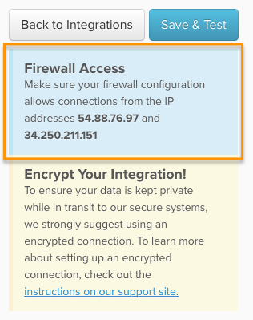

# Conectar [!DNL MySQL] via conexão direta

## Neste tópico

* [Permitir acesso ao endereço IP  [!DNL Commerce Intelligence] ](#allowlist)
* [Criar um  [!DNL MySQL] usuário para [!DNL Commerce Intelligence]](#steptwo)
* [Inserir informações de conexão em  [!DNL Commerce Intelligence]](#stepthree)

## Ir para

* [[!DNL MySQL] via `SSH tunnel`](../integrations/mysql-via-ssh-tunnel.md)
* [Verificação da chave do host SSH](../integrations/ssh-host-key-verification.md)
* [[!DNL MySQL] via  [!DNL cPanel]](../integrations/mysql-via-cpanel.md)

>[!NOTE]
>
>A [!DNL Adobe] recomenda que você use o [SSH](../integrations/mysql-via-ssh-tunnel.md) ou alguma outra forma de criptografia para proteger seus dados! Para verificação da chave do host SSH, consulte [verificação da chave do host SSH](../integrations/ssh-host-key-verification.md). Se isso não for uma opção, você ainda poderá conectar o [!DNL Commerce Intelligence] diretamente ao banco de dados usando as instruções neste tópico.

Este tópico orienta você na conexão direta do banco de dados do [!DNL MySQL] com o [!DNL Commerce Intelligence]. Essas configurações também podem ser usadas com [!DNL Adobe Commerce] ou qualquer outro banco de dados de comércio eletrônico que use MySQL.

## Permitir acesso aos endereços IP [!DNL Commerce Intelligence] {#allowlist}

Para que a conexão seja bem-sucedida, você deve configurar o firewall para permitir o acesso de seus endereços IP. Eles são `54.88.76.97` e `34.250.211.151`, mas também estão na página de credenciais [!DNL MySQL]:



## Criar um usuário [!DNL MySQL] para [!DNL Commerce Intelligence]

A maneira mais simples de criar um usuário `MySQL` para [!DNL Commerce Intelligence] é executar a consulta a seguir quando conectado a `MySQL` com privilégios `GRANT`. Substitua `Commerce Intelligence IP Address` pelo endereço IP [!DNL Commerce Intelligence] e `secure password` por uma senha segura de sua escolha:

```sql
    GRANT SELECT ON *.* TO 'magentobi'@'<Commerce Intelligence IP address>' IDENTIFIED BY '<secure password>';
```

Para impedir que esse usuário acesse dados em bancos de dados, tabelas ou colunas específicos, você pode executar `GRANT` consultas que só permitem o acesso aos dados permitidos.

**Execute novamente a consulta GRANT para todos os IPs necessários usando o mesmo usuário e senha.**

## Inserir informações de conexão no Commerce Intelligence

Para finalizar, você precisa inserir as informações de conexão e usuário em [!DNL Commerce Intelligence]. Você deixou a página de credenciais [!DNL MySQL] aberta? Caso contrário, vá para **[!UICONTROL Data** > **Connections]**, clique em **[!UICONTROL Add New Data Source]** e depois no ícone [!DNL MySQL]. Não se esqueça de alterar a opção `Encrypted` para `Yes`.

Insira as seguintes informações nesta página, começando com a seção `Database Connection`:

* `Connection Nickname`: Digite um nome para a integração (por exemplo, Loja de Ecommerce)
* `Username`: O nome de usuário de [!DNL Commerce Intelligence] [!DNL MySQL]
* `Password`: A senha para o usuário [!DNL Commerce Intelligence] [!DNL MySQL]
* `Port`: Porta do MySQL no servidor (`3306` por padrão)
* `Host`: por padrão, este é localhost. Em geral, esse é o valor do endereço de ligação do servidor [!DNL MySQL], que por padrão é `127.0.0.1 (localhost)`, mas que também pode ser algum endereço de rede local (por exemplo, `192.168.0.1`) ou o endereço IP público do servidor.

  O valor pode ser encontrado no arquivo `my.cnf` (localizado em `/etc/my.cnf`) abaixo da linha que lê `\[mysqld\]`. Se a linha de vinculação de endereço for comentada nesse arquivo, seu servidor estará protegido contra tentativas de conexão externa.

Quando terminar, clique em **[!UICONTROL Save & Test]** para concluir a instalação.

## Documentação relacionada

* [Reautenticação de integrações](https://experienceleague.adobe.com/docs/commerce-knowledge-base/kb/how-to/mbi-reauthenticating-integrations.html)
