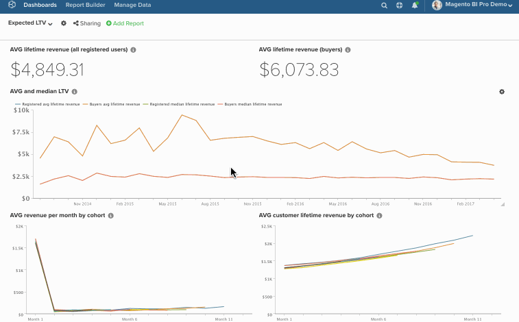

# Gráficos de edição em massa nos painéis

O recurso de edição em massa facilita a alteração de nomes e datas de gráficos em seus painéis. Por exemplo, você deseja que todos os gráficos em um painel específico se refiram a um único armazenamento e relatório mensalmente em vez de trimestralmente. Em vez de alterar tudo manualmente, deixe o recurso `bulk-editing` funcionar. Neste tópico, você aprenderá a usar:

* [O Recurso  [!DNL Find/Replace] &#x200B;](#findreplace)

* [O Recurso  [!DNL Prepend Name] &#x200B;](#prepend)

* [O Recurso  [!DNL Change Dates] &#x200B;](#dates)

Dito isto, considere isto: *Estas alterações precisam ser permanentes?* Caso contrário, considere clonar o painel e alterar as datas no novo painel. Isso permite preservar o painel original e, ao mesmo tempo, fazer as alterações necessárias.

>[!NOTE]
>
>Se você estiver alterando vários relatórios, o processo de atualização pode demorar um pouco.

## Usando o [!DNL Find/Replace] {#findreplace}

1. Clique no ícone de engrenagem () ao lado do nome do painel e, em seguida, na janela [!UICONTROL Bulk Edit Reports].

1. Clique em **[!UICONTROL Chart Title Find and Replace]** na janela pop-up.

1. No campo `Chart Title Find`, digite as palavras ou os caracteres que deseja localizar.

1. No campo `Replace With`, digite as palavras ou os caracteres que devem substituir o que está no campo `Find`.

1. Clique em **[!UICONTROL Update Reports]**.

Exemplo:

## Precedendo `Chart Names` {#prepend}

1. Clique no ícone de engrenagem () ao lado do nome do painel e, em seguida, na janela [!UICONTROL Bulk Edit Reports].

1. Clique em **[!UICONTROL Prepend Report Names]** na janela pop-up.

1. Digite as palavras ou os caracteres que você deseja anexar aos seus gráficos.

1. Clique em **[!UICONTROL Update Reports]**.

Exemplo:

## Alterando `Dates` {#dates}

1. Clique no ícone de engrenagem () ao lado do nome do painel e selecione a janela [!UICONTROL Bulk Edit Reports].

1. Clique em **[!UICONTROL Change Dates]** na janela pop-up.

1. Defina os novos `Start/End Date` e `Time Interval`. Você também pode deixar esses campos inalterados.

1. Clique em **[!UICONTROL Update Reports]**.

Exemplo:

