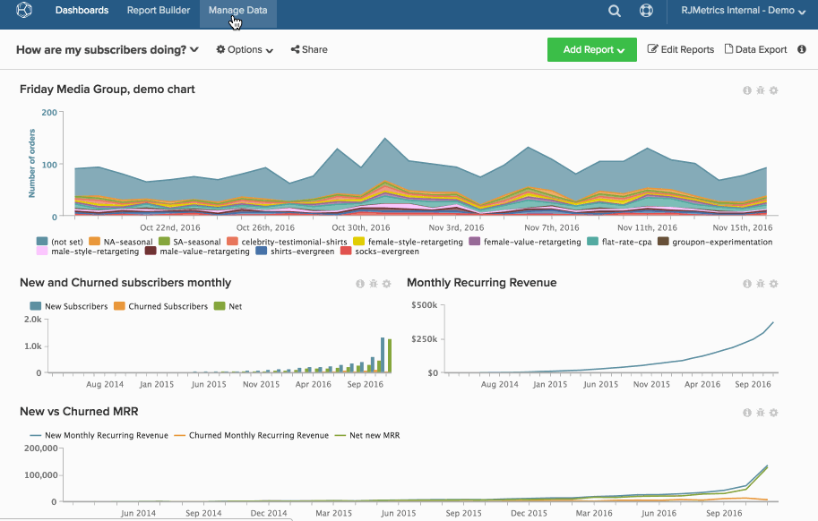

# Excluir permanentemente um gráfico

Mesmo se você [remover um gráfico do painel](../../data-user/dashboards/remove-charts-dashboard.md), ele ainda existe em seu [!DNL MBI] conta.

Para excluir permanentemente um gráfico:

1. Clique em **[!UICONTROL Account Setting]** na barra lateral.

1. Clique em **[!UICONTROL Charts]**.

1. Os gráficos que você tem a capacidade de excluir (com base nas permissões do usuário e na propriedade do gráfico) serão exibidos no lado direito da tela.

1. Clique na caixa de seleção ao lado da linha do gráfico que deseja excluir.

1. Clique em **[!UICONTROL Delete Selected]**.

   >[!NOTE]
   >
   >Se o gráfico estiver sendo usado em um painel ou resumo de email, uma notificação será exibida. Para continuar, é necessário confirmar a exclusão e clicar em **[!UICONTROL Force Deletion]**.

Exemplo:

<!--{: width="630" height="402"}-->
