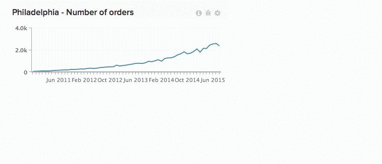

# Trabalhar com gráficos em painéis

Números escalares. Gráficos de barras. Gráficos que se estendem por longos períodos. Todos os gráficos exibem informações de forma diferente, o que significa que o tamanho e a localização de gráficos não são uma solução de tamanho único. No [!DNL Commerce Intelligence] , você pode redimensionar e reorganizar gráficos para criar seus espaço de trabalho ideais.

*Para redimensionar um gráfico* , clique e arraste o canto inferior direito de qualquer gráfico.

*Para mover um gráfico* , passe o cursor sobre a parte superior do gráfico até que o `Move` cursor seja exibido. Clique e segure e arraste o gráfico até o local desejado. Solte clique para colocar o gráfico.

