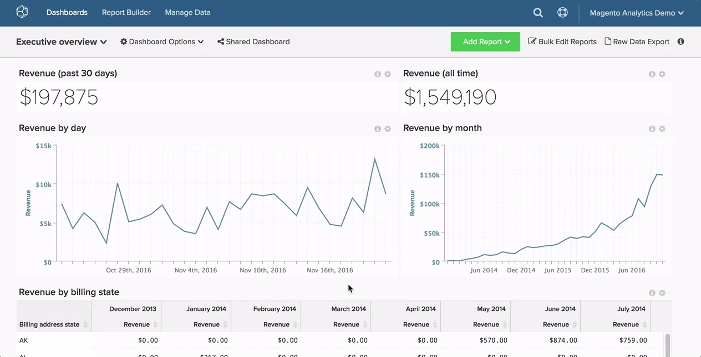

# Pesquisar por um painel

Neste artigo, mostramos como usar o [`Global Search` recurso](#global) para procurar painéis e como pesquisar por [painéis de propriedade de outros usuários](#other).

## Pesquisa global {#global}

O `Global Search` permite procurar e selecionar painéis para visualização.

* *Para visualizar uma lista de seus painéis existentes*, clique no painel.

* *Procurar um painel*, digite alguns critérios de pesquisa na barra de pesquisa depois de clicar na lista suspensa do painel. Se qualquer painel corresponder aos critérios, será exibido primeiro na lista.

Exemplo:

## Encontrar painéis de propriedade de outros usuários {#other}

Procurando um painel de propriedade de outro usuário? Se o painel puder ser visualizado por outras pessoas, você poderá pesquisá-lo clicando em **[!UICONTROL Find]** no `Dashboard Options` lista suspensa.

