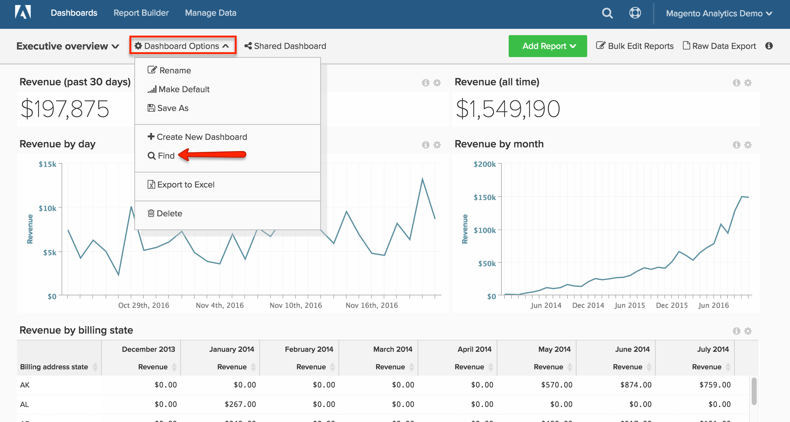

# Pesquisar um painel

Este artigo mostra como usar a variável [`Global Search` recurso](#global) para procurar painéis e como pesquisar [painéis de propriedade de outros usuários](#other).

## Pesquisa global {#global}

A variável `Global Search` permite procurar e selecionar painéis para visualização.

* *Para visualizar uma lista de seus painéis existentes*, clique no painel.

* *Para pesquisar um painel*, digite alguns critérios de pesquisa na barra de pesquisa depois de clicar na lista suspensa do painel. Se algum painel corresponder aos critérios, será exibido primeiro na lista.

Exemplo:

## Localizar painéis de propriedade de outros usuários {#other}

Procurando um painel de propriedade de outro usuário? Se o painel puder ser visualizado por outras pessoas, procure-o clicando em **[!UICONTROL Find]** no `Dashboard Options` lista suspensa.

