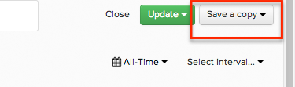

# Criar uma cópia de um relatório

Geralmente, você quer criar gráficos definidos de forma semelhante nos quais deseja alterar apenas um elemento, como editar um filtro ou alterar a variável `group by`.

Nesses casos, inicie o `Chart Editor` e clique em **[!UICONTROL Save As]** no canto superior direito. Isso replica seu gráfico existente e o adiciona ao painel atual com o novo nome selecionado e permite editar as configurações do novo gráfico imediatamente.

