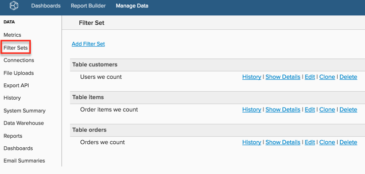

# Criar conjuntos de filtros

Se você tiver várias métricas em [!DNL Commerce Intelligence] que precisam ser filtradas de maneira semelhante (por exemplo, filtrar ordens de teste), poderá criar Conjuntos de Filtros salvos e aplicá-los às métricas. Isso economiza tempo, pois não é necessário adicionar filtros individuais ao criar ou editar uma métrica.

Consulte o [vídeo de treinamento](https://experienceleague.adobe.com/docs/commerce-knowledge-base/kb/how-to/mbi-training-video-filter-sets.html) para obter mais informações.

>[!NOTE]
>
>Requer [permissões de administrador](../../administrator/user-management/user-management.md).

1. Clique em **[!DNL Manage Data** > **Filter Sets]** na barra lateral.

   

1. Clique em **[!UICONTROL Add Filter Set]** na parte superior da página.

1. Selecione a tabela que contém as métricas que você deseja filtrar.

   Por exemplo, se você deseja filtrar sua métrica `Total number of orders` e ela está incorporada na tabela `orders`, selecione essa tabela.

1. Nomeie o `Filter Set`.

1. Adicione todos os filtros relevantes.

   Por exemplo, se você quiser incluir apenas pedidos com status de concluído na métrica `Total number of orders`, você aplicará um filtro que exclui todos os pedidos que não têm status = `complete`.

1. Verifique a lógica do filtro e se os parênteses e operadores estão posicionados corretamente: por exemplo, `\[A\] AND \[B\]; (\[A\] OR \[B\]) AND \[C\]`.

   Um filtro incorreto geralmente é a causa das discrepâncias de dados entre os relatórios do [!DNL Commerce Intelligence] e os resultados esperados.

1. Salve o `Filter Set`.

Depois que um conjunto de filtros é salvo, é possível aplicá-lo a qualquer métrica que esteja usando a mesma tabela. Por exemplo, se você criou uma `Filter Set` na tabela `orders`, é possível aplicá-la a *qualquer métrica* criada nessa tabela, como `Revenue`.

>[!NOTE]
>
>`Filter Sets` também pode ser aplicado às colunas calculadas em [!DNL Commerce Intelligence]. Você pode solicitar a aplicação de um conjunto de filtros a uma dimensão de dados criada em [!DNL Commerce Intelligence] via entrando em contato com o suporte.

## Relacionados

* [Práticas recomendadas para segmentação e filtragem](../../best-practices/segment-filter.md)
