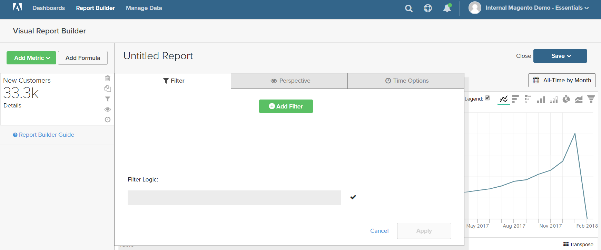

# Filtros

Um ou mais filtros podem ser adicionados para limitar os dados usados para produzir um relatório. Cada filtro é uma expressão que inclui uma coluna da tabela associada, um operador e um valor. Por exemplo, para incluir apenas clientes repetidos, você pode criar um filtro que inclua apenas clientes que fizeram mais de um pedido. Vários filtros podem ser usados com `AND/OR` operadores para adicionar lógica ao relatório.

>[!TIP]
>
>Um relatório pode ter no máximo 3.500 pontos de dados. Para reduzir o número de pontos de dados, use um filtro para reduzir a quantidade de dados usada para gerar o relatório.

[!DNL Adobe Commerce Intelligence] O inclui uma seleção de filtros que podem ser usados &quot;prontos para uso (OOTB)&quot; ou modificados para atender às suas necessidades. Não há limite para o número de filtros que você pode criar.

## Para adicionar um filtro:

1. No gráfico, passe o mouse sobre cada ponto de dados.

   Neste relatório, cada ponto de dados mostra o número total de clientes do mês.

1. No painel esquerdo, clique no link Filtros () ícone.

   

1. Clique em **[!UICONTROL Add Filter]**.

   Os filtros são numerados alfabeticamente e o primeiro é `[A]`. As duas primeiras partes do filtro são opções suspensas e a terceira parte é um valor.

   

   * Clique na primeira parte do filtro e escolha a coluna que deseja usar como assunto da expressão.

     

   * Clique na segunda parte do filtro e escolha o operador.

     

   * Na terceira parte do filtro, insira o valor necessário para concluir a expressão.

     

   * Quando o filtro estiver concluído, clique em **[!UICONTROL Apply]**.

     O relatório agora inclui apenas clientes repetidos e o número de registros de clientes recuperados para o relatório foi reduzido de 33.000 para 12.600.

     <!--{: .zoom}-->

1. Na barra lateral, clique na perspectiva ( ) ícone.

   <!--{: .zoom}-->

1. Na lista de configurações, escolha `Cumulative`. Em seguida, clique em **[!UICONTROL Apply]**.

   

   A variável `Cumulative` A perspectiva distribui a alteração ao longo do tempo, em vez de mostrar os altos e baixos de cada mês.

1. Insira um `Title` para o relatório e clique em **[!UICONTROL Save]** como um `Chart` ao painel.

   
