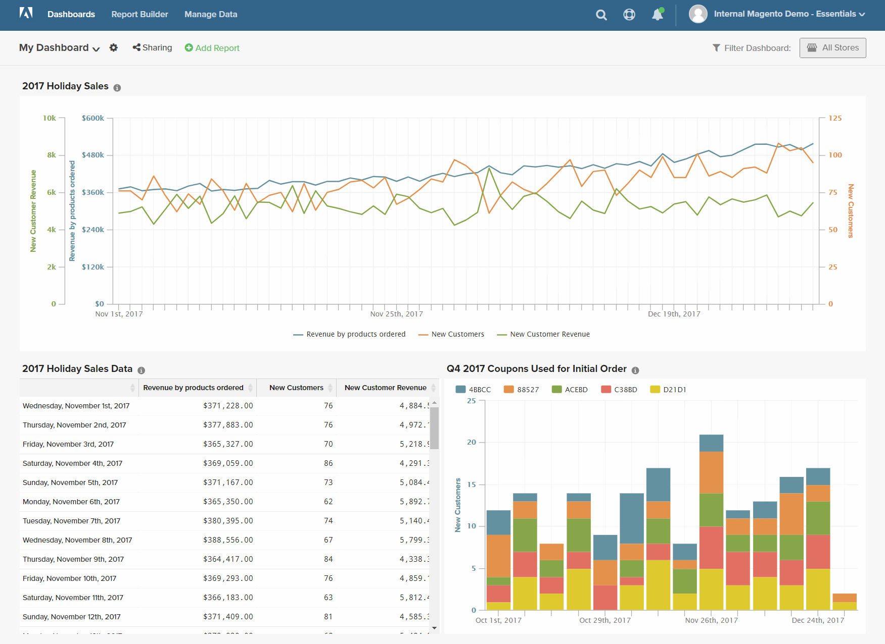

# Fórmulas

Uma fórmula combina várias métricas e lógica matemática para responder uma pergunta. Por exemplo, quanto da receita por produto durante a temporada de festas foi gerada por novos clientes?

## Etapa 1: Criar o relatório básico

1. No menu , escolha `Report Builder`.

1. Clique em **[!UICONTROL Add Metric]** e escolha a primeira métrica para o relatório.

   Para este exemplo, a variável `Revenue by products ordered` será usada.

1. Clique em **[!UICONTROL Add Metric]** e escolha a segunda métrica para o relatório.

   Para este exemplo, a variável `New Customers` será usada.

1. Na barra lateral, clique em **[!UICONTROL Details]** para exibir informações sobre cada métrica.

   

1. Na barra lateral, clique no nome de cada métrica para abrir a página de configurações em uma nova guia do navegador. Role para baixo para ver cada componente da métrica, incluindo a consulta da métrica, o filtro e as dimensões.

   

1. Para retornar ao seu relatório, clique na guia anterior do navegador.

1. No gráfico, passe o mouse sobre alguns pontos de dados em cada linha para ver as quantidades associadas a cada métrica.

## Etapa 2: Adicionar fórmula

1. Na parte superior da barra lateral, clique em **[!UICONTROL Add Formula]**.

   A caixa de fórmula mostra as métricas como entradas disponíveis `A` e `B`, e inclui uma caixa de entrada onde é possível inserir a fórmula.

   Faça o seguinte:

   * No `Enter your Formul` caixa de entrada, digite `A/B`.

      Isso dividirá a receita por produtos solicitados pelo número de novos clientes.

   * Definir `Select format` para `123Number`.

   * Na barra lateral, substitua `Untitled` com um nome para a fórmula.

   

1. Ao concluir, clique em **[!UICONTROL Apply]**.

   O relatório agora tem uma nova linha para a fórmula, `New Customer Revenue`e a barra lateral mostra a quantidade total de receita gerada por novos clientes.

   

## Etapa 3: Adicionar um intervalo de datas

1. Clique em **[!UICONTROL Date Range]** no canto superior direito.

1. No `Fixed Date Range` , faça o seguinte:

   * Nos calendários, escolha o intervalo de datas.

      Neste exemplo, a temporada de férias é de 1º de novembro a 31 de dezembro.

   * Em `Select Time Interval`, escolha `Day`.

      

   * Ao concluir, clique em **[!UICONTROL Apply]**.

   O relatório agora está limitado à temporada de festas, com um ponto de dados para cada dia.

   

## Etapa 4: Salvar o relatório

Nesta etapa, você salvará o relatório como um gráfico e também como uma tabela.

1. Clique em `Untitled Report` na parte superior da página e insira um título descritivo. Para este exemplo, o título do relatório é `2017 Holiday Sales`.

   Em seguida, faça o seguinte:

   * No canto superior direito, clique em **[!UICONTROL Save]**.

   * Para `Type`, aceitar o padrão `Chart` configuração.

   * Escolha a `Dashboard` se o relatório estiver disponível.

   * Clique em **[!UICONTROL Save to Dashboard]**.

1. Clique no título do relatório e altere o nome. Neste exemplo, o título do relatório é alterado para `2017 Holiday Sales Data`.

   Em seguida, faça o seguinte:

   * No canto superior direito, clique em **[!UICONTROL Save a Copy]**.

   * Definir `Type` para `Table`.

   * Escolha a `Dashboard` se o relatório estiver disponível.

   * Clique em **[!UICONTROL Save a Copy to Dashboard]**.

1. Para ver os relatórios no painel, execute um dos seguintes procedimentos:

   * Clique em **[!UICONTROL Go to Dashboard]** na mensagem na parte superior da página.

   * No menu , escolha **[!UICONTROL Dashboards]**. Clique no nome do painel atual para exibir a lista. Em seguida, clique no nome do painel onde o relatório foi salvo.
